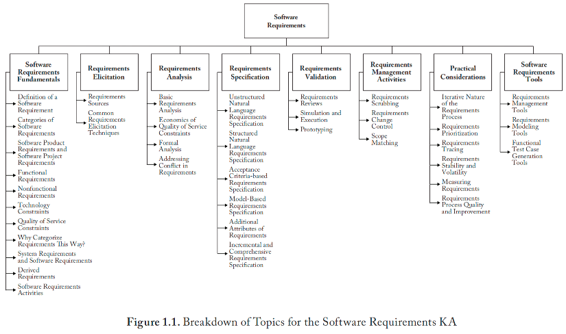
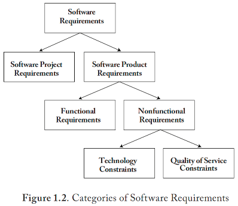
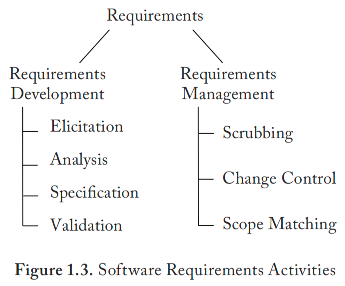
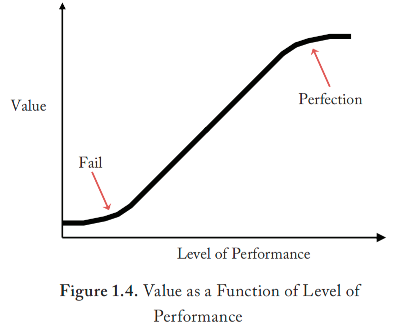
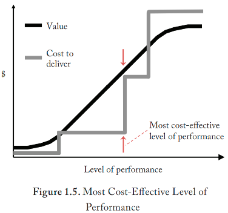
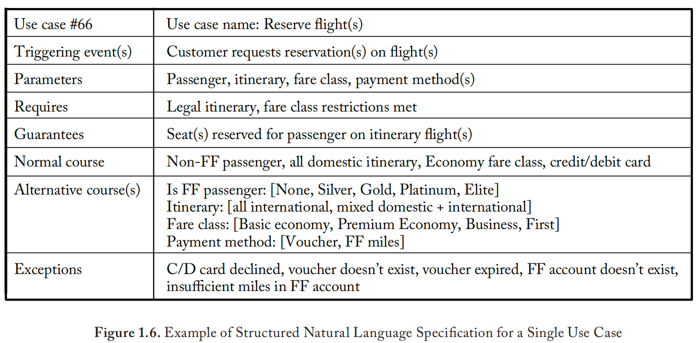

# **缩写词**

| 缩写   | 英文                                         | 中文                    |
| :----- | -------------------------------------------- | ----------------------- |
| ATDD   | Acceptance Test Driven Development           | 验收测试驱动开发        |
| BDD    | Behavior Driven Development                  | 行为驱动开发            |
| CIA    | Confidentiality, Integrity, and Availability | 保密性、完整性、可用性  |
| FSM    | Functional Size Measurement                  | 功能规模度量/功能点度量 |
| INCOSE | International Council on Systems Engineering | 国际系统工程协会        |
| JAD    | Joint Application Development                | 联合英语开发            |
| JRP    | Joint Requirements Planning                  | 联合需求规划            |
| SME    | Subject Matter Expert                        | 领域专家                |
| SysML  | Systems Modeling Language                    | 系统建模语言            |
| TDD    | Test Driven Development                      | 测试驱动开发            |
| UML    | Unified Modeling Language                    | 统一建模语言            |

# 简介

​        软件需求应从两个角度来看待。首先，它是对软件产品或项目的需求和约束的表述，旨在解决现实世界的问题。其次，它是开发和维护软件产品及其构建项目需求所必需的活动。本知识领域（KA）将介绍这两种角度。

​	如果团队在确定需求方面做得不好，项目、产品或两者都可能面临成本增加、延期、取消和缺陷等问题。原因之一是：每个软件产品需求通常都会引发许多设计决策。每个设计决策通常又会引发许多代码层面的决策。每个决策还可能涉及多个测试决策。换句话说，正确确定需求是一项至关重要的工作。如果不能及早发现并修复缺失、误解或错误的需求，可能会导致指数级的连锁反应，最终需要进行大量返工来纠正这些问题。

​	现实世界的软件项目往往会面临两个主要的需求相关问题：

1. **不完整性：**利益相关者的需求以及必要的细节并未被挖掘并传达给软件工程师；
2. **歧义性：**需求的沟通方式存在多种解释，而其中只有一种解释是正确的。

​        除了需求在构建软件初始中显而易见的短期作用之外，它们在长期维护中也扮演着一个虽不为人知但却至关重要的角色。当收到没有任何配套文档的软件时，软件工程师可以通过多种方式来确定代码的功能，例如执行代码、使用调试器单步执行、手动执行、进行统计分析等等。难点在于确定代码的预期功能。通常所说的“bug”（但更准确的说法是“缺陷”）实际上是指软件预期功能与实际功能之间的可观察差异。需求文档在软件整个生命周期中的作用是记录和分析这些差异。软件需求文档在整个软件服务生命周期中的作用是：为那些维护代码但可能并非其原始作者的软件工程师捕捉并传递原始意图。

​	软件需求知识领域涉及软件整个服务生命周期内的开发和持续管理软件需求。本知识领域阐明了以下重要理解：

- 软件需求并非一定是软件开发生命周期中一个独立的前期活动，而是一个始于项目启动、并往往在软件整个服务生命周期内持续细化的过程；
- 需求工作需根据具体组织和项目的实际情况进行适应性调整。

​	术语“需求工程”常被用来指代对需求的系统性处理。为确保术语一致性，除“软件工程”这一专有表述外，本知识领域将不使用“工程”一词。

​	软件需求知识领域与软件架构、软件设计、软件构建、软件测试和软件维护知识领域，以及软件工程模型与方法知识领域中的模型主题关系最为密切，因为以模型形式来规定需求通常具有很高的价值。

​	本知识领域亦与软件工程过程知识领域中的软件生命周期主题相关，因为本领域的焦点在于明确需求工作能够且应当“做什么”以及“如何做”，而项目所采用的生命周期则决定了这些工作“何时”进行。例如：

- 在瀑布式生命周期中，所有需求工作基本上都在独立的需求阶段完成，并预期在后续阶段开展架构、设计与构建工作之前已基本完成。
- 在某些迭代式生命周期中，初始的、高层次的需求工作在初始阶段完成，在一个或多个细化阶段进一步的细化。
- 在敏捷生命周期中，需求工作是增量式、即时进行的，随着每个新增功能元素的构建而同步开展。

​	软件需求工作在项目中"做什么"以及"如何做"，应由所构建的软件性质决定，而非由构建所采用的生命周期决定。就需求文档捕捉并传递软件意图这一作用而言，下游维护人员不应仅从这些需求文档的形式上就能推断出早期开发所采用的生命周期。

​    译者注：需求文档的呈现方式与项目采用的软件开发生命周期的方法无直接关系。例如使用UML用例图和单个用例描述的表单，无法推断出项目采用瀑布还是Scrum方法。

​	本知识领域与软件配置管理、软件工程管理和软件质量知识领域也有所关联，但关联程度相对较弱。软件配置管理方法可用于追踪和管理需求；软件质量关注需求自身的规范性程度；而工程管理则可以利用需求的状态来评估项目的完成情况。

# 软件需求知识领域主题分解

软件需求知识领域的主题分解如图1.1所示。

## **1. 软件需求基础**

### **1.1 软件需求的定义** [1*, 第1章第5-6页] [2*, 第4章第102页]

正式而言，软件需求被定义为 [28]：

- 用户解决问题或达成目标所需的条件或能力；
- 为满足合同、标准、规格说明或其他正式强制性文件要求，系统或系统组件必须满足或具备的条件或能力；
- 以上（1）或（2）中所描述的条件或能力的文档化表示形式。

​	本知识领域对这一正式定义进行了扩展，将软件项目的**需要**和**约束**的表达也纳入其中。

​	最基本的层面上，软件需求是为了解决现实世界问题而必须展现出的特性。其目标可能是自动化支持组织业务策略和流程的任务的全部或部分、修正现有软件的缺陷、或控制设备——这只是众多可以通过软件解决方案来解决的问题中的几个例子。

​	业务策略与流程以及设备功能往往非常复杂。由此延伸，软件需求通常是来自不同组织层级、涉及或关联于软件运行环境某些方面的各利益相关方需求的复杂组合。

​	通常由客户、顾客和用户提出需求。然而，其他第三方——如监管机构，以及在某些情况下，软件组织或项目自身——也可能提出需求。（另见[5, c1]、[6, c1]、[9, c4]。）

### **1.2 软件需求的类别 [1\*, 第1章第7-12页] [2\*, 第4.1节]**

​	图1.2展示了本知识领域所定义的软件需求类别及其相互关系（另参见[5, c1][6, c1][9, c4]）。下文将对每个类别进行详细说明。

### **1.3 软件产品需求与软件项目需求**

​	软件产品需求规定了软件预期应具备的形态、适配性或功能。软件项目需求（亦称为过程需求，有时也称为业务需求）则是对构建软件的项目所施加的约束。项目需求通常涉及成本、进度和/或人员配置的限制，但也可能约束软件项目的其他方面，例如测试环境、数据迁移、用户培训及维护等。软件项目需求可嵌入到项目章程或其他高层级项目启动文件中。这些需求主要与项目管理方式（参见软件工程管理知识领域）或应使用的生命周期过程（参见软件工程过程知识领域）相关。本知识领域后续不再对软件项目需求作进一步讨论。

### **1.4 功能需求**

​	功能需求规定了软件需提供的可观测行为——即需要遵循的策略和需要执行的流程。以银行软件为例，其策略可能包括："一个账户必须至少有一名客户作为其所有者"，以及"账户余额绝不允许为负"。流程则可具体定义向账户存款、从账户取款以及在不同账户间转账等操作的含义。

​	即使是技术性极强（非面向业务）的软件，例如实现传输控制协议/互联网协议（TCP/IP）网络通信协议的软件，同样包含策略与流程："一个端口可存在零个、一个或多个关联连接，但一个连接必须仅存在于一个关联端口上"，"连接的可接受状态应包括'监听'、'同步已发送'、'已建立'、'正在关闭'……"，以及"若数据段的生存时间归零，则该数据段应被删除"。（参见[5, c1][6, c10][9, c4]。）

### **1.5 非功能需求**

​	非功能需求从某些方面对实现所需采用的技术进行约束：使用何种计算平台？何种数据库引擎？结果需要达到何种精确度？结果必须多快展现？特定类型的记录需要存储多少条？部分非功能需求可能涉及软件的运行（参见"运维与维护知识领域"）。（另见[5, c1][6, c11][9, c4]。）

​	非功能需求可进一步划分为**技术约束**和**服务质量约束**。这两类需求之间存在本质关联，这种关联可能产生积极或消极影响，因此每当修改某项非功能需求时，都必须考虑其对其他需求可能造成的影响。

### **1.6 技术约束**

​	这类需求强制要求——或禁止——使用特定的、已命名的自动化技术或已定义的基础设施。例如：要求使用特定计算平台（如Windows™、macOS™、Android OS™、iOS™），特定编程语言（如Java、C++、C#、Python），与特定网页浏览器（如Chrome™、Safari™、Edge™）兼容，给定的数据库引擎（如Oracle™、SQL Server™、MySQL™），以及通用技术（如精简指令集计算机（RISC）、关系型数据库）。禁止使用指针的要求也属于此类示例。（另见[9, c4]。）

### **1.7 服务质量约束**

​	这类需求并不约束特定、已命名的技术的使用，而是规定自动化解决方案必须达到的可接受的性能水平。例如响应时间、吞吐量、准确性、可靠性和可扩展性。ISO/IEC 25010：《系统和软件工程——系统和软件质量需求与评估（SQuaRE）——系统和软件质量模型》[27] 包含了可能与软件相关的各类质量特性的大量清单（另见[9, c4]）。安全与保障也是一个特别重要且容易被忽视的需求主题（有关应考虑的具体安全需求类型，详见"安全知识领域"）（另见[2*, c13]）。

### **1.8 为何以这种方式对需求进行分类？**

以这种方式对需求进行分类有以下原因：

- 不同类别的需求往往来源于不同的来源；
- 需求获取技术常因来源而异；
- 分析技术因类别而不同；
- 规格说明技术因类别而不同；
- 验证主体因类别而不同；
- 不同类别以不同方式影响最终软件。

此外，按这些类别组织需求还有以下好处：

- 复杂性得以更好管理，因为不同领域可以分开处理；软件工程师可以在处理策略和流程复杂性的同时，无需担忧自动化技术问题（反之亦然）。一个大问题分解为两个较小问题，这是经典的"分而治之"的复杂性管理策略。
- 不同的专业知识领域可以隔离；利益相关者（而非软件工程师）是待自动化策略和流程领域的专家。软件工程师（而非利益相关者）是技术专家。当业务专家拿到混杂了功能和非功能的需求进行评审或确认时，他们可能会因为不理解甚至不关心技术问题而放弃。相关需求评审者可以专注于与其相关的需求子集。

​	最初在[18, c1-4]中描述、并在[8]和[9, c4]中解释的"完美技术过滤器"有助于区分功能需求和非功能需求。简言之，**功能需求**是指即使存在一台具有无限速度、无限内存、零成本、零故障等的计算机来构建软件，仍然需要陈述的需求。所有其他软件产品需求都是对自动化技术的约束，因此属于**非功能需求**。

​	大型系统往往横跨多个主题领域或领域。如[9, c6]所述，递归设计展示了父领域中的非功能需求如何成为或引发出子领域中的功能需求。例如，父银行领域中关于用户安全的非功能需求，可能成为或引发出子安全领域中的功能需求。类似地，父银行领域中关于审计和事务管理的横切非功能需求，可能成为或引发出子审计领域和子事务领域中的功能需求。将大型系统分解为一组相关的领域，可以显著降低复杂性。

### **1.9 系统需求与软件需求**

​	国际系统工程协会（INCOSE）将系统定义为：**"为实现既定目标而相互作用、相互结合的一组要素集合，包括硬件、软件、固件、人员、信息、技术、设施、服务及其他支持性要素"** [24]。

​	在某些情况下，区分系统需求与软件需求是有益的或必要的。系统需求适用于更大的系统（例如，一辆自动驾驶汽车），而软件需求仅适用于该更大系统中的软件要素。部分软件需求可能由系统需求衍生而来（另参见[5, c1]）。在其他情况下，软件本身即是所关注的系统，而硬件和支持系统则被视为平台或基础设施，因此此时的系统需求大多即是软件需求。

### **1.10 派生需求**

​	在实践中，需求具有语境敏感性，且取决于观察视角。外部利益相关者可以提出范围需求，这对整个项目而言是一项需求——即使该项目涉及数百名软件工程师。架构师决定采用管道-过滤器架构风格，从整体项目利益相关者的视角看并非需求，而是一项设计决策；但从负责构建特定过滤器的子团队视角看，该决策则被视为一项需求。

​	航空航天工业长期使用"衍生需求"这一术语，意指并非由项目整体外部利益相关方提出，而是在更大开发团队内部施加的需求。架构师关于管道-过滤器的决策符合这一定义。该选择在外部利益相关方看来是设计决策，但对负责开发各过滤器的子团队而言则是需求。（另见[9, c4]。）

### **1.11 软件需求活动**

​	图1.3展示了需求开发与需求管理两类活动。整体而言，需求开发可理解为"就待构建软件的内容达成共识"，而需求管理则可视为"随时间推移维护该共识"。本知识领域将阐述每项活动：需求开发活动将分多个主题呈现，需求管理则作为独立主题整体呈现。（另见[5, c1][6, 2]。）

## **2. 需求获取**

​	需求获取的目标是发掘候选需求，亦被称为**需求捕获**、**需求发现**或**需求采集**。如前所述，现实软件项目需求工作的一个问题是需求不完整，这可能是由于获取不充分所致。虽然无法保证一套需求是完整的，但执行良好的需求获取有助于最大程度地减少不完整性。（另见[5, c2-3][6, c3-7]。）

### **2.1 需求来源**

​	需求来自许多不同的来源——可以从这些来源获取需求。所有潜在的需求来源都应被识别和评估。利益相关者可以被定义为任何个人、团体或组织，包括：

- 积极参与项目；
- 受到项目成果的影响；
- 能够影响项目成果。

软件项目的典型利益相关者包括但不限于以下：

- **客户**——为软件构建出资的人或组织（例如，组织管理层）；
- **顾客**——决定软件产品是否投入使用的人或组织；
- **用户**——直接或间接与软件交互的人；用户可分为使用类型、执行任务、技能与知识水平、权限等级等；
- **领域专家**；
- **运维人员**；
- **一线产品支持人员**；
- **相关专业机构**；
- **监管机构**；
- **特殊利益团体**；
- **因项目成功可能受到负面影响的人**；
- **开发人员**。

**利益相关者类别**是具有相似视角和需求的利益相关者群体。在软件项目工作中，以利益相关者类别而非个体利益相关者为单位进行工作，可以产生重要的额外见解。

许多项目受益于执行**利益相关者分析**，以尽可能识别出更多重要的利益相关者类别。这减少了需求偏向于代表性较强的利益相关者而疏于代表性较弱的利益相关者的可能性。当一个利益相关者类别的需求与另一个利益相关者类别的需求发生冲突时，利益相关者分析还可以为谈判和冲突解决提供参考。（另见[5, c3][6, c3]。）

需求并不只限于来自人。其他非人的需求来源可以包括：

- 文档，如先前版本的需求、任务说明、操作概念；
- 其他系统；
- 更大的业务环境，包括组织策略和流程；
- 计算环境。

### **2.2 常见的需求获取技术**

可以使用多种技术从利益相关者处获取需求。某些技术在特定利益相关者类别上的效果优于其他技术。常见的利益相关者获取技术包括：

- 访谈；
- 会议，可能包括头脑风暴；
- 联合应用开发[13]、联合需求规划[14]及其他引导式研讨会；
- 协议分析；
- 焦点小组；
- 问卷和市场调查；
- 探索性原型，包括低保真和高保真用户界面原型[1*, c15]；
- 用户故事映射。

获取可能很困难，软件工程师需要了解（例如）用户可能难以描述其任务，会遗漏重要的未说明信息，或者不愿意或无法合作。获取不是一项被动的活动。即使有合作且表达清晰的利益相关者，软件工程师也必须努力获取正确的信息。许多产品需求是隐性的，或者只能在尚未收集的信息中找到。

需求也可以从利益相关者以外的来源获取。此类来源和技术包括：

- 系统的先前版本；
- 系统先前版本的缺陷跟踪数据库；
- 与正在开发的系统接口的其他系统；
- 竞争性基准测试；
- 文献检索；
- 质量功能部署的“质量屋QFD”[15]；
- 观察，即软件工程师研究正在进行工作的过程及其环境；
- 学徒式学习，即软件工程师通过亲自执行工作来学习；
- 使用场景描述；
- 分解（例如，从能力分解为史诗，再分解为特性，再分解为用户故事）；
- 任务分析[16]；
- 设计思维（共情、定义、构思、原型、测试）[17]；
- ISO/IEC 25010：《系统和软件工程——系统和软件质量需求与评估——系统和软件质量模型》[27]；
- 安全需求，如“安全知识领域”中所述；
- 适用的标准和法规。

（另见[5, c3][6, c4-7]。）

## 3. 需求分析 

**[1\*, c8-9]**

​	需求不大可能一经获取即成为最终形式。通常需要进一步的调查，以探索最初获取信息所提示的完整、真实的需求。需求分析帮助软件开发人员理解候选需求的含义和影响，无论是单个需求还是在整个需求集的背景下。

### **3.1. 基本需求分析 **

**[1\*, c8-9]**

以下这份关于需求应具备特性的列表可以指导基本的需求分析。软件工程师力求确立任何尚未满足的特性。每项需求应当：

- **无歧义**（只能以一种方式解释）；
- **可测试**（可量化），意味着符合或不符合需求可以清晰地证明；
- **具有约束力**，意味着客户愿意为其付费，并且不愿缺少它；
- **原子性**，代表单一的决策；
- **代表真实的、实际的利益相关者需求**；
- **使用利益相关者的词汇**；
- **被所有利益相关者接受**。

完整的需求集应当具备以下特性：

• **完备性** — 需求需充分涵盖边界条件、异常情况及安全性要求；
• **简洁性** — 需求内容不应包含无关信息；
• **内部一致性** — 需求之间不应存在矛盾；
• **外部一致性** — 需求不应与任何原始资料冲突；
• **可行性** — 在成本、进度、人员及其他限制条件下，存在可行且具备成本效益的解决方案。

​	在某些情况下，获取到的需求陈述可能代表的是待实现的解决方案，而非待解决的本质问题。这可能导致实施次优方案的风险。**五问法**（例如[3*, c4]）通过反复追问“为何存在此需求？”，从而逼近问题的本质。当回答变为“若不实现此需求，则利益相关者的问题将无法解决”时，追问即告停止。通常经过两到三轮追问即可触及问题本质，该方法命名为“五问法”意在激励工程师尽可能深入挖掘。

### **3.2 服务质量约束的经济性考量**

**[3\*]**

​	服务质量约束往往具有特殊挑战性，这通常源于工程师没有从经济角度进行考量[9, c4]。图1.4展示了典型服务质量约束（如容量、吞吐量、可靠性）的经济性视角：其价值随性能水平提升而增长。对于响应时间、平均修复时间等随性能水平提升而价值递减的约束类型，其价值曲线呈现垂直对称形态。

​	在相关性能水平区间内，系统达到特定性能水平时将为利益相关者带来相应价值。该价值曲线包含两个关键点：

**1. 理想点** — 这是最有利的性能水平，超过此点将不会带来额外收益。即使系统性能能够超越理想点，客户也无法利用这种额外能力。例如，一个社交媒体的支持用户数若超过世界人口，其超出部分即为冗余能力。

**2. 失效点** — 这是最不利的性能水平，低于此点收益将不再继续减少。例如，社交媒体平台可能需要至少维持最低市场份额才能保持其作为平台的可行性。

​	即使被明确表述，量化的需求点通常也具有任意性。它往往基于客户根据软件支付费用后认为合理的诉求。即使软件工程师无法构建完全达到规定需求点的系统，该软件通常仍具有价值，只是价值低于客户预期。此外在某些情况下，超越需求点的能力可能显著提升价值。

​	实现特定性能水平的成本通常呈阶梯函数形态。首先，在给定投资水平下存在可达到的最高性能水平；随后需要追加投资，新的投资能使性能提升至新的、更有利的最高水平。图1.5展示了最具成本效益的性能水平——即在该性能水平下的价值与实现成本之间正向差值最大的点。

（关于此类经济分析的更多信息，请参阅《软件工程经济学知识域》或参考文献[3*]。）

​	软件工程师应特别关注服务质量约束之间的正负相关性（例如参见[1*, c14]中的图14-1）。某些服务质量约束具有相互促进关系：提升某一约束的性能水平会自动改善另一约束的性能。例如，代码可修改性越强，其可靠性往往越高，因为可修改性与可靠性在一定程度上都是代码简洁度的体现。另一方面，代码运行速度越高，其可修改性可能越低，因为高速通常通过代码复杂化的优化手段实现。

### **3.3 形式化分析 **

**[2\*, s12.3.2-12.3.3]**

​	形式化分析在某些应用领域已显现优势，特别是在高完整性系统中（例如[5, c6]）。需求的形式化表达依赖于采用具有形式化定义语义的规范语言。形式化具有双重优势：首先，形式化需求精准而简洁，原则上能降低误释可能性；其次，形式化需求可进行逻辑推演，从而能证明所指定软件应具备的期望属性。这使得可通过静态验证确认需求所定义的软件确实具备客户、用户及软件工程师期望的特性（例如无死锁性）。

​	此主题与《软件工程模型与方法知识域》中的形式化方法密切相关。

### **3.4 需求冲突处理**

​	当项目涉及更多元化的利益相关者时，需求冲突更易发生。需求分析的重要环节在于识别并管理此类冲突（例如[6, c17]）。一旦识别出冲突需求，工程师可考虑两种不同的冲突管理方法（也可能采用其他方法），并确定最合适的处理方案。

​	一种方法是通过利益相关者协商达成解决方案。多数情况下，软件工程师单方面决策并不明智，因此需要与利益相关者协商达成共识性决议。出于契约考量，此类决策的可追溯性往往也至关重要。典型案例如项目范围管理——即平衡既定软件产品需求与项目成本、进度、人员及其他项目级约束条件下可实现目标之间的关系。关于协商与冲突解决已有大量参考资料可供借鉴[25]。

​	另一种方法是采用**产品族开发模式**（例如[20]）。该方法将需求分为两类：第一类为*不变需求*，即所有利益相关者均认可的需求；第二类为*可变需求*，即存在冲突的需求。软件工程师可重点理解满足所有利益相关者所需的变化范围，通过"针对不变性设计"满足不变需求，采用"面向变更设计"集成定制点，从而配置出最契合相关利益相关者的系统实例。简单案例如下：天气应用的部分用户需要摄氏温度显示，而其他用户需要华氏温度显示。

## 4.需求规格化

**[1\*, c10-14, c20-26] [2\*, s4.4, c5]**

**需求规格化**关注如何记录需求，以便记忆和传递。这可能是本知识域中最具争议性的话题。争论焦点集中在以下问题：

- 是否应书面记录需求？
- 若需书面记录，应采用何种形式？
- 若已书面记录，是否需要长期维护？

这些问题没有标准答案，具体取决于以下因素：

- 软件工程师对业务领域的熟悉程度
- 同类软件的既有先例
- 需求错误的风险程度（概率与严重性）
- 软件生命周期内的人员流动预期
- 开发团队的地理分布
- 项目过程中利益相关者的参与程度
- 是否计划采用第三方服务、封装解决方案或开源库
- 是否外包设计或构建工作
- 基于需求的测试预期强度
- 采用候选规格化技术所需的工作量
- 基于需求的估算所需精度
- 必要的需求追溯范围（如需要）
- 合同对需求规格化内容与格式的要求

​	如本知识域引言所述，软件需求工作的具体内容与方法应由所构建软件的特性决定，而非其采用的生命周期模型。下游维护人员不应仅通过需求形式就能推断前期开发采用的生命周期。所选生命周期的影响应仅限于项目各阶段需求的完整度：瀑布式生命周期要求在需求阶段结束时完整定义需求；敏捷生命周期则允许需求持续变更、增减，直至项目结束才达到完整状态。

​	有些组织已形成需求文档化文化，有些则不然。初创项目常受产品愿景和有限资源的强烈驱动，其团队可能将需求文档视为不必要的开销。但随着产品演进成熟，软件工程师往往意识到需要追溯驱动产品功能的需求，以评估变更提案的影响。因此，需求文档与变更管理对长期成功至关重要。项目对需求（特别是需求规格化）的处理方式，可能在软件生命周期内持续演化。

​	需求文档化的最基本建议是**基于受众分析决策**：需求规约有哪些不同类型的信息使用者？他们需要什么信息？如何组织呈现信息才能使各使用者以最小代价获取所需信息？

​	需求分析与规格化存在一定重叠与依存关系。某些需求规格化技术（特别是基于模型的规约）能够支持并促进超越已有分析的深度需求探索。

​	已文档化的软件需求应与软件生命周期过程的其他交付物遵循相同的配置管理规范（详见《配置管理知识域》）。此外在可行情况下，单个需求也应纳入配置管理与可追溯性体系，这通常由需求管理工具支持（见主题8：软件需求工具）。

​	需求规格化技术可分为若干大类（下文将分别讨论），实际项目可能组合运用多种技术。ISO/IEC/IEEE 29148 [26] 以及文献[1*, c10-14]、[5, c4]、[6, c16]等均提供需求文档模板资源。

译者注：规格化一个过程，规约是工作产物，也可以称为制品。

### **4.1 非结构化的自然语言需求规约 **

**[1\*, c11] [2\*, s4.4.1]**

​	自然语言需求规约使用通用日常语言表达需求，可分为非结构化与结构化两种形式。

​	典型的非结构化的自然语言规约是自然语言陈述的集合，通常采用"系统应……"的句式。例如：业务规则是对待自动化业务的结构或行为某方面进行定义或约束的陈述。"若学生有未缴学费，则不能注册下学期课程"就是一条可作为需求的业务规则实例，作为大学选课软件的组成部分。有些项目可将用户手册作为合格的需求规约发布，尽管这种方式的效果存在局限（另见[5,c4][26]）。

### **4.2 结构化的自然语言需求规约 **

**[1\*, c8] [2\*, s4.4.2]**

​	结构化的自然语言需求规约对需求表达方式施加约束，旨在提升精确性与简洁度。
​	最简单的示例是"执行者-动作"格式：执行者是负责实施动作的实体，动作是需要发生的操作。执行者前可添加触发事件，动作后可跟随可选条件或限定语。例如"订单发货时，系统应创建发票（除非订单条款为'预付'）"即采用该格式：触发事件是"当订单发货时"，执行者是"系统"，动作是"创建发票"，条件限定是"除非订单条款为'预付'"。
​	其他示例包括用例规约模板（如图1.6所示，编写优质的用例规约指南见[11]），以及用户故事格式"作为<角色>，我想要<能力>以便<收益>"和决策表等（另见[5,c4][6,c12,c16][7,c2-5]）。

### **4.3 基于验收标准的需求规约**

​	该通用方法包含两个具体变体：验收测试驱动开发（ATDD）和行为驱动开发（BDD）。
​	ATDD[2*, s3.2.3, s8.2]是更大型测试驱动开发（TDD）方法的一部分（见《软件测试知识域》）。TDD核心思想是测试用例先行于构建，因此除非至少存在一个单元测试或验收测试级别的失败用例，否则不应编写新生产代码或修改现有代码。ATDD流程包含三步：

1. 选定待实现的功能单元（如用户故事）
2. 软件工程师、业务领域专家及可能的质量保障/测试人员在开展任何生产设计或构建工作前会商，就验证功能单元正确实现必须通过的测试用例集达成共识
3. 现有软件必须至少未通过其中一项验收测试，该失败用例赋予软件工程师创建或修改生产代码直至通过全部约定测试的权限（此步骤可能需要多次迭代，期间可进行代码重构）

​	当所有验收测试（及预设的单元/集成测试）通过后，该功能单元即视为已完全正确实现，流程返回步骤1选择新功能单元开始新循环。
​	ATDD看似测试技术而非需求规格化技术，但测试用例通常采用"当输入X时，预期软件产生Y结果"的形式。若将"预期软件产生"替换为"软件应产生"，则测试用例即转变为需求陈述。一个验收测试在技术层面可能涵盖多项需求，但ATDD测试用例本质上是精确无歧义的需求陈述这一核心理念成立。
​	BDD方法[19]结构更严谨，业务专家通常更倾向此方法，因为其技术表象较弱。BDD将功能单元描述为用户故事（格式如"作为<角色>我想要<能力>以便<收益>"），进而识别并规约"场景"集（格式如"给定<情境>[及<更多情境>]，当<触发条件>则<结果>[及<更多结果>]"）。
​	以"作为银行客户，我想从自动取款机取现以便无需前往银行获取现金"为例：
• 充足余额场景："给定账户余额500美元，且客户银行卡有效，且取款机钞箱资金充足，当账户持有人请求100美元时，则取款机应支付100美元且账户余额变为400美元，同时返还客户银行卡"
• 余额不足场景："给定账户余额50美元，且客户银行卡有效，且取款机钞箱资金充足，当账户持有人请求100美元时，则取款机不应支付任何现金，应提示余额不足，余额保持50美元，同时返还客户银行卡"

​	BDD目标是为每个功能单元建立全面场景集，取款案例还需补充"客户银行卡已禁用"和"取款机钞箱资金不足"等场景，验收测试用例可从BDD场景直接推导。
​	基于验收标准的需求规约直击需求歧义问题：自然语言固有的歧义性在测试用例语言中不存在，验收标准规约使用高度精确的测试用例语言书写需求。但此法不解决不完备性问题，不过将ATDD/BDD与领域测试、边界值分析、成对测试等功能测试覆盖准则结合（见《软件测试知识域》），可降低需求不完备概率（另见[9,c1,c12]）。

### **4.4 基于模型的需求规约 **

**[1\*, c12] [2\*, c5] [4\*]**

​	规避自然语言固有歧义的另一途径是采用统一建模语言（UML）或系统建模语言（SysML）等建模语言。这些建模语言可脱离具体计算技术，像建筑工程蓝图般精确简洁地规约功能需求[9,c1-2]。本主题与《软件工程模型与方法知识域》紧密相关，需求模型分两大类：

1. 用于规约执行策略的**结构化模型**：即逻辑类模型（亦称概念数据模型/逻辑数据模型/实体关系图），如[9,c8]所述
2. 用于规约执行过程的行为模型：包括[9,c7]所述的用例建模、[9,c9]所述的交互图、[9,c10]所述的状态建模，以及UML活动图与[1*,c12-1310]所述的数据流建模

​	基于模型的需求规约在形式化程度上存在差异：

1. 敏捷建模（如[10]）形式化程度最低：模型或仅为传达关键信息的粗略草图，沟通效果优先于建模符号规范使用

2. 半形式化建模（如[9,c6-12]）提供建模语言语义定义（[9,附录L]），但未形式化证明其完备性与一致性

3. 形式化建模（如Z语言、维也纳开发方法VDM、规格说明描述语言SDL及[5,c7]）具有精确定义的语义，支持通过机械分析验证特定属性存在与否以避免关键推理错误，"构造正确性"术语在此语境中使用（见《软件工程模型与方法知识域》的形式化方法章节）

​	一般而言，需求模型形式化程度越高，歧义性越低，软件工程师误解需求概率越小。更形式化的需求模型还具备以下优势：

​	• 更简洁紧凑

​	• 更易（或可机械）转换为代码

​	• 可作为推导验收测试用例的基础

​	文献[4*]重要启示：形式化建模语言虽强于半形式化与敏捷建模，但形式化符号可能加重建模者与读者的负担。Wing的折衷方案是采用易读写的表层语法（如UML状态图）搭配形式化定义的基础（如Z语言）。

### **4.5 需求的附加属性 **

**[1\*, c27pp462-463]**

​	除已描述的基本需求陈述外，为部分或全部需求记录附加属性具有实用价值。这些补充细节可助力软件工程师更好解读与管理需求[6,c16]，可能附加属性包括：
• 支持需求追溯的标签
• 描述（需求补充细节）
• 依据（需求重要性缘由）
• 来源（提出需求的利益相关者角色或姓名）
• 用例或相关触发事件
• 类型（需求分类，如功能性/服务质量）
• 依赖关系
• 冲突关系
• 验收标准
• 优先级（见本知识域后续"需求优先级排序"）
• 稳定性（见本知识域后续"需求稳定性与易变性"）
• 产品族开发的通用性/变体属性（如[20]）
• 支撑材料
• 需求变更历史
Gilb的Planguage（Planning Language的缩写）[7]建议的属性包括：度量尺度、计量标准、最低值、目标值、卓越值、历史值、趋势值与记录值。

### **4.6 增量式与完整式需求规约**

​	明确记录需求的项目通常采用两种方法之一。**增量式规约**指每个版本的需求文档仅记录相对上一版本的差异（增补、修改与删除），优势在于可减少文档篇幅。**完整式规约**则要求每个版本的需求文档包含全部需求而不仅记录变更，优势在于读者可通过单一文档理解所有需求，无需追踪系列文档的累积变更。

​	部分组织结合两种方法：中期版本（如x.1, x.2, x.3）采用增量规约，主要版本（如1.0, 2.0, 3.0）采用完整规约。读者只需查阅最近主要版本的需求文档即可获取完整规约集合。

## **5. 需求验证 **

[1*, c17] [2*, s4.5]

​	需求验证旨在确保需求准确反映利益相关者当前认知（及可能记录）的真实需要。核心问题包括：

- 是否涵盖当前所有相关需求？
- 是否存在不代表利益相关者需要的需求陈述？
- 需求表述是否恰当？
- 需求是否可理解、一致且完整？
- 需求文档是否符合相关标准？

​	常用验证方法有三类：**需求评审、模拟执行与原型构建**（另见[5,c5] [9,c12]）。

### **5.1 需求评审**

[1\*, c17pp332-342] [2\*, c4p130]

​	最常用的验证方式是对需求文档进行评审或审查。评审者需识别错误、遗漏、无效假设、表述不清及偏离公认实践等问题。多视角评审更为理想：

- 客户与用户核查其期望需求是否被完整准确呈现
- 具备需求规格化专长的软件工程师核查文档清晰度与标准符合性
- 负责架构、设计或构建的软件工程师核查文档能否充分支持后续工作

为评审者提供检查清单、质量标准或"完成定义"可引导其聚焦特定核查维度（见《软件质量知识域》的评审与审计章节）。

### **5.2 模拟执行**

​	非技术利益相关者可能不愿耗时评审详细规约。对于形式化规约（如基于模型的规约），软件工程师可通过人工解读"执行"规约。借助充分的演示场景集，可说服利益相关者确信规约完整准确定义了其策略与流程（见[9,c12]）。

### **5.3 原型构建**

[1\*, c17p342] [2\*, c4p130]

​	若需求规约无法直接模拟执行，可由软件工程师构建原型以具体展示实现的关键维度，从而验证工程师对需求的理解。

​	原型有助于暴露软件工程师的潜在假设，并在必要时提供修正反馈。例如用户界面的动态行为通过动画原型可能比文字描述或图形模型更易理解。但需注意原型的外观问题或质量缺陷可能分散评审者对核心功能的关注，且原型开发成本较高。不过若能避免因错误需求导致的开发浪费，其成本更容易获得合理性。

## **6. 需求管理活动**

 [1\*, c27-28] [2\*, s4.6]

​	需求开发可视为"就待构建软件内容达成共识"（见图1.3），而需求管理则是"随时间推移维持该共识"。本主题探讨需求管理（另见[5,c9]）。

### **6.1 需求梳理**

​	需求梳理[22,c14,c32]旨在找到满足利益相关者需要的最小化简明需求集，从而缩减解决方案规模与复杂度，最小化实施投入、成本与周期。梳理过程需消除以下需求：

- 超出范围的需求
- 投资回报不足的需求
- 重要性不足的需求

​	该过程另一重要环节是简化不必要的复杂需求。在瀑布式等计划驱动生命周期中，需求梳理可与需求验证评审协同进行；在敏捷生命周期中，梳理隐含在迭代规划过程中——只有最高优先级需求才能进入迭代。

### **6.2 需求变更控制 **

**[1\*, c28] [2\*, s4.6]**

​	变更控制是需求管理的核心，与《软件配置管理知识域》紧密关联。

​	采用瀑布式等计划驱动生命周期的项目应建立明确的需求变更控制流程，包含：

- 变更已达成共识的需求的申请途径
- 可选的影响分析阶段（深入评估变更收益与成本）
- 负责受理/拒绝/延期变更决策的个人或团队
- 向受影响方通报决策的机制
- 追踪已采纳变更至完成的机制

​	所有利益相关者必须理解并同意：接受变更意味着接受其对进度、资源的连带影响，或项目其他范围的相应调整。理想情况下范围变更应客观可量化（如以功能规模单位计量）。

​	在敏捷生命周期中，需求变更管理隐含执行。任何变更请求仅成为产品待办列表的新条目，仅当优先级足够高时才会被纳入迭代（另见[5,c9][22,c17]）。

### **6.3 范围匹配**

​	范围匹配[22,c14]指确保待架构、设计与构建的需求范围不超出项目的成本、进度或人员约束。当需求范围超出约束时，必须通过降低范围（移除足够数量的低优先级需求）、增加产能（延长周期或增加预算/人员）或协商适当组合方案来解决。范围匹配应尽可能量化（如采用功能规模单位）。

​	在瀑布式等计划驱动生命周期中，范围匹配可与需求验证协同；在敏捷生命周期中，只要实施基于速率的迭代规划，进入迭代的工作量必然是可预期完成的。

## **7. 实践考量**

### **7.1 需求过程的迭代性**

[2\*, s4.2]

​	典型软件需求不仅广度大，还需足够深度。现实项目中广度与深度的双重压力常促使团队迭代执行需求活动：某些阶段侧重拓展需求知识广度，某些阶段则需深化细节。实践中一次性完成所有需求工作几乎不可能（另见[6,c2,c9]）。

### **7.2 需求优先级排序**

[1\*, c16]

​	需求优先级排序在整个软件项目中至关重要，既能帮助软件工程师优先交付最具价值的功能，又支持冲突解决与范围匹配的智能权衡。优先级排序对初始开发后的维护也具价值：高优先级需求的缺陷通常应优先修复。

​	现有多种优先级排序方法，回答几个关键问题可帮助选择最佳方案。首要问题是"决定需求优先级的相关因素是什么？"可能相关因素包括：

- 价值；期望度；客户/用户满意度
- 非期望度；客户/用户不满意度（见下文卡诺模型）
- 交付成本
- 软件生命周期内的维护成本
- 实施技术风险
- 即使用户不使用也需实现的风险

​	Kano卡诺模型（[6,c17]的理论基础）表明仅考虑价值、期望度或满意度可能导致优先级误判。通过评估需求未满足时利益相关者的不满意度能获得更好的优先级认知。例如开发邮件客户端的项目中，两个候选需求可能涉及：

**1. 有效垃圾邮件过滤器**
**2. 邮件附件处理功能**

​	优先级排序必须权衡两方面：用户拥有特定功能将获得的满意度，以及缺乏特定功能将产生的不满感。例如用户对有效垃圾邮件过滤器的满意度可能高于附件处理能力，因此基于满意度标准，垃圾邮件过滤器将获得更高优先级。但另一方面，无法处理附件会使许多用户极度不满——其程度远超缺乏有效垃圾邮件过滤器的情况。综合考虑功能实现带来的满意度与功能缺失引发的不满度，开发者通常会给附件处理功能分配比垃圾邮件过滤器更高的优先级。

​	第二个关键问题是"如何将相关因素集转化为优先级表达？"公式
$$
优先级 = 价值 × (1 - 风险)/成本
$$
 仅是实现此目标的客观函数示例之一。相关因素的度量方案选择会对客观函数形成约束（参见《计算基础》中的测量理论章节）。

确定需求优先级后，必须以可传达给所有利益相关者的方式予以明确。可采用多种方法，包括：

- 枚举量表（如：必须有、应该有、最好有）
- 数值量表（如：1-10分级）
- 按优先级降序排列的需求清单

有效的需求优先级排序应聚焦于发现具有相似优先级的需求组，而非建立过度严苛的度量尺度或争论细微差异。

### 7.3 需求追溯

[1\*, c29]
	需求追溯可服务于两个潜在目的：一是作为记录相关项目工作产品间一致性的核算工作，例如可核查"针对每个已识别的软件需求，是否存在计划满足它的设计要素？"若未发现对应设计要素，则要么该需求未在设计中得到满足，要么设计正确而一个或多个陈述的需求可被删除。同理可核查"针对每个已识别的设计要素，是否存在使其存在的需求？"若未发现对应需求，则该设计要素可能多余，或所述需求不完整。

​	另一目的是协助拟议需求变更的影响分析。例如若某系统需求变更，可追溯至其关联的软件需求，但并非所有关联需求都需变更。每个受影响的软件需求又可追溯至其关联设计要素，同样并非所有设计要素都需变更。最终受影响的每个设计要素可追溯至关联代码单元，这些软件需求、设计要素与代码单元还可进一步追溯至关联测试用例以进行更深入的影响分析。这有助于建立实施该系统需求变更所需工作量的"影响范围"。

​	软件需求可向上追溯至系统需求、标准文档等相关规范源文件，也可向下追溯至设计要素和基于需求的测试用例，还可追溯至用户手册中描述已实现功能的相关章节（另见[23]）。

### 7.4 需求稳定性与易变性

[2\*, s4.6]
	部分需求非常稳定，可能在软件整个生命周期内永不改变；部分需求稳定性较低，可能在生命周期内变更但不会在开发期间变化。例如银行应用中，计算利息并向客户账户贷记的功能需求，可能比支持不同类型免税账户的需求更稳定——前者反映银行业务的核心特征（账户可产生利息），后者可能因政府立法变更而过时。还有部分需求极不稳定，可能在项目期间多次变更。评估需求在特定时段内的变更可能性具有实用价值，识别潜在易变需求有助于软件工程师建立更具变更容忍度的设计（例如[20]）（另见[9,c4]）。

### 7.5 需求度量

[1\*, c19]
	实践中，掌握特定软件产品需求量的度量概念具有实用价值。该数值可用于评估新开发项目规模或需求变更规模，估算开发或维护任务成本（例如[9,c23]），或简单作为其他度量的分母。功能规模度量（FSM）是评估功能需求体量的技术，故事点也可视为需求规模的度量指标。

​	更多关于规模度量与标准的信息可参见《软件工程过程知识域》。目前已开发出许多可将软件需求规约质量与成本、验收度、性能、进度及可复现性等其他项目变量关联的质量指标。单个软件需求及整体需求规约文档的质量指标，可从本知识域前文3.1节"基本需求分析"讨论的期望特性中推导得出。

### 7.6 需求过程质量与改进 

**[1\*, c31]**
	本主题关注需求过程的质量评估与改进，旨在强调需求过程对软件产品成本、时效性及客户满意度的关键作用，同时助力需求过程与软件系统的质量标准及过程改进模型对齐。过程质量改进与《软件质量知识域》和《软件工程过程知识域》紧密相关，涵盖以下方面：

- 过程改进标准与模型对需求过程的覆盖
- 需求过程度量与基准比对
- 改进计划与实施
- 安全/CIA（保密性、完整性、可用性）改进/规划与实施

## 8. 软件需求工具 

[1*, c30]

​	辅助软件工程师处理软件需求的工具主要分为三类：**需求管理工具、需求建模工具与功能测试用例生成工具**，具体讨论如下。

### 8.1 需求管理工具 

[1\*, c30pp506-510]

​	需求管理工具支持存储需求属性、追溯、文档生成与变更控制等多种活动。实际上，追溯与变更控制只有在工具支持下才具备可操作性。由于需求管理是优秀需求实践的基础，许多组织已投资此类工具，但更多组织仍以临时性且通常不尽人意的方式（如电子表格）管理需求（另见[5, c8]）。

### 8.2 需求建模工具 

[1\*, c30p506] [2\*, s12.3.3]
	需求建模工具至少应支持可视化创建、修改和发布基于模型的需求规约。部分工具还提供静态分析扩展功能（如语法正确性、完整性与一致性检查）。形式化分析需要工具支持才能应用于非简单系统，此类工具主要分两类：定理证明器或模型检查器。两种工具都无法实现完全自动化证明，且使用工具所需的形式化推理能力限制了形式化分析的广泛普及。部分工具还支持规约的动态执行（仿真）。

### **8.3 功能测试用例生成工具**

​	需求规约语言的形式化定义越完善，功能测试用例至少部分机械生成的可能性越高。例如将BDD场景转换为测试用例并不困难。另一示例涉及状态模型：可针对该类模型中每个已定义转换生成正向测试用例，而从未出现的状态与事件组合中可推导出反向测试用例（更多信息参见《测试知识域》第8.2节测试工具）。从UML需求模型推导测试用例的过程可参考文献[9, c12]。

​	在最普遍的情况下，此类工具仅能生成测试用例输入数据。确定预期结果并非总能实现，通常还需要额外的业务领域专业知识。

# **知识点与参考资料对照矩阵**

|                                 | **Wiegers** **2013** [1\*] | **Sommerville** **2016** **[2\*]** | **Tockey** **2005 **[3\*] | **Wing** **1990** [4\*] |
| ------------------------------- | -------------------------- | ---------------------------------- | ------------------------- | ----------------------- |
| **1. 软件需求基础**             |                            |                                    |                           |                         |
| 1.1. 软件需求定义               | c1pp5-6                    | c4p102                             |                           |                         |
| 1.2. 软件需求分类               | c1pp7-12                   | s4.1                               |                           |                         |
| 1.3. 软件产品需求与软件项目需求 | c1pp14-15                  |                                    |                           |                         |
| 1.4. 功能需求                   | c1p9                       | s4.1.1                             |                           |                         |
| 1.5. 非功能需求                 | c1pp10-11                  | s4.1.2                             |                           |                         |
| 1.6. 技术约束                   |                            |                                    |                           |                         |
| 1.7. 服务质量约束               |                            |                                    |                           |                         |
| 1.8. 需求如此分类的意义         |                            |                                    |                           |                         |
| 1.9. 系统需求与软件需求         |                            |                                    |                           |                         |
| 1.10. 派生需求                  |                            |                                    |                           |                         |
| 1.11. 软件需求活动              | c1pp15-18                  | s4.2                               |                           |                         |
| **2. 需求获取**                 |                            |                                    |                           |                         |
| 2.1. 需求来源                   | c6                         | s4.3                               |                           |                         |
| 2.2. 常用需求获取技术           | c7                         | s4.3                               |                           |                         |
| **3. 需求分析**                 |                            |                                    |                           |                         |
| 3.1. 基本需求分析               | c8-9                       |                                    |                           |                         |
| 3.2. 服务质量约束的经济性分析   |                            |                                    | c1-27                     |                         |
| 3.3. 形式化分析                 |                            | s12.3.2-12.3.3                     |                           |                         |
| 3.4. 需求冲突处理               |                            |                                    |                           |                         |
| **4. 需求规约**                 |                            |                                    |                           |                         |
| 4.1. 非结构化自然语言需求规约   | c11                        | s4.4.1                             |                           |                         |
| 4.2. 结构化自然语言需求规约     | c8                         | s4.4.2                             |                           |                         |
| 4.3. 基于验收标准的需求规约     |                            | s3.2.3, s8.2                       |                           |                         |
| 4.4. 基于模型的需求规约         | c12                        | c5                                 |                           | pp8-11                  |
| 4.5. 需求的附加属性             | c27pp462-463               |                                    |                           |                         |
| 4.6. 增量式与完整式需求规约     |                            |                                    |                           |                         |
| **5. 需求验证**                 |                            |                                    |                           |                         |
| 5.1. 需求评审                   | c17pp332-342               | c4p130                             |                           |                         |
| 5.2. 模拟执行                   |                            |                                    |                           |                         |
| 5.3. 原型构建                   | c17p342                    | c4p130                             |                           |                         |
| **6. 需求管理活动**             |                            |                                    |                           |                         |
| 6.1. 需求梳理                   |                            |                                    |                           |                         |
| 6.2. 需求变更控制               | c28                        | s4.6                               |                           |                         |
| 6.3. 范围匹配                   |                            |                                    |                           |                         |
| **7. 实践考量**                 |                            |                                    |                           |                         |
| 7.1. 需求过程的迭代性           | 流程                       |                                    | s4.2                      |                         |
| 7.2. 需求优先级排序             | c16                        |                                    |                           |                         |
| 7.3. 需求追溯                   | c29                        |                                    |                           |                         |
| 7.4. 需求稳定性与易变性         |                            | s4.6                               |                           |                         |
| 7.5. 需求度量                   | c19                        |                                    |                           |                         |
| 7.6. 需求过程质量与改进         | c31                        |                                    |                           |                         |
| **8. 软件需求工具**             |                            |                                    |                           |                         |
| 8.1. 需求管理工具               | c30pp506-510               |                                    |                           |                         |
| 8.2. 需求建模工具               | c30p506                    | s12.3.3                            |                           |                         |
| 8.3. 功能测试用例生成工具       |                            |                                    |                           |                         |

# 延伸阅读

**IIBA，《业务分析知识体系指南®（BABOK®指南）第三版》[30]**
BABOK指南是业务分析领域的参考知识体系，全面描述了该学科内容。虽然其范围比软件需求更广泛且不仅限于软件，但BABOK指南的绝大部分内容与软件需求高度相关。

**P. LaPlante，《软件与系统需求工程》[5]**
本书可作为[1*]的潜在替代选择，对软件需求进行了全面论述。

**S. Robertson和J. Robertson，《掌握需求过程：正确获取需求》[6]**
这是[1*]的另一潜在替代选择，提供了对软件需求的深入探讨。

**T. Gilb，《竞争性工程：使用Planguage的系统工程、需求工程与软件工程手册》[7]**
本书提出了独特的需求视角，强调需求的精确性与完整性，并具有强烈的商业价值驱动导向。

**K. Wiegers，《软件开发精髓：五十年软件经验教训》[21]**
本书是基于Wiegers博士丰富实践经验的重要（但常被忽视的）关键成功因素汇编。其中第2章专门论述软件需求。

**R. Fisher和W. Ury，《谈判力》[25]**
这部关于原则性谈判与冲突解决的经典著作为处理多利益相关者环境下软件需求中不可避免的冲突提供了良好基础。

**N. Ahmad，《电子沟通对小型软件开发中访谈技术获取隐性知识的影响》[29]**
该博士论文展示了在需求获取的半结构化访谈前，使用四种不同类型的电子沟通工具与受访者讨论访谈议程细节，如何有效提升隐性（隐藏）知识的获取效果。

# 参考

[1*] K. E. Wiegers and J. Beatty, Software Requirements, 3rd ed., Redmond, WA: Microsoft Press, 2013.

[2*] I. Sommerville, *Software Engineering*, 10th ed., New York: Addison-Wesley, 2016.

[3*] S. Tockey, *Return on Software:* *Maximizing the Return on Your Software* *Investment*, Boston, MA: Addison Wesley, 2005.

[4*] J. M. Wing, “A Specifier’s Introduction to Formal Methods,” *Computer*, vol. 23, no. 9, 1990, pp. 8, 10-23.

[5] P. Laplante and M. Kassab, *Requirements* *Engineering for Software and Systems*, 4th ed., Boca Raton, FL: CRC Press, 2022.

[6] S. Robertson and J. Robertson, *Mastering the Requirements Process:* *Getting Requirements Right*, Upper Saddle River, NJ: Addison Wesley, 2013.

[7] T. Gilb, *Competitive Engineering: A* *Handbook for Systems Engineering,* *Requirements Engineering, and* *Software Engineering Using Planguage*, Oxford, UK: Elsevier Butterworth Heinemann, 2005.

[8] E. Yourdon, *Modern Structured Analysis*,  Englewood Cliffs, NJ: Prentice Hall, 1989.

[9] S. Tockey, *How to Engineer Software*, Hoboken, NJ: Wiley, 2019.

[10] S. Ambler, *Agile Modeling: Effective* *Practices for eXtreme Programming* *and the Unified Process*, Hoboken, NJ: Wiley, 2002.

[11] A. Cockburn, *Writing Effective* *Use Cases*, Upper Saddle River, NJ: Addison-Wesley, 2000.

[12] L. Constantine and L. Lockwood, *Software for Use*, Reading, MA: Addison-Wesley, 2000.

[13] J. Wood and D. Silver, *Joint Application* *Development*, New York, NY: Wiley, 1995.

[14] E. Gottesdiener, *Requirements by* *Collaboration*, Boston, MA: Addison Wesley, 2002.

[15]J. Terninko, *Step by Step QFD*, 2nd ed., Boca Raton, FL: CRC Press, 1997.

[16] G. Salvendy, *Handbook of Human Factors*, 4th ed., Hoboken, NJ: Wiley, 2012.

[17] T. Brown and B. Katz, *Change by* *Design: How Design Thinking Transforms* *Organizations and Inspires Innovation*, Revised and updated ed., New York, NY: Harper Collins, 2019.

[18] S. McMenamin and J. Palmer, *Essential* *Systems Analysis*, New York, NY: Yourdon Press, 1984.

[19] J. Smart, *BDD in Action:* *Behavior-Driven Development for the* *Whole Software Lifecycle*, Shelter Island, NY: Manning Publications, 2015.

[20]D. Weiss and C. Lai, *Software Product* *Line Engineering: A Family-Based* *Software Development Process*, Reading,  MA: Addison-Wesley, 1999.

[21] K. Wiegers, *Software Development* *Pearls: Lessons from Fifty Years of* *Software Experience*, Boston, MA: Addison-Wesley Professional, 2021.

[22] S. McConnell, *Rapid Development*, Redmond, WA: Microsoft Press, 1996.

[23] O. Gotel and C. W. Finkelstein, “An Analysis of the Requirements Traceability Problem,” presented at the Proceedings of the 1st International Conference on Requirements Engineering, 1994.

[24]INCOSE, *Systems Engineering* *Handbook: A Guide for System Life Cycle* *Processes and Activities*, 3.2.2 ed., San Diego, US: International Council on Systems Engineering, 2012.

[25]R. Fisher and W. Ury, *Getting to Yes*, 3rd ed., New York, NY: Penguin, 2011.

[26]ISO/IEC/IEEE 29148 “Systems and software engineering – Life cycle processes – Requirements engineering,” *International Standards* *Organization*, 2018.

[27]ISO/IEC 25010: “System and software engineering – Systems and software Quality Requirements and Evaluation (SQuaRE) – System and software quality models,” *International Standards* *Organization*, 2011.

[28]ISO/IEC/IEEE, “ISO/IEC/IEEE 24765:2017 Systems and Software Engineering — Vocabulary,” 2nd ed. 2017.

[29] N. Ahmad, *Effects of Electronic* *Communication on the Elicitation* *of Tacit Knowledge in Interview* *Techniques for Small Software* *Developments*, doctoral thesis, University of Huddersfield, 2021.

[30]IIBA, *A Guide to the Business Analysis* *Body of Knowledge® (BABOK®* *Guide) v3*, International Institute of  Business Analysis, Toronto, Ontario, Canada, 2015.
