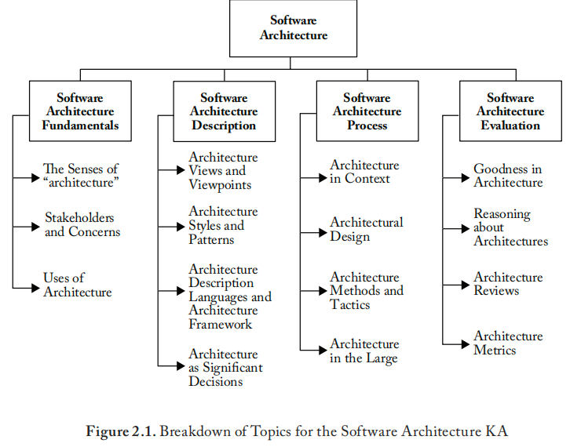
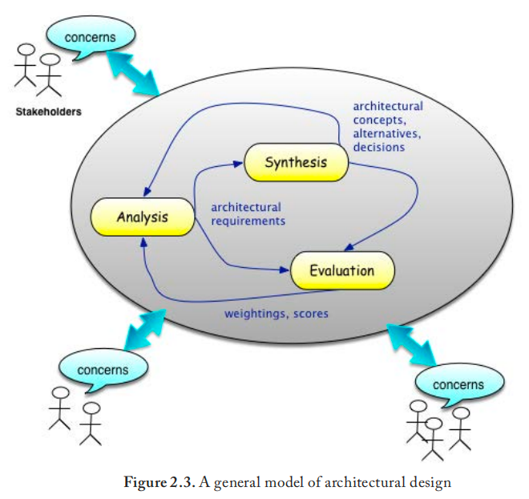

# **缩写词**

| 缩写 | 英文                                    | 中文             |
| :--- | --------------------------------------- | ---------------- |
| AD   | Architecture Description                | 架构描述         |
| ADL  | Architecture Description Language       | 架构描述语言     |
| API  | Application Programming Interface       | 应用开发接口     |
| ASR  | Architecturally Significant Requirement | 架构显性需求     |
| ATAM | Architectural Tradeoff Analysis Method  | 架构权衡分析方法 |
| IDL  | Interface Description Language          | 接口描述语言     |
| MVC  | Model View Controller                   | 模型-视图-控制器 |
| QAW  | Quality Attribute Workshop              | 质量属性研讨会   |
| RA   | Reference Architecture                  | 参考架构         |
| REST | Representational State Transfer         | 表征状态迁移     |
| SAAM | Software Architecture Analysis Method   | 软件架构分析方法 |
| UML  | Unified Modeling Language               | 统一建模语言     |

#  **引言**

​	本章从多个维度探讨软件架构：概念体系；表现形式与工作产物；环境背景、过程方法；以及分析与评估。

​	相较于前一版本，本版本将软件架构设立为独立的知识域，与软件设计知识域相分离。这是基于自20世纪90年代以来该学科领域日益显著的重要性和快速发展。

# **软件架构知识域主题分解**

​	软件架构知识域的主题分解结构如图2.1所示。

## **1. 软件架构基础**

[2*, c1] [29*, 附录C] [38*, c2] [41*, c1-3]

### **1.1 "架构"的多重含义** [2*, c2] [6*, c6.1] [29*, c6]

​	软件工程及相关学科对"架构"一词存在多重理解。

​	首先，"架构"常指一门**学科**：构建事物的艺术与科学——此处特指软件密集型系统。该学科涵盖业界已发现并采用的各类概念、原则、过程与方法。

​	其次，"架构"指实现该学科目标的各种**过程**。软件架构也被视为软件设计的组成部分，通常被理解为一个多阶段过程，可分为以下阶段：

- 架构设计阶段
- 高层设计阶段
- 详细设计阶段
  软件设计是第3章的重点，本章聚焦于架构构建过程与架构设计。

​	第三，"架构"指将架构设计学科与过程应用于软件系统设计所产生的**成果**。作为成果的架构通过架构描述进行表达，这将在"软件架构描述"主题中讨论。架构概念已不断演进，当前存在多种定义。

1990年的早期架构定义强调软件结构：

> **架构**：系统或组件的组织结构。[引自：IEEE Std 610.12–1990，IEEE软件工程术语表]

​	该定义未能充分反映架构思想的演进：例如它无法区分模块的详细设计与Makefile文件，两者都反映了软件系统或组件的组织结构，但不应都被视为架构。此外，对结构的强调常局限于代码结构，未能涵盖软件系统的所有结构：

> 系统的软件架构是理解系统所需的结构集合。这些结构包括软件元素、元素间关系以及两者的属性。[2*]

​	然而在20世纪90年代中期，软件架构逐渐发展为更广泛的学科，涉及对软件结构与架构的更通用研究。许多软件系统结构并不直接反映在代码结构中，两类结构都对系统整体产生影响：系统具备哪些行为？如何与其他系统交互？如何保证安全等属性？对软件包含多种不同结构的认识，引发了关于软件架构（以及更广义的软件设计）若干重要概念的讨论，催生出当前定义如：

> **（系统）架构**：体现在系统元素、关系中以及其设计与演进原则中的基础概念或属性，存在于系统所处环境内。[23]

​	该定义的核心思想是：(1) 架构关注软件系统的根本特性——并非所有元素、互连或接口都被视为根本；(2) 架构将系统置于其环境中考虑。与建筑学类似，软件架构具有外向性，需考虑超出系统边界的上下文环境，包括系统必须交互的人员、组织、软件、硬件及其他设备。

### **1.2 利益相关者与关注点**

[2*, c3-14] [38*, c8-9] [41*, c3]

​	软件系统拥有众多利益相关者，他们相对于系统承担不同角色并持有不同利益。这些不同利益被称作**关注点**，遵循Dijkstra的关注点分离原则：

> 请允许我尝试解释，在我看来智能思维的特征是什么。那就是：人们愿意为了自身一致性而深入孤立地研究主题的某个方面，同时始终明白自己仅专注于众多方面之一。我们知道程序必须正确，可以仅从该视角进行研究；我们也知道它应当高效，可以说改日再研究其效率。在不同情境下，我们可能自问程序是否可取，如果可取，原因何在。但试图同时处理这些不同方面并无裨益——恰恰相反！这就是我有时称为"关注点分离"的方法——即便无法完美实现，却是我所知唯一能有效梳理思想的技巧。这就是我所谓"[将]注意力聚焦于某个方面"的含义：它并非忽略其他方面，而是公正地承认从该视角看其他方面无关紧要。这需要同时具备单线程与多线程思维。[12]

​	系统的根本特性随利益相关者的关注点与角色而变化。因此，软件结构也随利益相关者角色与关注点而异（另参见《软件设计知识域》中的"设计方法"主题）。

​	软件系统的客户最关注系统何时交付以及构建与运营成本。用户最关注系统功能与使用方式。设计与编程人员则关注算法是否满足系统需求等。确保系统安全运行的责任方又持有不同的关注点。

​	关注点涵盖广泛议题，可能涉及对系统在其环境中产生影响的任何因素，包括开发、技术、业务、运营、组织、政治、经济、法律、监管、生态与社会影响。与软件需求类似，它们可分为功能类、非功能类或约束类（参见《软件需求知识域》）。关注点以多种常见形式体现，包括需求、质量属性或"特性"、涌现属性（可能是期望的或禁止的）以及各类约束（如上所列）。参见《软件质量知识域》。主题2"软件架构描述"将展示关注点如何塑造架构及描述这些架构的工作产物。关注点示例如图2.2所示。关注点并非静态存在，会随系统生命周期及技术、政策等影响因素演变而发展。例如，随着对气候变化认知的加深，能效、可持续性等关注点日益受到重视[24]。

### **1.3 架构的用途**

 [2*, c24] [38*, c30]
	软件系统架构的主要用途是为相关人员提供对系统的**共享理解**，以指导其设计与构建。架构还作为软件系统的**初步构想**，为分析与评估备选方案提供基础。第三类常见用途是支持**逆向工程**（或逆向架构），帮助相关人员在开展维护、增强或修改前理解现有软件系统。为支持这些用途，架构应予以文档化（参见"软件架构描述"主题）。

​	康威定律指出："设计系统的组织……其产生的设计必然是组织沟通结构的副本"[11]。实证研究观察到这些系统的架构往往反映其组织的沟通结构[28]。根据软件系统与组织的特性，这可能是优势也可能是弱点。架构可以增强大型团队内部的沟通，也可能损害沟通效果。组织的每个部门都可以基于对架构的了解来规划其计划、成本与进度活动。创建规划良好且文档完善的架构是提升软件设计与组件适用性和可重用性的途径之一。架构构成了程序族或软件产品线的设计基础，可通过识别族成员间的共性，并设计可重用、可定制组件以适应族成员间的可变性来实现。

## **2. 软件架构描述** 

[2*, c1.2, 22] [38*, c12-13] [40*, c6] [41*, c6-7]
	在主题1"软件架构基础"中，软件架构被定义为软件系统在其环境中的基础概念或属性。但由于视角不同，每个利益相关者对该软件系统根本特性的理解可能各异。对于小型系统和独立工作的个人，在脑海中构建系统架构模型或许可行。但对于由团队开发和运营的大型复杂系统，特别是在系统构想不断演变、人员流动的情况下，一个**具象化表示**极具价值。拥有作为工作产物的具体表示，还可作为分析架构、组织其设计及指导实施的基础。这些工作产物被称为**架构描述**。

​	架构描述为软件系统记录其架构，面向那些对软件系统持有需要通过架构解答的关注点的利益相关者。如主题1"软件架构基础"所述，主要受众包括关注系统构建的设计师、工程师和程序员。对这些利益相关者而言，架构描述是指导软件系统构建的**蓝图**。对其他人员而言，架构描述是其工作的基础——例如测试与质量保障、认证、部署、运营、维护及未来演进。

​	历史上，架构描述使用文本和非正式图表来传达架构。然而，利益相关者受众的多样性及其不同的关注点导致了架构表示形式的多样性。表示法的选择应基于需求、目的以及这些选择对需要该信息的利益相关者的效用（如可理解性、熟悉度）。这些表示通常基于相关社区或学科的现有实践进行专门化设计，以有效应对多样化的利益相关者与关注点（参见《软件设计知识域》与《软件工程模型与方法知识域》）。这些不同的表示称为**架构视图**。

### **2.1 架构视图与视点** 

[6*, c7-9] [29*, c8] [38*, c3] [40*, c6.2]
	架构视图代表架构的一个或多个方面，用以处理一个或多个关注点[38*]。视图处理不同的关注点——例如，逻辑视图（描述系统如何满足功能需求）、进程视图（描述系统如何利用并发性）、物理视图（描述系统如何部署与分布）和开发视图（描述顶层设计如何分解为实施单元、这些单元间的依赖关系以及如何构建实施）。通过视图分离关注点，使得相关利益相关者能一次聚焦于少数事项，并提供管理架构可理解性与整体复杂性的手段。

​	架构实践已从使用文本和非正式图表演变为使用更严谨的表示形式。每个架构视图使用明确定义的约定、表示法和模型来描绘系统的架构元素[38*]。每个视图的约定被记录为**架构视点**[23]。视点指导架构视图的创建、解读与使用。每个视点将利益相关者受众的关注点与一组约定相关联。在基于模型的架构构建中，每个视图均可根据其视点进行机器检查。

​	**常见视点**包括：

- 模块视点（用于从模块及其组织角度表达软件系统的实现[2*]）；*
- *组件与连接器视点（用于表达软件的大规模运行时组织与交互[2*]）；
- 逻辑视点（用于表达软件领域与能力的基础概念[25]）；
- 场景/用例视点（用于表达用户如何与系统交互[25]）；
- 信息视点（用于表达系统的关键信息元素及其访问与存储方式[38*]）；*
- *部署视点（用于表达系统如何配置与部署以进行运营[38*]）。
- 其他已记录的视点还包括可用性、行为、通信、异常处理、性能、可靠性、安全性与安全性等视点。

​	每个视点提供了讨论一组关注点及其处理机制的词汇或语言。视点语言为利益相关者提供了共享的表达方式。视点不必局限于单个软件系统，组织或应用社区可将其重用于许多类似系统。当使用统一建模语言（UML）等通用表示法时，可针对系统、其领域或相关组织进行专门化定制。（参见第2.3节架构描述语言与架构框架。）

​	除规定表示形式外，架构视点还可捕捉学科或实践社区内的工作方式。例如，软件可靠性视点捕捉了软件可靠性社区在识别与分析可靠性问题、制定备选方案以及综合与表示解决方案方面的现有实践。如同工程手册，通用和专门的视点提供了记录可重复或可重用方法以应对反复出现的软件问题的手段。Clements等人引入了**视图类型**，建立了视点的三方分类：模块视图类型、组件与连接器视图类型，以及分配视图类型[9]。

​	架构描述常使用多个架构视图来表示应对不同利益相关者各种关注点所需的多样化结构。视图构建有两种常见方法：综合法与投影法。在综合法中，架构师构建目标系统的视图，并使用对应规则将这些视图集成到架构描述中。在投影法中，架构师通过某种（可能是机械的）提取程序从单一统一模型（或"超模型"）中推导出每个视图[23]。在架构描述中引入多个视图的后果是视图间可能存在不匹配：它们是否一致？它们描述的是同一个系统吗？这被称为**多视图问题**[39]。投影法限制了不一致的可能性，因为视图是从单一（假定一致的）模型推导而来，但代价是表达能力：底层模型可能无法捕捉任意关注点。在综合法中，架构师使用链接或其他形式的可追溯性将视图集成到整体中，通过交叉引用视图元素来实现一致性[23,25]。视点通常包含建立视图间一致性或其他关系的规则。

### **2.2 架构模式、风格与参考架构**

 [2*, c2.12] [6*, c6,15] [38*, c11] [40*, c6.3] [41*, c11]
	受建筑学悠久历史的启发，**架构风格**是一种特定的构建方式，能产生软件系统的特征属性。架构风格通常表达软件系统的大规模组织结构。相比之下，**架构模式**表达在软件系统上下文中对反复出现问题的通用解决方案——它不一定适用于整个系统。设计模式的讨论参见《软件设计知识域》第4.4节。

​	已记录有多种架构风格与模式[7,39]：

- 通用结构（如分层、调用-返回、管道-过滤器、黑板、服务与微服务）
- 分布式系统（如客户端-服务器、N层、代理、发布-订阅、点对点、表征状态转移（REST））
- 方法驱动（如面向对象、事件驱动、数据流）
- 人机交互（如模型-视图-控制器、表示-抽象-控制）
- 自适应系统（如微内核、反射与元级架构）
- 虚拟机（如解释器、基于规则、过程控制）

​	**模式目录**（或模式系统）通过协调的模式集合来表达架构风格与解决方案。模式目录示例包括用于N层架构的[7]、[19]，用于面向服务架构的[13]，以及用于微服务架构的[37]。模式目录不限于架构风格，可聚焦于解决特定关注点，例如安全性[17]。

​	架构风格与模式之间并无严格界限。模式与风格都为特定情境中的具体问题提供解决方案。架构风格通过定义（子）系统的主要部分及其交互方式来表达系统或子系统的全局方面[7,38*]。架构风格可以表达为架构模式[7]。架构模式存在于不同规模层次，可能适用于系统的单个元素，也可能在整个系统中重复应用。

​	相对于为讨论软件系统各方面提供语言的架构视点，一个统一的概念是：模式与风格都是这些语言中用于表达架构（和设计，参见《软件设计知识域》第4.4节"设计模式"）特定方面的**惯用语**。架构模式或风格以特定方式使用从视点语言中提取的词汇，来讨论视图元素，包括元素与关系类型及其实例，以及对它们组合的约束[23,39]。通过这种方式，视点、模式与风格成为编码推荐实践以促进重用的机制。

​	**参考架构**是一种约束或指导其他架构的架构。作为记录的参考架构描述，参考架构为开发单个系统、产品线或系统族与应用领域的架构提供了共同基础。参考架构捕捉共性以促进开发便捷性、集成与互操作性以及其他类型的标准化。参考架构已在许多领域开发和应用，包括汽车系统、医疗保健、物联网、云计算、航空电子、制造与电信。

### **2.3 架构描述语言与架构框架** 

[2*, c22] [29*, c11] [38*, 附录] [41*, c6-7]
	**架构描述语言**ADL是用于表达软件架构的领域特定语言。ADL起源于用于大规模编程的**模块互连语言**[36]。有些ADL针对单一应用领域或架构风格（如用于事件驱动风格航空电子系统的MetaH），另一些则是通用的，旨在阐述整个企业的关注点（如ArchiMate™）。UML因其在软件设计活动中的广泛使用而常被用作架构描述语言[41*]。ADL通常提供超越描述的能力，以支持架构分析或代码生成。

​	**架构框架**捕捉"在特定应用领域和/或利益相关者社区内建立的架构描述约定、原则与实践"[23]。框架在特定领域内编码推荐实践，并实现为一组相互关联的视点或ADL。示例包括汽车行业的AUTOSAR、OMG的统一架构框架（UAF®）以及ISO开放分布式处理参考模型。

### **2.4 作为重要决策的架构**

 [38*, c8] [40*, c6.1]
	架构设计是一个创造性过程。在此活动中，架构师做出许多深刻影响架构、下游开发过程及软件系统的决策。许多因素影响决策，包括软件系统利益相关者的突出关注点、需求，以及开发期间和整个生命周期中的可用资源。对质量属性的影响及竞争性质量属性之间的权衡往往是设计决策的基础。

​	架构设计活动产生一个决策网络作为其结果，其中一些决策源自先前的决策。决策可被明确记录，并附有对每个重要决策理由的解释。决策分析提供了架构评估的一种方法。（参见主题4"软件架构评估"。）

​	**架构依据**捕捉做出架构决策的原因，包括决策前所作的假设、考虑的替代方案，以及用于选择某种方法并拒绝其他方法的权衡或标准。记录被否决的决策及其否决原因也可能有用。未来既可防止软件项目做出糟糕决策——一个因遗忘原因而先前已被否决的决策，也可使开发团队认识到相关条件已发生变化，从而重新审视该决策。

​	**架构技术债**概念的引入是为了反映：当前为架构所做的决策可能在软件系统生命周期的后期产生重大后果。延迟的决策可能损害其可维护性或未来可演化性，而这份债务必须偿还——通常由他人偿还，不一定是造成债务的人。此类债务对系统的未来开发与运营具有经济影响。例如，当软件项目时间有限时，它可能在首个版本中开发一个不太关注模块化的初始设计。缺乏模块化可能对后续版本的开发时间产生不利影响，影响开发人员，并可能损害系统的未来可维护性。后续添加功能可能需要进行大量重构，影响未来时间线并引入额外缺陷[26]。架构技术债可以像其他关注点一样，使用模型和视点进行分析与管理[27]。

## **3. 软件架构过程**

 [29*, c9] [38*, c6-7] [41*, c4]
	本节概述架构设计过程的一般模型。它用于演示架构设计如何融入软件工程过程的总体背景（参见《软件工程过程知识域》），并作为理解当前使用的多种架构方法的框架。它也认识到架构设计可在多种上下文下进行。

### **3.1 上下文中的架构** 

[29*, c12-13] [41*, c2]
	架构存在于多种上下文中。在传统生命周期中，存在一个由软件系统需求驱动的**架构设计阶段**（参见《软件需求知识域》）。有些需求将成为**架构驱动因素**，影响关于架构的重大决策，而其他需求则推迟到软件过程的后续阶段，如设计或构建。

​	在产品线或产品族设置中，基于一组基本需求、需要和其他因素开发**产品线/族架构**。该架构将成为一个或多个根据特定产品需求开发的产品实例的起点，并基于产品基线构建。

​	在敏捷方法中，通常没有专门的架构设计阶段。唯一的架构描述可能就是代码本身。在某些敏捷实践中，软件架构被认为通过基于用户故事的一系列快速开发周期来编码系统而"涌现"。虽然这种方法在以用户为中心的信息系统中取得了一些成功，但对于其他类别的应用（如嵌入式和信息物理系统），当关键架构属性可能无法通过任何用户故事阐明时，很难确保涌现出足够的架构。

​	在企业和系统与系统之间上下文中，如同在产品线和产品族中一样，总体架构（企业、系统或产品线/族的）提供了对软件架构的形式和约束的主要需求与指导。此基线可通过规范、附加需求、应用程序编程接口或一致性测试套件来强制执行。

#### **3.1.1 架构与设计的关系** 

[40*, c6] [41*, c2]
	设计与架构的界限常常模糊。有人说，架构是那些不能放心交给设计师去做的决策集合。事实上，随着软件设计学科的成熟，特别是自20世纪90年代以来，架构从软件设计中逐渐独立出来。存在多种对比：设计通常聚焦于既定需求集合，而架构往往必须通过与利益相关者谈判和需求分析来塑造需求。此外，架构通常必须识别并处理更广泛的关注点，这些关注点可能最终成为目标软件系统的需求，也可能不会。

### **3.2 架构设计** 

[2*, c19–23]
	**架构设计**是在过程中应用设计原则与方法以创建和记录软件架构的活动。执行此活动的架构方法有多种。本节描述基于[20]的各种架构方法背后的通用模型。

​	架构设计涉及识别系统的主要组件；其职责、属性与接口；以及它们之间及与环境之间的关系和交互。在架构设计中，决定了系统的基础要素，但其他方面（如主要组件的内部细节）则被推迟。

​	架构设计中的典型关注点包括：

- 总体架构风格与计算范式
- 系统大规模细化为关键组件
- 组件间的通信与交互
- 关注点与设计职责分配给组件
- 组件接口
- 对扩展性与性能属性、资源消耗属性、可靠性属性的理解与分析
- 大规模/系统级处理主导关注点的方法（如适用时的安全性与安全性）
  架构设计概览如图2.3所示。

​	架构设计是迭代的，包含三个主要活动：**分析、综合与评估**。通常，这三个主要活动在不同粒度层次上并发执行。

#### **3.2.1 架构分析** 

[2*, c19] [41, c8]
	**架构分析**收集并阐述**架构显性需求**ASR，ASR被定义为"任何影响软件系统架构的需求"[31]。架构分析基于已识别的关注点以及对软件上下文（包括已知需求、利益相关者需要和环境约束）的理解。ASR反映了架构必须解决的设计问题。通常，初始需求与已知约束的组合若必须付出成本、进度等代价才能满足。在此类情况下，通过谈判来修改输入的需求、需要与期望以使解决方案成为可能。架构分析产生ASR、初始系统级决策以及从上下文中得出的任何总体系统原则（参见"上下文中的架构"）。

#### **3.2.2 架构综合** 

[2*, c20]
	架构综合根据架构分析的成果开发候选解决方案。综合过程通过详细解决ASR识别的设计问题展开，并进行权衡以协调这些解决方案之间的相互作用。这些成果反馈至架构分析，从而产生细化的ASR、原则与决策，进而引出更详细的解决方案元素。

#### **3.2.3 架构评估** 

[2*, c21] [38*, c14]
	架构评估验证所选方案是否满足ASR，以及何时何地需要返工。架构评估方法将在主题4"软件架构评估"中讨论。

### **3.3 架构实践、方法与策略** 

[2*, c3.4] [29*, c10] [38*, c9-14]
	已有多种记录在案的架构方法（参见"延伸阅读"中的列表）。

### **3.4 大规模架构构建**

 [29*, c12, 14] [40*, c19]
	架构设计标志着生命周期的特定阶段，但仅是软件架构构建的一部分。软件架构构建并非在真空中进行，如第3.1节"上下文中的架构"所述，而是在通常包含其他架构的上下文中展开。例如，应用架构应遵循企业架构；为了在系统之系统中"良好运作"，每个组成系统的架构都应遵循系统与系统之间的架构。在此类情况下，这些关系需要反映为被构建软件上的ASR。许多软件架构构建活动与原则不仅限于软件，同样适用于系统与企业架构构建[29]。Weinreich和Buchgeher扩展了Hofmeister等人用于第3.2节"架构设计"的模型，将以下活动纳入[42]：

- 架构实施：监督实施并认证实施符合架构
- 架构维护：在实施后管理与扩展架构
- 架构管理：管理组织相互关联的架构组合
- 架构知识管理：提取、维护、共享与利用可重用架构资产，包括决策、经验教训、规范及跨组织的文档

## **4. 软件架构评估** 

[2*, c21] [38*, c14] [41*, c8]

### **4.1 架构的"优良性"** 

*[2*, c1.3, 2] [6*, c17]
	架构分析贯穿于创建与维护架构的全过程。架构评估通常由第三方在既定里程碑作为评估形式进行。

​	鉴于软件架构的多关注点、多学科性质，架构的"优良"体现在诸多方面。罗马建筑师维特鲁威主张所有建筑应具备firmitas（坚固）、utilitas（实用）和venustas（美观）的属性。对于软件系统及其架构，可以询问：

- 在其生命周期及可能的演进中是否稳健？
- 是否适合其预期用途？
- 使用该架构构建软件系统是否可行且具有成本效益？
- 即使不"美观"，对于必须构建、使用和维护软件的人员是否至少清晰易懂？

​	每个架构关注点都可作为评估的基础。评估依据需求（当可用时）或依据需要、期望与规范（在其他情况下）进行。"优良"的架构不仅应解决利益相关者的不同关注点，还应处理这些关注点相互作用的后果。例如，安全的架构可能构建与验证成本过高；易构建的架构若无法融入新技术，可能在系统生命周期内难以维护。

​	**架构权衡分析方法** [10] 提供了一种基于效用树中的质量属性及说明这些属性的场景来系统评估软件架构的方法。对竞争性质量需求及其架构方法之间的权衡分析是架构评估的关键。Clements等人描述了几种评估方法，包括ATAM、软件架构分析方法以及质量属性研讨会[10]。SARA报告定义了软件架构评估的通用框架[31]。

### **4.2 关于架构的推理** 

[38*, c10]
	每个架构关注点都有独特的评估基础。当评估基于稳健、现有的架构描述时最为有效。架构描述可被查询、检查与分析。例如，功能或行为评估受益于拥有系统该方面的明确架构视图或其他表示以供研究。可靠性、安全性与安全性等专门关注点通常依赖各自学科的专门化表示。

​	架构文档常处于未完成、不完整、过时或不存在的状态。在此类情况下，评估工作必须依赖参与者的知识作为主要信息来源。

​	**用例**常用于通过比较用例中的步骤，以及执行这些步骤可能涉及的软件架构元素，来检查架构的完整性与一致性（参见《软件工程模型与方法知识域》）[23]。

​	关于各类关注点推理的通用框架，参见Bass等人[3]。

### **4.3 架构评审** 

[2*, c21]
	架构评审是通过评估一个或多个架构关注点来评估架构状态与质量、识别风险的有效方法[1]。许多评审是非正式或基于专家经验的，有些则更具结构性，围绕待覆盖主题的检查清单组织。Parnas和Weiss提出了一种有效的评审方法，称为**主动评审** [33]，其中每个评估项都要求评审者执行特定活动以获取所需信息，而非使用检查清单。

​	许多组织已将架构评审实践制度化。例如，某行业团体开发了一个框架，用于定义、执行和记录架构评审及其结果[31]。

### **4.4 架构度量**

 [2*, c23]
	**架构度量**是架构特性的量化测量。已定义多种架构度量，其中许多源自设计或代码度量，并"提升"至适用于架构。度量包括组件依赖性、循环性与圈复杂度、内部模块复杂度、模块耦合与内聚、嵌套层级，以及对模式、风格和（必需）API使用的符合度。

​	在持续开发范式（如DevOps）中，其他度量已演进，它们不直接关注架构，而是关注过程的响应性，例如变更前置时间、部署频率、平均服务恢复时间与变更失败率等度量——作为架构状态的指标。 

|                               | **Bass** et **al. [2\*]** | **Budgen** [6\*] | **Maier ****et al. [29\*]** | **Rozanski ****et al. [38\*]** | Sommerville **[40\*]** | **Taylor**  **et al.** **[41\*]** |
| ----------------------------- | ------------------------- | ---------------- | --------------------------- | ------------------------------ | ---------------------- | --------------------------------- |
| **软件架构基础**              | c1                        |                  | 附录C                       | c2,                            |                        | c1-3                              |
| 1.1. "架构"的多重含义         | c2                        | c6.1             | c6                          |                                |                        |                                   |
| 1.2. 利益相关者与关注点       | c3-14                     |                  |                             | c8-9                           |                        | c3                                |
| 1.3. 架构的用途               | c24                       |                  |                             | c30                            |                        |                                   |
| **2. 软件架构描述**           | c1.2,22                   |                  |                             | c12-13                         | c6                     | c6-7                              |
| 2.1. 架构视图与视点           |                           | c7-9             | c8                          | c3                             | c6.2                   |                                   |
| 2.2. 架构模式、风格与参考架构 | c2.12                     | c6,15            |                             | c11                            | c6.3                   | c11                               |
| 2.3. 架构描述语言与架构框架   | c22                       |                  | c11                         | 附录                           |                        | c6-7                              |
| 2.4. 作为重要决策的架构       |                           |                  |                             | c8                             | c6.1                   |                                   |
| **3. 软件架构过程**           |                           |                  | c12-13                      | c6-7                           |                        | c4                                |
| 3.1. 情境中的架构             |                           |                  | c12-13,                     |                                |                        | c2                                |
| 3.1.1. 架构与设计的关系       |                           |                  |                             |                                | c6                     | c2                                |
| 3.2. 架构设计                 | c19–23                    |                  |                             |                                |                        | c8                                |
| 3.2.1. 架构分析               | c19                       |                  |                             |                                |                        |                                   |
| 3.2.2. 架构综合               | c20                       |                  |                             |                                |                        |                                   |
| 3.2.3. 架构评估               | c21                       |                  |                             | c14                            |                        |                                   |
| 3.3. 架构实践、方法与策略     | c3.4                      |                  | c10                         | c9-14                          |                        |                                   |
| 3.4. 大规模架构构建           |                           |                  | c12,14                      |                                | c19                    |                                   |
| **4. 软件架构评估**           | c21                       |                  |                             | c14                            |                        | c8                                |
| 4.1. 架构的"优良性"           | c1.3,2                    | c17              |                             |                                |                        |                                   |
| 4.2 关于架构的推理            |                           |                  |                             | c10                            |                        |                                   |
| 4.3 架构评审                  | c21                       |                  |                             |                                |                        |                                   |
| 4.4 架构度量                  | c23                       |                  |                             |                                |                        |                                   |

# 延伸阅读

**Perry和Wolf，《软件架构研究的基础》[34]**
Perry和Wolf的这篇奠基性论文在1992年正式发表前已非正式流传多年。它确实为软件架构学科的发展奠定了基础，引入了若干该领域的基础思想，包括：作为学科的架构；架构与设计的区分；软件架构的要素；多重视图；架构风格与类型；以及与其他领域的类比。

**Bass等人，《软件架构实践》[2\*]**
本书介绍了软件架构的概念与推荐实践，即软件如何结构化及其组件如何交互。书中详细探讨了多个质量关注点，包括：可用性、可部署性、能效、可修改性、性能、可测试性与可用性。作者提供了聚焦于架构设计、架构描述、架构评估及管理架构技术债的推荐实践。他们还强调了大型软件设计所处的业务环境的重要性，从而将软件架构置于现实环境中呈现，反映了组织面临的机会与约束。

**Kruchten，《架构的4+1视图模型》[25]**
这篇开创性论文提出了一种使用五个架构视点的架构描述方法。前四个视点用于生成逻辑视图、开发视图、进程视图和物理视图。这些视图通过选定的用例或场景进行整合以阐述架构，因此该模型形成4+1个视图。这些视图用于描述不同利益相关者（如最终用户、开发人员、项目经理）所构想的软件。

**Rozanski和Woods，《软件系统架构》[38\*]**
这是面向软件系统架构师的手册。它阐述了利益相关者、关注点、架构描述、架构视点与架构视图、架构模式与风格等关键概念，并配有实例。该书提供了端到端的架构构建过程，作者提供了一套可直接使用的实用视点目录，适用于广泛类型的系统。全书贯穿应用这些概念与方法的指导建议。

**R.N. Taylor, N. Medvidović, E. Dashofy，《软件架构：基础、理论与实践》[41\*]**
这是一本涵盖软件架构多方面的综合性教材，包括核心思想、软件工程背景下的软件架构、设计过程、架构建模、分析与可视化等章节，并专章探讨了实施、部署、适应性、非功能性属性、信任与安全等多个关注点。

**P. Clements等人，《记录软件架构：视图及其他方法（第二版）》[9]**
本书提供了捕获软件架构的最佳实践，通过指导和示例展示如何表达架构，使利益相关者能够构建、使用和维护系统。该书引入了视图（及相应视点）的三方分类法：模块视图类型、组件与连接器视图类型、分配视图类型，并为每种类型提供了大量实例。

**Brown，《开发者的软件架构》[5]**
Brown从开发者的视角概述了软件架构主题。他讨论了常见的架构驱动因素，包括架构原则、质量关注点、约束和功能需求。他深入探讨了开发环境中架构师的角色及所需知识与技能，重点关注交付过程中的架构实践问题以及风险管理。附录部分提供了一个案例研究。

**Fairbanks，《恰如其分的软件架构：风险驱动方法》[16]**
Fairbanks提出了一种在开发背景下基于风险的架构构建方法：只做足够的软件架构以缓解已识别的风险，这些风险可能源于有限的解决方案空间、极为苛刻的质量要求或潜在的高风险故障。该风险驱动方法与低形式化及敏捷方法相协调。Fairbanks认为，架构构建不仅关乎架构师，也与所有开发者密切相关。

**Erder, Pureur和Woods，《持续架构实践：敏捷与DevOps时代的软件架构》[15]**
本书展示了"经典"软件架构思想如何在当前敏捷、云原生和DevOps软件开发背景下演进，提供了关于安全性、弹性、可扩展性及新兴技术集成等一系列质量与横切关注点的实用指导。

# 参考

[1] M. Ali Babar, and I. Gorton, “Software Architecture Review: The State of the Practice”, *IEEE Computer*, July 2009.

[2*] L. Bass, P. Clements, and R. Kazman, *Software Architecture in Practice*, 4th edition, 2021.

[3] L. Bass, J. Ivers, M.H. Klein, and P. Merson, Reasoning Frameworks, CMU/SEI-2005-TR-007, 2005.

[4*] F. Brooks, *The Design of Design*, Addison-Wesley, 2010.

[5] S. Brown, Software Architecture for Developers, 2018, http://leanpub.com/software-architecture-for-developers.

[6*] D. Budgen, Software Design: Creating  Solutions for Ill-Structured Problems, 3rd Edition, CRC Press, 2021.

[7] F. Buschmann, R. Meunier, H. Rohnert, P. Sommerlad, and M. Stal, *Pattern Oriented Software Architecture*,  John Wiley & Sons, 1996

[8] H. Cervantes, R Kazman, *Designing* *Software Architectures: A Practical* *Approach*, 2nd ed., Addison-Wesley, 2024.

[9] P. Clements et al., *Documenting Software* *Architecture: Views and Beyond*, 2nd edition Addison-Wesley, 2011.

[10] P. Clements, R. Kazman, M. Klein,*Evaluating Software Architectures*, Addison-Wesley, 2001.

[11] M.E. Conway, “How Do Committees Invent?” *Datamation*, 14(4), 28-31, 1968.

[12] E.W. Dijkstra, “On the role of scientific thought”, 1974, available at https://www.cs.utexas.edu/users/EWD/transcriptions/EWD04xx/EWD447.html.

[13] T. Earl, *SOA Design Patterns*,Prentice-Hall, 2009

[14] P. Eeles, and P. Cripps, *The Process**of Software Architecting*, Addison Wesley, 2010.

[15]M. Erder, P. Pureur and E. Woods, *Continuous Architecture in Practice:* *Software Architecture in the Age of Agility* *and DevOps*, Addison-Wesley, 2021.

[16] G. Fairbanks, Just Enough Software Architecture: A Risk-Driven Approach, Marshall & Brainerd, 2010.

[17] E. Fernandez-Buglioni, Security Patterns in Practice: Designing Secure Architectures Using Software Patterns, Wiley, 2013.

[18] R.T. Fielding and R.N. Taylor, Principled design of the modern web architecture, ACM *Transactions on* *Internet Technology*, 2(2), 115–150, 2002.

[19] M. Fowler, D. Rice, M. Foemmel, E. Hieatt, R. Mee and R. Stafford, *Patterns of Enterprise Application* *Architecture*, Addison-Wesley, 2003.

[20]C. Hofmeister, P.B. Kruchten, R.L.Nord, H. Obbink, A. Ran, and P.America, “A general model of software architecture design derived from five industrial approaches”, *The* *Journal of Systems and Software*, 80,106–126, 2007.

[21] C. Hofmeister, R.L. Nord, and D. Soni,*Applied Software Architecture*, Addison Wesley, 2000.

[22] ISO/IEC/IEEE 24765:2017 Systems and Software Engineering — Vocabulary,2nd ed. 2017.

[23]ISO/IEC/IEEE 42010:2011,Systems and software engineering —Architecture description.

[24]R. Kazman, S. Haziyev, A. Yakuba,and D.A. Tamburri, Managing EnergyConsumption as an Architectural Quality Attribute, *IEEE Software*,35(5), 102–107, 2018

[25]P.B. Kruchten, The “4+1” View Model of Architecture, *IEEE Software* 12(6), 1995.

[26] P.B. Kruchten, R.L. Nord, and I. Ozkaya, *Managing Technical  Debt: Reducing Friction in Software*Development. Addison-Wesley, 2019.

[27] Z. Li, P. Liang and P. Avgeriou,Architecture viewpoints for documenting architectural technical debt. *Software Quality  Assurance*,Elsevier, 2016.

[28]Alan MacCormack, John Rusnak &Carliss Baldwin, Exploring the Duality between Product and Organizational ‘Mirroring’ Hypothesis. *Research Policy*, 41:1309–1324, 2012

[29*] M.W. Maier and E. Rechtin, *The Art of*  *Systems Architecting*, 3rd edition, CRC Press, 2021.

[30]N. Medvidović, D.S. Rosenblum,D.F. Redmiles and J.E. Robbins,Modeling software architectures in the Unified Modeling Language, ACM *Transactions on Software Engineering* *and Methodology*, 11(1), 2–57, 2002

[31] H. Obbink et al., *Report on Software**Architecture Review and Assessment* (SARA), version 1.0, available at https://philippe.kruchten.com/architecture/SARAv1.pdf, 2002. 

[32] D.L. Parnas, “On the criteria to be used in decomposing systems into modules”,*Communications of the ACM* 15(12),1053-1058, 1972.

[33] D.L. Parnas and D.M. Weiss,“Active Design Reviews: Principles and Practices”, Proceedings of 8th International Conference on Software Engineering, 215-222, 1985.

[34] D. Perry, A. Wolf, Foundations for the study of software architecture, ACM *SIGSOFT Software Engineering Notes*,17(4), 40–52, 1992

[35]E. Poort, H. van Vliet, RCDA:Architecting as a Risk- and Cost Management Discipline, *Journal of* *Systems and Software*, https://www.cs.vu.nl/~hans/publications/y2012/JSS-RCDA.pdf, 2012

[36] R. Prieto-Diaz and J.M. Neighbors,“Module Interconnection Languages”,*Journal of Systems and Software*, 6(4),307–334, 1986.

[37] C. Richardson, *Microservices Patterns*,Manning Publications, 2019

[38*] N. Rozanski and E. Woods, *Software* *Systems Architecture: Working with* *Stakeholders Using Viewpoints and* *Perspectives*, 2nd edition, Addison Wesley, 2011.

[39] M. Shaw and D. Garlan, *Software* *Architecture: Perspectives on an Emerging *Discipline*, Prentice Hall, 1996.

[40*]I. Sommerville, *Software Engineering*,  10th edition, 2016.

[41*] R.N. Taylor, N. Medvidović, E. Dashofy, *Software Architecture: Foundations, Theory,* *and Practice*, Wiley, 2009

[42]R. Weinreich and G. Buchgeher, Towards supporting the software architecture life cycle, *The Journal of Systems*and Software, 85, 546–561, 2012.