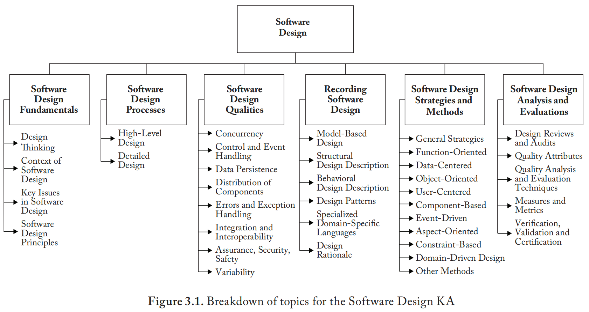

# **缩写词**

| 缩写 | 英文                                                 | 中文                   |
| :--- | ---------------------------------------------------- | ---------------------- |
| API  | Application Programming Interface                    | 应用编程接口           |
| AOD  | Aspect-Oriented Design                               | 面向切面设计           |
| CBD  | Component-Based Design                               | 基于组件设计           |
| CRC  | Class Responsibility Collaborator (Or Collaboration) | 类职责协作者（或协作） |
| DFD  | Data Flow Diagram                                    | 数据流图               |
| DSL  | Domain-Specific Language                             | 特定领域语言           |
| ERD  | Entity Relationship Diagram                          | 实体关系图             |
| FOSS | Free And Open Source Software                        | 自由开源软件           |
| IDL  | Interface Description Language                       | 接口描述语言           |
| MBD  | Model-Based Design                                   | 基于模型设计           |
| MDD  | Model-Driven Design                                  | 模型驱动设计           |
| OO   | Object-Oriented                                      | 面向对象               |
| PDL  | Program Design Language                              | 编程设计语言           |
| SDD  | Software Design Description                          | 软件设计描述           |
| SoC  | Separation of Concerns                               | 分离关注点             |
| UML  | Unified Modeling Language                            | 统一建模语言           |

#  **引言**

​	本章将从多个维度探讨软件设计——聚焦于基本概念、环境背景与过程方法、软件设计质量与策略，以及设计记录与评估。

​	"设计"一词以不同但密切相关的含义被使用，指代：(1) **学科**（"运用科学原理、技术信息及想象力，以最优经济性和效率定义执行[预设]功能的软件系统"[11]）；(2) 在该学科内执行的**过程**；(3) 应用该学科所获得的**成果**；(4) 软件系统生命周期中产出这些成果的**阶段**。

​	**软件设计描述** 是对软件设计成果的文档化记录。它是"为便于分析、规划、实施和决策而创建的软件表现形式。软件设计描述作为软件设计信息的传递媒介，可被视为系统的蓝图或模型"[11]。SDD可呈现为多种形式，涵盖软件向组件的细化、这些组件的组织方式、组件间及软件与外部世界间接口的定义——直至能够指导构建实现的详细程度。

​	将软件设计视为生命周期活动，它是软件工程学科的应用，通过分析软件需求来定义软件的外部特性和内部结构，作为软件构建的基础。

​	软件设计分三个阶段展开：

- 软件系统的**架构设计**
- 系统及其组件的**高层设计**（面向外部）
- **详细设计**（面向内部）

架构设计是架构构建的组成部分，已在《软件架构知识域》中讨论。

# **软件设计知识域主题分解**

​	软件设计知识域的主题分解结构如图3.1所示。

## **1. 软件设计基础** 

[3*] [4*]
	此处引入的概念、观念和术语构成了理解软件设计角色与范围的基础。

### **1.1 设计思维** 

[3*, c1-3] [4*, c1-2]
	设计无处不在，存在于为满足需求或解决问题而创建的事物与组织中。
	广义而言，设计可视为一种问题解决形式。例如，"棘手问题"（无确定性解决方案的问题）概念对于理解设计局限性具有重要意义。目标、约束、备选方案、表现形式和解决方案等其他众多概念帮助我们理解广义的设计。（另见《工程基础知识域》中"作为问题解决活动的设计"。）

​	设计思维包含两个核心要素：(1) 理解需求或问题，(2) 设计解决方案。Ross、Goodenough和Irvine提出了适用于软件的设计思维阐述：

> 该过程包含五个基本步骤：
>
> (1) 明确目标；
>
> (2) 构思实现目标的概念框架；
>
> (3) 设计实施概念结构的机制；
>
> (4) 引入表达机制功能及调用方式的表示法；
>
> (5) 在具体问题情境中描述表示法的使用方式以调用机制实现目标。[20]

​	这尤其契合软件设计，因为大量软件设计工作在于创建必要的词汇来表达问题、表达其解决方案并实现该方案。这些步骤强调了软件设计问题解决的语言学特性。这是我们在高层设计、详细设计和架构构建（见《软件架构知识域》"大规模架构构建"）中反复看到的模式。因此，软件设计是将问题陈述转化为解决方案陈述的实践过程。软件设计与其他类型的设计具有共性，可通过设计理论进一步理解[8]。

### **1.2 软件设计的语境** 

[4*, c13-14] [21*, c19-20]
	软件设计是软件开发过程的重要组成部分。理解软件设计的角色需要明确其如何融入软件开发生命周期（见《软件过程知识域》）。要理解该语境，必须把握软件需求、软件构建、软件测试和软件维护的主要特性与作用。语境随形式化程度、生命周期阶段等多种因素变化。

​	软件设计是将客户及其他需求、需要和关注点转化为可实施的设计规约的过程。其语境包括：

- **软件设计与软件需求的关系**：需求确立了软件设计必须解决的一系列问题。
- **软件设计与软件架构的关系**：在已建立架构的情况下，该架构通过捕获系统基本方面（如主要组件及其互连、应用程序接口、需使用的风格与模式、需遵循和执行的架构原则）来约束设计。
- **软件设计与软件构建的关系**：软件设计必须为实施者构建系统提供指导。
- **软件设计与软件测试的关系**：软件设计为确保设计正确实施和按预期运行的总体测试策略与测试用例奠定基础。

### **1.3 软件设计的关键议题**

 [3*, p69ff] [4*, c17.1.1] [21*, c6-7]
	设计软件时必须处理许多关键议题。有些是所有软件必须应对的质量关注点（性能、安全性、可靠性、可用性、可维护性等）。另一重要议题是如何细化、组织、互连和打包软件组件。这些议题至关重要，所有设计方法都以某种方式处理它们。（见《软件架构知识域》"利益相关者与关注点"主题、第1.4节"软件设计原则"及主题5"软件设计策略与方法"。）

​	相比之下，其他议题"处理软件行为的某些方面，这些方面不属于应用领域，而是涉及某些支撑领域"[2]。这类常横切系统功能的议题被称为**切面**，"往往不是软件功能分解的单元，而是以系统方式影响组件性能或语义的属性"[12]。

### **1.4 软件设计原则** 

[4*, c4.2]
	原则是"作为信念或行为体系或推理链基础的基本真理或命题"。[牛津英语词典]

​	设计原则为设计过程中的决策提供方向或指导。有些原则源于软件工程早期，其他甚至早于该学科，源自与软件无关的工程最佳实践。（见《工程基础知识域》。）决策也可借助量化方法辅助，如《软件工程经济学知识域》所述。软件设计原则是提供众多不同软件设计概念、方法和方法基础的关键观念。以下原则适用于设计的三个阶段。许多原则相互关联。无论单独使用还是结合使用，它们都体现在软件设计的其他方面，产生了设计捕获、策略和方法中的众多概念与构造。这本身也是上述设计思维过程的应用。软件设计原则包括：

- **抽象**：是"聚焦于与特定目的相关信息而忽略其余信息的对象视图"[11]。"抽象原则……有助于识别表面不同实体共有的本质属性"[20]。（另见《计算基础知识域》"抽象"主题。）
- **关注点分离**：设计关注点是"与软件设计相关的一个或多个利益相关者感兴趣的领域"[11]。通过识别和分离关注点，设计者可专注于系统各个独立的关注点，Dijkstra曾言"即使无法完美实现，[SoC]仍是有效梳理思想的唯一可用技巧"[5]。（另见《软件架构知识域》"利益相关者与关注点"主题。）
- **模块化**（或细化或分解）将大型软件构建为由较小组件或单元组成。每个组件有名称，并有定义良好的接口用于与其他组件交互。较小组件更易理解，因此更易维护。存在多种模块化策略。（见主题5"软件设计策略与方法"。）传统目标是将不同功能和职责置于不同组件中。David Parnas主张系统中每个模块应具有单一职责[17]。可将模块化视为更通用策略（如关注点分离或分治法）的特例。（见《计算基础知识域》"问题解决技术"主题。）
- **封装**（或信息隐藏）建立在抽象和模块化原则基础上，使非必要信息不易访问，让模块用户聚焦于接口的必要元素。
- **接口与实现分离**是封装的应用，涉及通过指定组件的公共接口（客户端已知且可访问）来定义组件，将组件使用与组件构建细节隔离。（见上文"封装（或信息隐藏）"。）
- **耦合**：定义为"计算机程序中模块间相互依赖程度的度量"[11]。多数设计方法主张模块应松散或弱耦合。
- **内聚**（或局部化）：定义为"模块内元素关联强度的度量"[11]。内聚强调基于相关性组织模块构成元素。多数设计方法主张模块应最大化其内聚/局部性。
- **一致性**是跨软件组件的统一性原则——应对常见或重复问题应产生通用解决方案。包括命名方案、表示法和语法、定义服务访问的接口和机制，以及元素和参数顺序。可通过规则、格式和样式等约定实现。
- **完备性**（或充分性）指确保软件组件捕获抽象的重要特征且无遗漏。完备性有多种形式，最重要的可能是针对需求的**设计完备性**：设计应足以让设计者演示如何满足需求以及后续工作如何满足这些需求。设计在软件模式和状态方面应完备。
- **可验证性**指验证设计是否符合需求及其他约束所需的信息可获取。这对任何软件都相关，但对高保障软件（如存在安全性、可靠性或安全关键关注点的软件）尤为重要。SDD应足以作为验证设计的基础。（见《软件测试知识域》和《软件质量知识域》。）
- **其他设计原则**。随着自主系统、机器学习和人工智能应用的增加，以及具有广泛社会影响的系统普遍出现，已开发出**伦理对齐设计**方法以应对普遍人类价值、政治自决、数据主体性和技术可靠性等关注点[9]。伦理对齐设计的一般原则包括：人权、福祉、数据主体性、有效性、透明度、问责制、滥用意识和能力。

 

## **2. 软件设计过程** 

[4*, c3] [21* c2, c7]
	软件设计通常被视为多阶段过程或活动。软件设计可分为以下阶段（必要时我们将阶段与一般活动加以区分）：

- 架构设计阶段
- 高层设计阶段
- 详细设计阶段

​	**架构设计阶段**处理系统整体及其与环境关系的基本要素（参见《软件架构知识域》）。

**	高层设计阶段**面向外部——构建软件的顶层结构与组织，识别其各个组件，以及软件系统及其组件如何与环境及其元素交互。

**	详细设计阶段**面向内部——以足够细节规格化每个组件，以便于其构建并满足外部义务，包括软件组件如何进一步细化为模块和单元。

​	每个阶段都体现了第1.1节"设计思维"概述的基本模式。并非所有软件过程都包含全部阶段，但当存在时，每个阶段都会对后续开发中的软件产生义务要求。

​	尽管软件开发者在各阶段活动上通常遵循相似准则，但关于必须做什么及何时做，各阶段之间并无严格界限。例如，对许多软件系统而言，在系统需求、架构描述或设计规约的约束和指导下，数据排序算法的选择会推迟至编程阶段。然而，对另一软件系统而言，合适算法的存在可能具有架构显著性，必须在生命周期早期确定。没有该算法，构建满足需求的软件将不可能实现。

​	各阶段的经验法则包括：

- **架构设计阶段**：定义计算模型、主要计算要素及其间重要协议与关系。此阶段制定应对横切关注点（如性能、可靠性、安全性和安保性）的策略，并阐明横切决策，包括系统范围的风格（如事务型N层风格与管道过滤器风格的对比及决策依据）。
- **高层设计阶段**：识别主要计算要素及其间重要关系，重点关注每个主要组件的存在性、角色和接口。该定义应足够详细，使客户端组件的设计者或程序员能够正确高效地访问各服务功能——无需阅读其代码。
- **详细设计阶段**：定义每个模块的内部结构，专注于算法、数据访问和数据表示选择的详细说明与论证。详细设计规约应足够充分，使程序员能在构建阶段编码每个模块（参见《软件构建知识域》）。代码是解决方案的表示，其详细完整程度足以让编译器（或解释器）执行。

### **2.1 高层设计** 

[3*, c5] [4*, c6]
	高层设计规定系统主要组件之间及与环境（包括用户、设备和其他系统）的交互。高层设计涉及以下方面：

- 系统必须响应的外部事件和消息
- 系统必须产生的事件和消息
- 事件和消息的数据格式与协议规格
- 输入事件/消息与输出事件/消息之间的顺序与时序关系规格
- 端到端事务和事件线程的追踪与分析
- 数据持久化（数据的存储与管理方式）

​	高层设计在系统软件架构（如有）确立的边界内进行。上述各项都可能受到架构指令的指导或约束。例如，事件信令和消息传递将使用架构建立的协议与交互模式；数据格式与协议将使用架构指定的数据与通信标准。若无明确的架构设计阶段，部分指令将由软件需求确定或在高层设计期间决定。

### **2.2 详细设计** 

[4*, c14]
	详细设计阶段在高层设计确立的约束内进行。它规定主要系统组件的内部特性、内部模块及其与其他模块的互连、它们提供的服务与过程、计算属性、算法、数据访问规则与数据结构。具体包括：

- 将主要系统组件细化为模块或程序单元，包括使用现成组件和应用框架的机会
- 将设计职责分配给模块和程序单元
- 模块间的交互
- 组件、模块和程序单元之间的作用域与可见性
- 组件模式、组件状态及其间转换
- 数据与控制相互依赖关系
- 数据组织、打包与实现
- 用户界面
- 必要的算法与数据结构

## **3. 软件设计质量** 

[4*, c4]
	软件需求与架构指令旨在引导软件获得特定特性或设计质量。设计质量是关注点的重要子类（参见《软件架构知识域》"利益相关者与关注点"主题）。设计原则（见第1.4节"软件设计原则"）的作用之一即是帮助软件实现这些质量。设计者关注的特性包括：

### **3.1 并发性**

 [21*, c17]
	并发设计关注软件如何细化为进程、任务、线程等并发单元，以及这些决策在效率、原子性、同步和调度方面的后果。

### **3.2 控制与事件处理**

 [21*, c21]
	事件处理涉及如何组织控制流，以及如何通过同步、隐式调用和回调等多种机制处理响应式事件和时序事件。

### **3.3 数据持久化**

 [21*, c6, c16]
	数据持久化涉及系统中数据的存储与管理。

### **3.4 组件分布**

 [21*, c17]
	分布设计关注软件组件如何分布在硬件（包括计算机、网络和其他设备）上，以及这些组件在满足性能、可靠性、可扩展性、可用性、可监控性、业务连续性等预期目标时如何进行通信。

### **3.5 错误与异常处理、容错性** 

[21*, c11]
	此关注点涉及如何预防、规避、缓解、容忍和处理错误及异常状况。

### **3.6 集成与互操作性**

 [4*, c11, c14, c16]
	该问题在企业或系统之系统层面，或在异构系统或应用程序需要通过数据交换或相互服务访问进行协作的任何复杂软件中出现。在软件系统内部，当组件使用不同框架、库或协议设计时也会产生该问题。

### **3.7 保障性、安全性与安保性** 

[21*, c10-14]
	高保障性涵盖多项软件质量，包括安全性和安保性关注点，涉及软件在面临危险等关键情况下是否按预期运行。对于使用不同协议和媒体进行通信的分布式应用组件，安保性成为关键关注点。安保性设计关注如何在面对系统攻击或违反系统策略时，防止未经授权的信息泄露、创建、更改、删除或拒绝访问，同时限制损害、维持服务连续性并协助修复与恢复。安保性设计涉及在可能对人类生命造成伤害或损失，或对财产或环境造成损害的情况下，对软件行为的管理。

### **3.8 可变性**

 [7*]
	可变性关注软件系统中允许的变体，这是大多数软件的基本特性[6]，指为不同市场细分或使用场景创建软件系统变体的能力。

​	可变性研究最初出现在软件产品线和系统族中，以适应和管理多种变体（如针对不同组织或市场）的部署。（参见附录B6，产品线、方法与工具标准。）它也适用于软件生态系统和情境感知软件。（另见《软件构建知识域》3.5节"构建中的复用"。）

​	特征模型用于将需求和依赖关系收集到功能包中。（参见《软件工程模型与方法知识域》中主题4.1"敏捷方法"下的特征驱动开发。）

## **4. 记录软件设计** 

[1*] [4* c7-8]
	设计过程的成果是积累的知识及记录该知识的工作产物。软件设计的工作产物捕获：

(1) 使用领域词汇描述待解决问题的各方面；

(2) 解决设计问题的解决方案词汇（见第1.1节"设计思维"）；

(3) 已作出的重大决策；

(4) 每个重要决策理由的解释。

记录重要决策的理由可增强软件产品在考虑修改或增强时的长期可维护性（见第4.6节"设计依据"）。这些通常称为设计描述或设计规约的工作产物，可采用文本、图表、模型和原型等形式，构成待实现软件的蓝图。

​	软件设计的一个基本方面是设计者之间以及与客户、实施者和其他利益相关者之间关于设计的沟通。无论是使用敏捷、传统还是形式化方法开发软件，情况都是如此。沟通方式会根据目标受众、传达的详细程度以及与利益相关者关注点的相关性而变化。例如，在使用传统或形式化方法时，设计通常通过一系列设计描述演进；而在敏捷方法中，演进的设计可能隐含在开发者的思维中，仅以代码形式显式存在。虽然后一种方法支持开发者的敏捷性，但其他利益相关者（如关注需求、认证、测试和质量保障的人员）可能需要显式的设计信息来完成工作。因此，项目应基于利益相关者受众、主题和预期用途，审慎决定需要哪些设计规约。

​	设计者可分析评估这些工作产物，以确定设计是否能满足软件的需求和约束。软件设计还审查评估替代解决方案和权衡取舍。除了将其作为构建和测试的输入与起点外，利益相关者还可利用设计工作产物规划后续活动，如系统验证与确认。

​	随着设计概念的演进，其表示方式也在演变（见第1.1节"设计思维"）；设计过程的一部分涉及为问题和解决方案创建恰当的词汇。早期阶段可能最适宜使用非正式草图。区分过程性（"工作中"）规约与最终设计产物是有益的：前者由设计团队为设计团队制作；后者可能为已知利益相关者甚至未知的未来受众制作。

​	存在多种表示法来描述软件设计制品。软件设计常使用多种类型的表示法进行。两大关注领域是**软件结构**与**软件行为**：有些用于描述设计的结构组织，其他用于表示软件的预期行为。下文将它们分类为结构性和行为性关注点的表示法（分别见第4.2节"结构性设计描述"和第4.3节"行为性设计描述"）。某些表示法主要用于架构设计阶段，其他主要用于详细设计阶段；有些在所有软件设计阶段都有用。有些表示法与特定设计方法的语境紧密相关（见《软件设计策略与方法知识域》）。

​	**统一建模语言** 是广泛使用的表示法家族，涵盖结构性和行为性关注点，应用于从架构到详细设计的所有设计阶段[1]。

### **4.1 基于模型的设计** 

[4*, c7.3] [21*, c5.5]
	在软件工程（包括架构与设计）的发展历程中，存在从基于文档的制品向基于模型的制品的演进。基于模型的设计是一种记录设计的方法，其中模型扮演重要角色。

​	这一趋势反映了基于文档制品的局限性以及自动化工具能力的提升。基于文档的制品使用自然语言和非正式图表传达设计者意图，可能引入歧义和不完整性。即使文档使用明确定义的格式，相关信息也可能分散在不同文档中，使理解与分析变得困难。通过MBD，适当的工具可以收集和组织相关信息，以可访问的形式供设计者和其他利益相关者使用。

​	现代工具加速了从文档到基于模型制品的趋势。工具支持对各种软件方面的动画或仿真、假设场景和权衡分析以及快速原型制作。工具还促进了持续测试与集成方法、增强的交互式可追溯性以及知识捕获与管理，这些在基于文档的方法中效率低下甚至不可行。

​	**模型驱动开发** 是一种使用模型作为开发过程主要制品的开发范式（见《软件工程模型与方法知识域》）。

### **4.2 结构性设计描述** 

[1*, c4-14] [7*, c4] [21*, c5.3]
	以下类型的表示法（多数为图形化）用于表示软件设计的结构性方面——即描述主要组件及其互连方式（静态视图）以及组件和模块的职责分配：

- **类图与对象图**：表示一组类、对象及其相互关系。
- **组件图**：表示一组组件（系统的可替换元素，符合并提供一组接口的实现）及其互连。组件模型从早期的模块互连语言演变为Ada和Java等编程语言的包系统，以及当前函数式语言系统（如Haskell和Coq）的复杂模块系统。
- **类职责协作者卡**：表示组件（类）的名称、其职责以及为实现这些职责而交互的组件。
- **部署图**：表示一组物理节点及其互连，以建模部署在硬件上的软件物理方面。
- **实体关系图**：表示存储在信息库中或作为接口描述一部分的数据的概念、逻辑和物理模型。
- **接口描述语言**：类编程语言，用于定义软件组件的接口（导出操作的名称和类型）。
- **结构图**：描述程序的调用结构（即显示哪些模块调用其他模块以及被哪些模块调用）。

### **4.3 行为性设计描述** 

[1*, c15-24] [4*, c9-10] [7*, c5] [21*, c5.4]
	以下表示法和语言（部分为图形化，部分为文本）用于描述软件系统及其组件的动态行为。其中许多表示法主要在详细设计阶段使用（但不限于此）。此外，行为描述可包括设计决策的理由（见第4.6节"设计依据"）。

- **活动图**：显示计算从活动到活动的流程，还可表示并发活动、其输入输出以及并发机会。
- **交互图**：描述一组对象间的交互。主要有两类：通信（或协作）图与序列图。通信图显示对象间的交互，强调其链接及在链接上交换的消息；序列图显示对象间的交互，强调消息传递的时间顺序。
- **数据流图**：显示计算元素间的数据流。DFD提供"基于信息流网络建模的描述，每个元素利用或修改流入该元素的信息"[4]。DFD还有其他用途，如安全分析（识别可能的攻击路径和机密信息泄露）。
- **决策表与决策图**：表示条件和操作的复杂组合。
- **流程图**：表示控制流及相关操作的顺序。
- **状态（转移）图与状态图**：显示状态间转移以及组件行为如何基于当前状态和对输入事件的响应而变化。
- **形式化规约语言**：主要基于数学基本概念（如类型、集合、序列、逻辑命题）的文本语言，用于严格抽象地定义软件组件接口和行为，通常以前后条件、不变量、类型检查和计算模型的形式（见《软件工程模型与方法知识域》"形式化方法"章节）。
- **伪代码与程序设计语言**：结构化、类编程语言的表示法，用于描述过程的处理行为，通常在详细设计阶段使用。这些语言的使用现今较少，但仍见于算法文档中。

### **4.4 设计模式与风格** 

[3*, c12] [4*, c15] [7*, c1-2] [21*, c7.2]
	简言之，模式是"给定上下文中常见问题的通用解决方案"[7]。设计模式包括：

- **创建型模式**（如建造者、工厂、原型、单例）
- **结构型模式**（如适配器、桥接、组合、装饰器、外观、享元、代理）
- **行为型模式**（如命令、解释器、迭代器、中介者、备忘录、观察者、点对点、发布-订阅、状态、策略、模板、访问者）

​	设计模式可用于反映过去在解决特定设计问题时证明有用的惯用法，建立解决方案词汇，以及记录和解释设计决策。它们出现在所有设计阶段，包括架构设计。通常，架构风格可视为"大规模"模式，描述贯穿软件的架构级问题的通用解决方案。（另见《软件架构知识域》主题2.2"架构风格与模式"。）

### **4.5 专用语言与领域特定语言** 

[21*, c15]
	并非所有设计表示都容易归入结构/行为二分法。例如，用户界面设计混合了用户可能看到的结构布局和基于用户操作的屏幕序列行为逻辑。安全性和可靠性等专门关注点通常有其自身的表示形式，这些形式已在相关专业社区中演进发展[21]。

​	近期的趋势是**领域特定语言**DSL的成熟以及开发DSL的广泛可用工具。在此方法中，设计过程的一部分是对特定应用领域的概念和构造进行编码，以创建该领域的计算机语言，从而使用这些构造表示设计能产生动画化或可执行的实现。DSL在这种方法中模糊了建模语言、设计语言和编程语言之间的界限。

​	目前已有针对多个领域的DSL及配套工具，包括：仿真系统；实时、响应式与分布式系统；游戏开发；用户界面设计；测试开发；以及语言处理工具。DSL的发展得益于日益强大的语法驱动工具，这些工具在给定语言定义的情况下，可为专用语言生成图形用户界面、语法检查器、代码生成器、编译器和链接器。

### **4.6 设计依据**

 [3*, c16 ] [21*, c6.1]
	一项有用的设计成果是对所采取重大决策的深入理解和显式文档记录，以及每个决策理由的解释。设计依据捕获了为何作出某项设计决策，包括先前的假设、考虑的替代方案，以及用于选择一种方法并拒绝其他方法的权衡和标准。尽管决策理由对当前设计团队可能显而易见，但对部署后修改或维护系统的人员可能不那么明显。记录依据可增强软件产品的长期可维护性。在维护期间持续捕获变更依据也有助于软件的可持续性。

​	记录被否决的决策及其否决原因也可能有用。捕获这些依据能使团队在假设、需求或约束变化时重新审视先前被否决的决策。依据的重要性可见于例如自由开源软件项目中，这些项目通常涉及人员流动频繁的大型分布式开发团队。

​	设计依据可作为软件设计描述的一部分或配套制品进行捕获。依据常以文本形式捕获，但也可使用其他表示形式，如将设计描绘为相互关联的决策网络图。

## **5. 软件设计策略与方法** 

[21*, c3]
	存在多种策略和方法来构建和指导设计过程；其中许多是从编程风格或范式演变而来。除了体现一种或多种通用策略外，大多数设计方法侧重于使一个或多个设计概念（无论是对象、方法还是事件）成为软件组织的突出主题。这些主题随后指导设计者应首先关注什么、如何进行以及如何构建模块。

### **5.1 通用策略** 

[4*, c13]
	设计过程中常用的一些通用策略包括：分治法与逐步细化策略；自顶向下与自底向上策略；基于启发式、模式和模式语言的策略；以及迭代和增量方法。

### **5.2 面向功能（或结构化）设计**

 [4*, c9]
	这是经典的软件设计方法之一。它侧重于通过细化（或分解）识别主要软件功能，并以自顶向下的方式详细阐述它们。结构化设计常遵循结构化分析，生成数据流图和相关的处理描述。各种工具支持将数据流图自动转换为高层设计。

### **5.3 数据为中心的设计**

 [4*, c9] [21*, c5.4.1]
	数据为中心的设计从程序操作的数据结构入手，而非其执行的功能。软件设计者规定输入和输出数据结构，然后开发将输入转换为输出的程序单元。已提出多种启发式方法处理特殊情况，如输入和输出结构不匹配的情况。

### **5.4 面向对象设计** 

[4*, c10]
	已提出多种基于对象的软件设计方法。该领域从20世纪80年代中期的早期面向对象设计（名词表示对象；动词表示方法；形容词表示属性）演变而来，其中继承和多态性扮演关键角色，发展到基于组件的设计领域，其中可以定义和访问元信息（例如通过反射）。尽管面向对象设计的根源源于数据抽象概念，但职责驱动设计已被提议作为面向对象设计的替代基本原则。设计策略常配有助记符，如类设计的SOLID原则（单一职责、开闭原则、里氏替换、接口隔离和依赖倒置）以及方法设计的SOFA原则（简短、单一职责、少量参数和抽象层级一致性）。

### **5.5 以用户为中心的设计** 

[3*, c9]
	以用户为中心的设计不仅是一种设计方法；它是一种多学科方法，强调深入理解用户及其需求，以此作为在其组织背景和待完成任务中设计用户体验的基础。它涉及收集用户需求、创建任务和决策的用户流程、制作代表用户界面的原型或模型，并根据原始需求评估设计解决方案[16]。

### **5.6 基于组件的设计** 

[1*, c25, c29] [4*, c11, c16] [21*, c16]
	基于组件的设计将软件系统分解为一个或多个独立组件，这些组件仅在明确定义的接口上进行通信，并符合系统范围的标准化组件模型。软件组件是一个独立单元，具有明确定义的接口和依赖关系，可以独立组合和部署。基于组件的设计处理与提供、开发和集成此类组件以提高复用性相关的问题。基于组件的设计通常强调所有组件的通用API和特定服务或职责的专用API。

### **5.7 事件驱动设计** 

[21*, c5.4.2]
	事件驱动设计是一种系统或组件通过响应事件（间接调用）来调用其操作的方法[15]。发布/订阅消息传递（广播）常被用作通过网络将事件传输给所有感兴趣订阅者的手段。发布/订阅使用称为主题的信道消息代理来保持生产者和消费者解耦。这与点对点消息传递不同，后者中发送者和接收者需要相互了解才能传递和接收消息。存在不同类型的事件处理，即简单事件处理、事件流处理和复杂事件处理。基于消息的系统通常在设计中包含可识别的发送者和接收者。事件驱动系统可能不明确标识发送者和接收者——而是每个模块在监听它们关心或需要响应的任何事件时产生事件[14]。"匿名"异步消息和事件处理是可扩展系统的良好策略。

### **5.8 面向切面设计** 

[1*, c10] [21*, c31]
	面向切面设计是一种使用切面来实现软件需求中确定的横切关注点和扩展的软件构建方法[12]。面向切面设计从面向对象设计和编程实践中演变而来。尽管它尚未成为广泛使用的设计或编程范式，但面向切面的视角经常在应用框架和软件库中使用，其中框架或库的参数可以通过切面声明进行配置。

### **5.9 基于约束的设计** 

[3*, c11]
	约束在设计过程中的作用是限制设计空间的规模，以排除不可行或不可接受的替代方案。约束加速设计，因为它们强制一些早期决策。约束可以反映对硬件、软件、数据、操作程序、接口或任何影响软件的事物施加的限制。然后可以使用搜索或回溯方法探索受约束的设计空间。基于约束的设计方法用于用户界面设计、游戏和其他应用。通常，约束满足问题可能在计算上难以处理；然而，可以使用各种基于约束的编程来近似或解决约束问题。

### **5.10 领域驱动设计** 

[4*, c13.6.2, c18.3]
	领域驱动设计是一种方法，其中设计者使用与分析人员和其他利益相关者共享的领域特定语言来描述目标软件系统。通过这种共享语言，软件需求中指定的对象、角色、事件和活动可以在软件设计描述中表达。（见《需求知识域》）。

### **5.11 其他方法** 

[21*, c18–c21]
	存在其他设计方法（见《软件工程模型与方法知识域》）。例如，迭代和自适应方法实现软件增量并减少对严格软件需求和设计的强调。面向服务的方法使用在分布式计算机上执行的Web服务构建分布式软件。软件系统通常使用来自不同提供商的服务构建，这些服务通过标准协议（如HTTP、HTTPS、SOAP）互连，旨在支持服务通信和服务信息交换。

## **6. 软件设计质量分析与评估** 

[4*, c7] [21*, c24]

### **6.1 设计评审与审计** 

[4*, c5.3]
设计评审旨在对设计进行全面检查，以评估完成状态或程度、需求覆盖范围、待解决或未决问题及潜在问题等关注点。设计评审可在设计任何阶段进行，可由设计团队、独立第三方或其他利益相关者执行。设计审计则更聚焦于特定特性清单（如功能审计）。（另见《软件质量知识域》第2.3节"评审与审计"。）

### **6.2 质量属性** 

[21*, c24]
多种属性共同构成软件设计的质量，包括各类"特性"（模块化、可维护性、可移植性、可测试性、可用性）和"性质"（正确性、健壮性）。质量是关注点的主要子集（见《软件架构知识域》"利益相关者与关注点"主题）。部分质量可在运行时观察（如性能、安全性、可用性、功能性、可用性）；其他则不能（如可修改性、可移植性、可重用性、可测试性）；还有一些（如概念完整性、正确性、完备性）可在软件设计中观察。

### **6.3 质量分析与评估技术** 

[21*, c24]
多种工具与技术可辅助分析和评估软件设计质量。（另见《软件质量知识域》"软件质量工具"主题。）

- **软件设计评审**：包括基于软件设计描述和其他设计制品的非正式与严谨技术，如架构评审、设计评审与审查；基于场景的技术；需求追溯。
- **静态分析**：可用于评估设计的形式化或半形式化静态（不可执行）分析（如故障树分析或自动化交叉检查）。若安全性是关注点，可进行设计脆弱性分析（如安全弱点的静态分析）。形式化设计分析使用数学模型，使设计者能预测行为并验证软件性能，而无需完全依赖测试。形式化设计分析可用于检测残余规约和设计错误（可能由不精确、歧义及其他错误导致）。（另见《软件工程模型与方法知识域》。）
- **仿真与原型构建**：用于评估设计的动态技术（如性能仿真或可行性原型）。

### **6.4 度量与指标** 

[4*, c5, c17] [21*, c24.5]
度量可用于评估或定量估算软件设计的各个方面，如规模、结构或质量。大多数已提出的度量基于产生设计所采用的方法（见主题5"软件设计策略与方法"）。这些度量分为两大类：

- **基于功能（结构化）的设计度量**：通过分析功能分解获得的度量；通常使用可计算多种度量的结构图（或层次图）表示。
- **面向对象的设计度量**：设计结构通常表示为类图，可在其上计算多种度量。也可计算每个类内部内容属性的度量。面向对象度量还考虑基于方法代码行数或发送消息数量的代码复杂度。

### **6.5 验证、确认与认证** 

[21*, c7-8]
系统性分析或设计评估在以下三个领域发挥重要作用：

- **验证**：确认设计满足规定需求；
- **确认**：确立设计能使系统满足其利益相关者（包括客户、用户、操作者和维护者）的期望；
- **认证**：第三方对设计符合其总体规约和预期用途的证明。
  （另见《软件质量知识域》第2.2节"验证与确认"。）

# **知识点与参考资料对照矩阵**

|                               | **Booch et al.  [1\*]   ** | Brooks  [3\*] | Budgen  [4\*]  | Gamma et al.  [7\*] | Sommervil le[21*] |
| ----------------------------- | -------------------------- | ------------- | -------------- | ------------------- | ----------------- |
| **1. 软件设计基础**           |                            | c1-3          | c1-2           |                     |                   |
| 1.1. 设计思维                 |                            | c1-3          | c1-2           |                     |                   |
| 1.2. 软件设计的语境           |                            |               | c13-14         |                     | c19-20            |
| 1.3. 软件设计的关键议题       |                            | p69ff         | c17.1.1        |                     | c6-7              |
| 1.4. 软件设计原则             |                            |               | c4.2           |                     |                   |
| **2. 软件设计过程**           |                            |               | c3             |                     | c2, c7            |
| 2.1. 高层设计                 |                            | c5            | c6             |                     |                   |
| 2.2. 详细设计                 |                            |               | c14            |                     |                   |
| **3. 软件设计质量**           |                            |               | c4             |                     |                   |
| 3.1. 并发性                   |                            |               |                |                     | c17               |
| 3.2. 控制与事件处理           |                            |               |                |                     | c21               |
| 3.3. 数据持久化               |                            |               |                |                     | c6, c16           |
| 3.4. 组件分布                 |                            |               |                |                     | c17               |
| 3.5 错误与异常处理、容错性    |                            |               |                |                     | c11               |
| 3.6 集成与互操作性            |                            |               | c11, c14, c16  |                     |                   |
| 3.7 保障性、安全性与安保性    |                            |               |                |                     | c10-14            |
| **4. 记录软件设计**           | c1-3                       |               | c7-8           |                     |                   |
| 4.1 基于模型的设计            |                            |               | c7.3,          |                     | c5.5              |
| 4.2 结构性设计描述            | c4-14                      |               | c7, c10        | c4                  | c5.3              |
| 4.3 行为性设计描述            | c15-24                     |               | c9-10          | c5                  | c5.4              |
| 4.4 设计模式与风格            |                            | c12,          | c15            | c1-2                | c7.2              |
| 4.5 专用语言与领域特定语言    |                            |               |                |                     | c15               |
| 4.6 设计依据                  |                            | c16,          | c12,           |                     | c6.1              |
| **5. 软件设计策略与方法**     |                            |               |                |                     | c3                |
| 5.1 通用策略                  |                            |               | c13            |                     |                   |
| 5.2 面向功能（或结构化）设计  |                            |               | c9             |                     |                   |
| 5.3 数据为中心的设计          |                            |               | c9             |                     | c5.4.1            |
| 5.4 面向对象设计              |                            |               | c10            |                     |                   |
| 5.5 以用户为中心的设计        |                            | c9            |                |                     |                   |
| 5.6 基于组件的设计            | c25, c29                   |               | c11, c16       |                     | c16               |
| 5.7 事件驱动设计              |                            |               |                |                     | c5.4.             |
| 5.8 面向方面设计              | c10                        |               |                |                     | c31               |
| 5.9 基于约束的设计            |                            | c11           |                |                     |                   |
| 5.10 领域驱动设计             |                            |               | c13.6.2, c18.3 |                     |                   |
| 5.11 其他方法                 |                            |               |                |                     | c18-21            |
| **6. 软件设计质量分析与评估** |                            |               | c7             |                     | c24               |
| 6.1 设计评审与审计            |                            |               | c5.3           |                     |                   |
| 6.2 质量属性                  |                            |               |                |                     | c24               |
| 6.3 质量分析与评估技术        |                            |               |                |                     | c24               |
| 6.4 度量与指标                |                            |               | c5, c17        |                     | c24.5             |
| 6.5 验证、确认与认证          |                            |               |                |                     | c7-8              |

# 延伸阅读

**布鲁克斯，《设计之设计》[3*]**
作为软件工程的先驱之一，布鲁克斯在此著作中汇集了关于软件设计各个方面的专题论文与案例研究。

# 参考

[1*] G. Booch, J. Rumbaugh, and I. Jacobson, *The Unified Modeling Language*  *User Guide*, 2nd edition, Addison Wesley, 2005. 

[2] J. Bosch, *Design and Use of Software* *Architectures: Adopting and Evolving* *a Product-Line Approach*, ACM Press, 2000.

[3*] F. Brooks, *The Design of Design*, Addison-Wesley, 2010.

[4*] D. Budgen, *Software Design: Creating*  *Solutions for Ill-Structured Problems*, 3rd Edition CRC Press, 2021.

[5] E.W. Dijkstra, On the Role of Scientific Thought. 1974. http://www.cs.utexas.edu/users/EWD/transcriptions/EWD04xx/EWD447.html.

[6] M. Galster, D. Weyns, D. Tofan, B.Michalik, and P. Avgeriou, Variability in Software Systems — A Systematic Literature Review, *IEEE Transactions on* *Software Engineering*, 40(3), 2014.

[7*] E. Gamma et al., *Design Patterns:*  *Elements of Reusable Object* *Oriented Software*, 1st ed, Addison Wesley, 1994.

[8] S. Gregor and D. Jones, The Anatomy of a Design Theory, Association for Information Systems, 2007.

[9] IEEE Std 7000™-2021, IEEE Standard Model Process for Addressing Ethical Concerns during System Design.

[10] ISO/IEC/IEEE 12207, Systems and Software Engineering — Software Life Cycle Processes.

[11] ISO/IEC/IEEE 24765:2017 Systems and Software Engineering — Vocabulary, 2nd ed. 2017.

[12] G. Kiczales et al., Aspect-Oriented Programming, *Proc. 11th European Conf.**Object-Oriented Programming* (ECOOP 97), Springer, 1997.

[13] T. Kosar, S. Bohra, M. Mernik, Domain-Specific Languages: A Systematic Mapping Study, *Information* *and Software Technology*, 71, 77-91, 2016.

[14] D. Luckham, *The Power of Events: an* *Introduction to Complex Event Processing*, Addison-Wesley, 2002.

[15] G. Mühl, L. Fiege, and P. Pietzuch, *Distributed Event-Based Systems*, Springer-Verlag, 2006.

[16] J. Nielsen, *Usability Engineering*, Morgan Kaufman, 1994.

[17] D.L. Parnas, On the Criteria To Be Used In Decomposing Systems Into Modules, *Communications of the ACM* 15(12), 1053–1058, 1972.

[18] D.L. Parnas and P.C. Clements, A Rational Design Process: How and Why to fake it, *IEEE Transactions on Software**Engineering* 12(2), 251– 257, 1986.

[19] D.L. Parnas and D.M. Weiss, Active Design Reviews: Principles and Practices, *Journal of Systems & Software* 7, 259–265, 1987

[20] D.T. Ross, J.B. Goodenough, and A. Irvine, Software Engineering: Process, Principles, and Goals, *IEEE* *Computer*, May 1975.

[21*] I. Sommerville, *Software Engineering*, 10th edition, Pearson, 2016.
