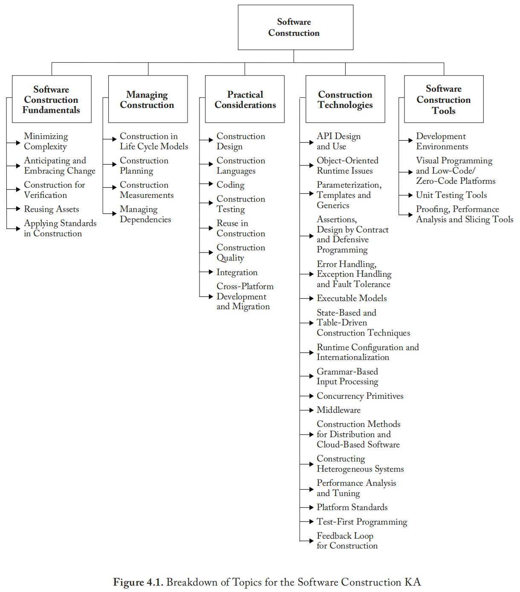

# **缩写词**

| 缩写    | 英文                                    | 中文                |
| :------ | --------------------------------------- | ------------------- |
| API     | Application Programming Interface       | 应用编程接口        |
| ASIC    | Application-Specific Integrated Circuit | 专用集成电路        |
| BaaS    | Backend As A Service                    | 后台即服务          |
| CI      | Continuous Integration                  | 持续集成            |
| COTS    | Commercial Off-The-Shelf                | 商用现成品          |
| CSS     | Cascading Style Sheets                  | 层叠样式表          |
| DSL     | Domain-Specific Language                | 特定领域语言        |
| DSP     | Digital Signal Processor                | 数字信号处理器      |
| ESB     | Enterprise Service Bus                  | 企业服务总线        |
| FPGA    | Field Programmable Gate Array           | 现场可编程门阵列    |
| GPU     | Graphic Processing Unit                 | 图形处理器          |
| GUI     | Graphical User Interface                | 图形用户界面        |
| HTML5   | Hypertext Markup Language Version 5     | 超文本标记语言第5版 |
| IDE     | Integrated Development Environment      | 集成开发环境        |
| JEE     | Jakarta Enterprise Edition              | Java企业版          |
| MDA     | Model-Driven Architecture               | 模型驱动架构        |
| NPM     | Node Package Manager                    | Node包管理器        |
| OMG     | Object Management Group                 | 对象管理组织        |
| PIM     | Platform Independent Model              | 平台无关模型        |
| POSIX   | Portable Operating System Interface     | 可移植操作系统接口  |
| PSM     | Platform-Specific Model                 | 平台相关模型        |
| SDK     | Software Development Kit                | 软件开发工具包      |
| UML     | Unified Modeling Language               | 统一建模语言        |
| WYSIWYG | What You See Is What You Get            | 所见即所得          |

# 引言

​	软件构建指通过编码、验证、单元测试、集成测试和调试对软件进行详细创建和维护的过程。软件构建知识域与其他所有知识域存在关联，但与软件设计知识域和软件测试知识域的联系最为紧密，因为软件构建过程涉及大量设计和测试活动。该过程以设计输出作为起点，并为测试环节提供输入（此处的“设计”和“测试”指具体活动而非知识域本身）。设计、构建与测试之间的边界（若存在）会因项目采用的软件生命周期流程而有所不同。

​	虽然部分详细设计可能在构建开始前完成，但大量设计工作是在构建过程中进行的。因此，软件构建知识域与软件设计知识域紧密相连。

​	同时，在整个构建过程中，软件工程师会持续进行单元测试和集成测试。因此，软件构建知识域与软件测试知识域也密切相关。

​	软件构建知识域还与配置管理、质量保证、项目管理及计算技术等领域相关，故也涉及相应的知识域。

​	首先，在软件项目中，**软件构建过程通常会生成数量最多的配置项**（如源代码文件、文档、测试用例），因此软件构建知识域与软件配置管理知识域紧密相连。

​	其次，虽然质量在所有知识域中都至关重要，但**代码是软件项目的最终交付物**，而代码正是在构建过程中产生的，因此软件质量知识域与软件构建知识域密切相关。

​	第三，虽然项目管理涉及各种软件开发任务，但**软件构建通常产出软件项目中绝大多数的可交付成果**，因此软件构建知识域与软件工程管理知识域紧密关联。

​	第四，由于软件构建需要算法知识和编码实践，该知识域与**计算基础知识域**紧密相连，后者涉及支撑软件产品设计与构建的计算机科学基础。

# **软件构建知识域主题分解**

​	软件架构知识域的主题分解如图4-1所示。

## **1. 软件构建基础**

软件构建基础包含以下原则：

- 最小化复杂度
- 预见并适应变更
- 构建可验证性
- 资产复用
- 构建中应用标准
  前四个概念既适用于设计也适用于构建。以下章节将定义这些概念并阐述其在构建中的应用。

### **1.1 最小化复杂度** 

[1, c2, c3, c7-9, c24, c27, c28, c3, 1, c32, c34]
	人脑在工作记忆中对复杂结构和信息的处理能力有限，尤其是在长时间维度上。这深刻影响着人们向计算机传达意图的方式，并驱动软件构建的一个关键目标——**最小化复杂度**。降低复杂度的需求几乎适用于软件构建的所有方面，对测试软件构建尤为关键。

​	多种类型的复杂度可能影响软件构建。工具可用于管理软件组件及其构建过程的不同层面的复杂度。例如，**圈复杂度**是衡量代码测试和理解难度的静态分析指标。该工具由Thomas J. McCabe于1976年提出，通过计算程序源代码中线性独立路径的数量进行评估。理想情况下，测试用例数应至少达到该数值。其他工具示例包括Make（用于构建应用程序）和集成开发环境（用于输入、编辑和编译代码），这些工具有助于管理构建过程的复杂度。

​	在软件构建中，降低复杂度通过创建**简洁易读的代码**（而非巧妙复杂的代码）实现。这可以通过采用标准（见3.1.5节"构建中的标准"）、模块化设计（见3.1节"构建设计"）及众多具体技术（见3.3节"编码"）来实现。聚焦构建的质量技术也支持这一目标（见3.6节"构建质量"）。

### **1.2 预见并适应变更** 

[1-c3-c5, c24, c31, c32, c34, 2-c1, c3, c9, 3-c1]
	大多数软件会随时间演进，**预见变更**驱动着软件构建的诸多方面；软件运行环境的变化也会以不同方式影响软件。预见变更有助于软件工程师构建**可扩展的软件**，使其能在不破坏底层结构的情况下增强功能。许多具体技术支持预见变更（见3.3节"编码"）。

​	此外，当今商业环境要求众多组织更频繁、更快速、更可靠地交付和部署软件。预见具体且必要的变更可能很困难，因此软件工程师应谨慎地在软件中构建**灵活性和适应性**，以便更轻松地纳入变更。这些软件开发团队应通过采用敏捷开发、践行DevOps、实施持续交付和部署实践来**适应变更**。这些实践使软件开发过程和管理与演进环境保持一致。

### **1.3 构建可验证性** 

[1-c8, c20-c23, c31, c34]
	构建可验证性是指以特定的方式构建软件，使得软件工程师在编写过程中，以及测试人员和用户在独立测试与操作活动中能够**轻松发现缺陷**。支持构建可验证性的具体技术包括：遵循编码标准以支持代码审查和单元测试；组织代码以支持自动化测试；限制使用复杂或难以理解的语言结构；以及通过日志记录软件行为。

### **1.4 资产复用** 

[2-c15]
	复用指利用现有资产解决不同问题。在软件构建中，典型的可复用资产包括框架、库、模块、组件、源代码和商业现成品资产。复用包含两个紧密相关的方面：**为复用而构建**和**通过复用构建**。前者指创建可复用的软件资产，后者指复用软件资产构建新解决方案。复用常跨越项目边界，意味着复用的资产可能来自其他项目或组织。

### **1.5 构建中应用标准**

 [1-c4]
	在构建过程中应用外部或内部的开发标准，有助于实现项目的效率、质量和成本目标。特别是，**选择允许的编程语言子集和使用标准**对实现更高安全性具有重要辅助作用。

​	直接影响构建问题的标准包括：

- **沟通方法**（如文档格式和内容标准）
- **编程语言**（如Java、C++等语言标准）
- **编码标准**（如命名约定、排版和缩进标准）
- **异常处理策略**（如异常包含信息的标准及捕获后异常处理方式）
- **平台**（如操作系统调用的接口标准）
- **工具**（如图例化标准，如UML统一建模语言的符号规范）

​	**外部标准的使用**：构建依赖于外部标准，涉及构建语言、构建工具、技术接口以及软件构建知识域与其他知识域间的交互。标准来源广泛，包括硬件和软件接口规范（如对象管理组织）及国际组织（如电气电子工程师学会、国际标准化组织）。

​	**内部标准的使用**：标准也可在组织层面或针对特定项目创建。这些标准有助于协调团队活动、最小化复杂度、预见变更和构建可验证性。

## **2. 构建管理**

### **2.1 生命周期模型中的构建** 

[1-c2, c3, c27, c29, 2-c3, c7, 3-c1]
	为描述软件开发已创建众多模型，其中部分模型较其他模型更强调构建活动。从构建视角看，某些模型（如瀑布模型和阶段交付生命周期模型）更具线性特征。这些模型将构建视为仅在完成重要前提工作（包括详细需求分析、大量设计工作和详细规划）后发生的活动。这类线性方法强调构建前的活动（需求与设计），并在活动间建立更明确的界限。在此类模型中，构建的主要侧重点可能是编码。

​	其他模型（如演进式原型和敏捷开发）则更具迭代性。这些方法将构建视为与其他软件开发活动（包括需求、设计和规划）**并发或重叠**进行的活动。它们融合设计、编码和测试活动，并常将这些活动组合视为构建（参见软件工程管理和软件过程知识域）。

​	持续交付和部署实践进一步融合了编码、测试、交付和部署活动。在这些实践中，构建活动期间进行的软件更新会持续交付并部署到生产环境。整个过程通过由各种测试和部署活动组成的**部署流水线**实现完全自动化。

​	因此，构建的具体定义取决于所采用的生命周期模型。一般而言，软件构建主要包括编码和调试，但也涉及构建规划、详细设计、单元测试、集成测试及其他活动。

### **2.2 构建规划** 

[1-c3, c4, c21, c27-c29]
	**构建方法的选择**是构建规划活动的关键环节。这一选择影响构建前提工作的执行程度、执行顺序以及应在构建工作开始前完成的程度。

​	构建方法会影响项目团队在降低复杂度、预见变更和构建可验证性方面的能力。每个目标也可在过程、需求和设计层面解决，但构建方法的选择将对其产生影响。

​	构建规划还根据所选方法确定：组件的创建与集成顺序、集成策略（如阶段式或增量式集成）、软件质量管理流程、任务分配给特定软件工程师的方式，以及其他相关任务。

### 2.3 构建度量

 [1-c25, c28]
	可对众多构建活动和制品进行度量，包括：开发、修改、复用和删除的代码量；代码复杂度；代码审查统计；缺陷修复与发现率；工作量；进度安排等。这些度量有助于构建管理、确保构建过程中的质量及改进构建过程等（更多关于度量的内容参见软件工程过程知识域）。

### **2.4 依赖管理** 

[2-c25]
	软件产品常严重依赖内部和外部（商业或开源）依赖项，这使开发者能复用通用功能而非重复开发，从而显著提升开发效率。此外，包管理器（如Java的Maven和JavaScript的NPM）被广泛用于自动化安装、升级、配置和移除依赖项的过程。

​	软件产品的直接和间接依赖构成**依赖供应链网络**。供应链网络中的任何依赖都可能给软件产品带来潜在风险，需由开发者或工具进行管理。应避免不必要的依赖以提高构建效率；避免依赖项与软件产品间的许可证冲突以降低法律风险；防止依赖项的缺陷或漏洞传播到软件产品中以提升软件质量；应建立规范与监控机制以防止开发者引入不可信的外部依赖。

## **3. 实践考量**

​	构建是一项软件工程师常需应对现实世界中混沌、多变甚至相互冲突约束的活动。正因现实约束，实践考量对构建的驱动作用超过其他知识域，且相较于其他活动，软件工程在构建活动中最具**工艺性**。

### **3.1 构建设计** 

[1-c3, c5, c24, 2-c7]
	部分项目将大量设计活动分配至构建阶段，而其他项目则将设计分配至明确聚焦设计的专门阶段。无论具体分配方式如何，**某些详细设计工作必然发生在构建层面**，且该设计工作受软件所解决现实问题的约束支配。

​	正如建筑施工人员需根据计划中未预见的间隙进行微调，软件构建者也必须在构建过程中对软件设计细节进行大小调整。构建层面的设计活动细节本质上与软件设计知识域所述相同，但其应用于更小规模的算法、数据结构和接口。

### **3.2 构建语言** 

[1-c4]
	构建语言涵盖人类用于指定问题可执行解决方案的所有沟通形式。因此，构建语言及其实现（如编译器）可影响性能、可靠性和可移植性等软件质量属性，甚至可能**严重引发安全漏洞**。

​	最简单的构建语言是**配置语言**，软件工程师通过有限预定义选项创建新软件或定制安装。Windows和Unix操作系统中使用的基于文本的配置文件即属此类，某些程序生成器的菜单式选择列表也属配置语言。

​	**工具包语言**用于从工具包（应用特定的可复用部件集成集）元素构建应用，较配置语言更复杂。工具包语言可明确定义为应用程序编程语言，或通过工具包接口集隐含定义应用。

​	**脚本语言**是常用的应用程序编程语言，部分脚本语言中脚本被称为批处理文件或宏。

​	**编程语言**是最灵活的构建语言，但也包含最少的特定应用领域和开发过程信息，因此需要最多的培训与技能才能有效使用。编程语言选择**极大影响编码期间引入漏洞的可能性**（例如从安全角度看，C/C++库函数的不安全使用存在风险）。

​	编程语言使用三种通用表示法：

- **语言学表示法**（如C/C++、Java）
- **形式化**（如Event-B）
- **可视化**（如MATLAB）

​	语言学表示法特别通过文本字符串表示复杂软件结构，其模式组合可具备类句法结构。正确使用时，每个字符串应具有强烈语义内涵，使人直观理解软件执行时的行为。

​	形式化表示法较少依赖词语和文本字符串的日常直觉含义，更多依赖由精确、无歧义和形式化（或数学）定义支撑的定义。形式化构建表示法和方法是大多数系统编程表示法的语义基础，其中准确性、时间行为和可测试性比映射到自然语言的便利性更重要。形式化构建还使用精确定义的符号组合方式，避免了许多自然语言结构的歧义。

​	可视化表示法较少依赖语言式和形式化构建的文本表示，更多依赖对代表底层软件的视觉实体的直接视觉解读与布局。可视化构建因仅通过屏幕上图标排列实现"复杂"语句的困难而受限。但在主要编程任务是构建和"调整"程序可视化界面，且其详细行为具有底层定义的情况下，这些图标是强大工具。

​	当前，**领域特定语言** 广泛用于构建领域特定应用。与C/C++或Java等通用编程语言不同，DSL专为特定领域的应用构建设计。因此，DSL通常可基于目标领域更高层抽象定义，并能为特定问题类别优化。此外，DSL通常可通过领域特定概念和规则定义的可视化表示法表达。

### **3.3 编码** 

[1-c5-c19, c25-c26]
	软件构建编码活动需考虑以下方面：

- 创建可理解源代码的技术，包括命名约定和源代码布局
- 类、枚举类型、变量、命名常量等实体的使用
- 控制结构的使用
- 错误条件处理（包括预期和异常情况，如错误数据输入）
- 防止代码级安全漏洞（如缓冲区溢出或数组越界）
- 通过互斥机制和序列化可复用资源（包括线程和数据库锁）访问规范实现资源管理
- 源代码组织为语句、例程、类、包或其他结构
- 代码文档化
- 代码调优

### **3.4 构建测试** 

[1-c22, c23, 2-c8]
	构建包含两种测试形式（通常由编写代码的软件工程师执行）：**单元测试**和**集成测试**。构建测试旨在缩短缺陷植入代码与被发现的时间差，从而降低修复成本。某些情况下测试用例在编码后编写，其他情况下可能先于编码创建。

​	构建测试通常涉及软件测试知识域所述多种测试类型的子集，一般不包含系统测试、Alpha测试、Beta测试、压力测试、配置测试、可用性测试或其他更专业的测试。已发布两项构建测试标准：IEEE 829-2008《软件测试文档标准》和《软件单元测试标准》。更多专业参考资料参见软件测试知识域第2.1.1和2.1.2节。

### **3.5 构建中的复用** 

[2-c15, c16]
	构建中的复用包括**为复用而构建**和**通过复用构建**。

​	**为复用而构建**以基于多系统的广阔视角创建具有未来复用潜力的软件，通常基于可变性分析和设计。为避免代码克隆问题，开发者应将可复用代码片段封装到结构良好的库或组件中。

​	编码和测试期间为复用而构建的相关任务包括：

- 通过参数化、条件编译和设计模式等机制实现可变性
- 封装可变性使软件资产易于配置和定制
- 测试可复用软件资产提供的可变性
- 描述和发布可复用软件资产

​	**通过复用构建**指通过复用现有软件资产创建新软件。最常用的复用方法是复用语言、平台、工具或组织仓库提供的库代码。此外，当今许多应用使用第三方开源库。复用和现成软件通常具有与新建软件相同（或更高）的质量要求（如安全级别要求）。

​	编码和测试期间通过复用构建的相关任务包括：

- 选择可复用单元、数据库、测试过程或测试数据
- 评估代码或测试的可复用性
- 将可复用软件资产集成到当前软件中
- 报告新代码、测试过程或测试数据的复用信息

​	可复用软件资产形式不限于必须本地集成的软件制品。当前，通过RESTful PI等在线接口提供各类服务的**云服务**在应用中被广泛使用。在新的BaaS（后端即服务）云服务模型中，应用将其后端实现委托给云服务提供商——例如身份验证、消息传递和存储等实用程序通常由云提供商提供。

​	复用最好根据明确定义、可重复的过程系统化实践。系统化复用能显著提升软件生产力、质量和成本效益。系统化复用受到软件产品线工程及各种软件框架和平台等方法论支持。广泛使用的框架（如Spring）为企业应用提供可复用基础设施，使软件团队能专注于特定应用业务逻辑。商业平台提供各种可复用框架、库、组件和工具以支持应用开发，构建其生态系统。

### **3.6 构建质量** 

[1-c8, c20-c25, 2-c8, c24]
	除需求和设计活动中产生的缺陷外，构建期间引入的缺陷可能导致严重质量问题（如安全漏洞），不仅包括安全功能缺陷，还包括允许绕过安全功能或产生其他安全弱点或违规的其他缺陷。

​	存在多种技术可确保代码在构建过程中的质量，主要技术包括：

- 单元测试和集成测试（见3.4节"构建测试"）
- 测试驱动开发（见软件测试知识域6.1.2节）
- 断言和防御式编程的使用
- Debug调试
- 审查
- 技术评审（包括安全导向评审，见软件质量知识域2.3节）
- 静态分析（见软件质量知识域2.2.1节）

​	具体技术选择取决于所构建软件及执行构建活动的软件工程师技能集。程序员应了解良好实践和常见漏洞（如来自广泛认可的常见漏洞列表）。多种常见编程语言已提供针对安全弱点的自动化静态代码分析。

​	构建质量活动与其他质量活动的区别在于其**关注焦点**：这些活动聚焦于与代码密切相关的制品（如详细设计），而非与代码直接关联较少的制品（如需求、高层设计和计划）。

### **3.7 集成** 

[1-c29, 2-c8, 3-c11]
	构建期间的关键活动是将独立构建的例程routine、类、组件和子系统**集成为单一系统**。此外，特定软件系统可能需要与其他软件或硬件系统集成。

​	构建集成的相关考量包括：规划组件集成顺序、确定所需硬件、创建支持软件临时版本的脚手架、确定集成前对组件执行的测试和质量工作程度，以及确定项目中测试软件临时版本的时间点。

​	程序可通过**阶段式**或**增量式**方法集成。阶段式集成（也称大爆炸式集成）将组件软件部分的集成延迟到版本计划所有部分完成。增量式集成被认为较传统阶段式集成具有诸多优势（如更易定位错误、改进进度监控、更早产品交付和改善客户关系）。在增量式集成中，开发者以小片段编写测试程序，然后逐个组合片段。通常需要额外测试基础设施（如桩模块、驱动模块和模拟对象）以实现增量式集成。此外，通过逐单元（如类或组件）构建集成，构建过程能为开发者和客户提供早期反馈。

​	当前，**持续集成**CI 已在实践中广泛采用。使用CI的软件团队频繁集成其工作，通常每日进行多次集成。CI通常通过自动化流水线实现，流水线构建并测试每次集成以检测错误并提供快速反馈。

### **3.8 跨平台开发与迁移** 

[4-c]
	某些应用（如移动应用）严重依赖特定平台（如苹果、安卓），这些平台通常包括操作系统、开发框架和API。为支持多平台，开发者需要使用相应编程语言和软件开发工具包为每个目标平台单独开发和构建应用。但这种方式的多平台开发需要更多时间和成本，且可能导致不同实现间的用户体验差异。

​	**跨平台开发**允许开发者使用通用语言开发应用并将其导出到不同平台。移动应用通常可通过两种方式实现：一种是通过能将通用语言编译为平台特定格式的工具生成原生应用；另一种是开发**混合应用**，将使用HTML5和CSS等语言开发的Web应用与针对不同操作系统的原生容器或包装器结合。

​	对于非以此方式开发的应用，开发者可考虑将应用从一个平台迁移到另一平台。迁移通常涉及不同编程语言和平台特定API的转换，并可通过工具实现部分自动化。

## **4. 构建技术**

### **4.1 API设计与使用** 

[5-c7]
	API是一组签名的集合，这些签名被导出并可供库或框架的用户用于编写应用程序。除了签名，API应始终包含关于程序效果和/或行为（即其语义）的声明。

​	API设计应使API易于学习和记忆、产生可读代码、难以误用、易于扩展、保持完整并维持向后兼容性。由于广泛使用的库或框架的API通常比其实现更持久，API应保持简洁稳定，以便于客户端应用程序的开发和维护。

​	API使用涉及选择、学习、测试、集成以及可能扩展库或框架提供的API（见3.5节"构建中的复用"）。

​	对于RESTful API等在线接口，OpenAPI等开放标准发挥重要作用。OpenAPI为HTTP API定义了与语言无关的标准接口，支持服务器端和客户端代码的自动生成，涵盖Java、JavaScript、Python等流行语言。同时，**API优先方法**已被广泛采用，该方法强调首先设计和构建应用程序的API。实践中，API优先方法通常通过使用API描述语言来建立API预期行为的契约。

### **4.2 面向对象运行时问题** 

[1-c6, c7]
	面向对象语言支持运行时机制，包括**多态性**和**反射**。这些运行时机制提高了面向对象程序的灵活性和适应性。

​	多态性是语言在运行时才知道软件将包含何种具体对象的情况下支持通用操作的能力。由于程序预先不知道对象类型，确切行为在运行时确定（称为动态绑定）。

​	反射是程序在运行时观察和修改其结构和行为的能力。例如，反射允许在运行时检查类、接口、字段和方法而无需在编译时知道其名称，还允许在运行时实例化新对象并使用参数化的类名和方法名调用方法。

### **4.3 参数化、模板与泛型** 

[6-c1]
	参数化类型（在Ada、Java、Eiffel中称为泛型，在C++中称为模板）允许在不指定所使用的所有其他类型的情况下定义类型或类，未指定的类型在使用时作为参数提供。参数化类型提供了在面向对象软件中组合行为的第三种方式（除类继承和对象组合外）。

### **4.4 断言、契约式设计与防御式编程** 

[1-c8, c9]
	断言是置于程序中的可执行谓词（通常是例程或宏），对程序执行运行时检查。断言在高可靠性程序中特别有用，使程序员能更快发现接口假设不匹配、代码修改时潜入的错误等问题。断言通常在开发时编译到代码中，随后从代码中编译移除以避免性能下降。

​	**契约式设计**是一种开发方法，其中为每个例程包含前置条件和后置条件。当使用前置和后置条件时，每个例程或类被认为与程序其余部分形成契约。契约精确规定例程的语义，从而有助于澄清其行为。契约式设计被认为能提高软件构建质量。

​	**防御式编程**指保护例程免受无效输入破坏。处理无效输入的常用方法包括检查所有输入参数值并决定如何处理错误输入。断言常用于防御式编程检查输入值。

### **4.5 错误处理、异常处理与容错**

 [1-c8, c9]
	错误处理方式影响软件满足正确性、健壮性及其他非功能性属性相关要求的能力。断言有时用于检查错误。其他错误处理技术包括返回中性值、替换下一个有效数据、记录警告消息、返回错误代码或关闭软件。

​	**异常**用于检测和处理错误或异常事件。异常的基本结构如下：例程routine使用throw抛出检测到的异常，异常处理块将在try-catch块中捕获异常。try-catch块可处理错误条件或将控制权返回调用例程。异常处理策略应遵循以下常见原则精心设计：在异常消息中包含导致异常的所有信息；避免空catch块；了解库代码抛出的异常；可能构建集中式异常报告器；标准化程序对异常的使用。

​	**容错**是通过检测错误然后从中恢复或如果无法恢复则控制其影响来提高软件可靠性的技术集合。最常见的容错策略包括备份重试、使用辅助代码和投票算法、以及用具有良性效果的虚假值替换错误值。

### **4.6 可执行模型**

 [7]
	可执行模型抽象了特定编程语言的细节和关于软件组织的决策。与传统软件模型不同，使用可执行建模语言（如xUML）构建的规约可在不改变的情况下部署到各种软件环境中。此外，可执行模型编译器（转换器）可使用关于目标硬件和软件环境的一组决策将可执行模型转换为实现。因此，构建可执行模型是构建可执行软件的一种方式。

​	可执行模型是支持OMG模型驱动架构计划的基础之一。可执行模型是指定平台无关模型的一种方式；PIM是不依赖任何实现技术的问题解决方案模型。然后可通过将PIM与其依赖的平台编织在一起来生成包含实现细节的**平台特定模型**。

### **4.7 基于状态和表驱动的构建技术** 

[1-c18]
	**基于状态的编程**（或自动机编程）是使用有限状态机描述程序行为的编程技术。状态机的转移图用于软件开发的各个阶段（规约、实现、调试和文档）。主要思想是以自动化技术流程的相同方式构建计算机程序。基于状态的编程通常与面向对象编程结合，形成称为基于状态的面向对象编程的新复合方法。

​	**表驱动方法**是使用表来显示信息而非用逻辑语句（如if和case）传达信息的方案。在适当情况下使用时，表驱动代码比复杂逻辑更简单且更易修改。使用表驱动方法时，程序员解决两个问题：在表中存储什么信息以及如何高效访问表中信息。

### **4.8 运行时配置与国际化** 

[1-c3, c10]
	为实现更高灵活性，程序常被构建为支持其变量的**延迟绑定时间**。例如，运行时配置通过及时模式更新和读取配置文件在程序运行时绑定变量值和程序设置。

​	**国际化**是为程序（通常是交互式软件）支持多区域设置的技术活动。相应活动**本地化**修改程序以支持特定本地语言。交互式软件可能包含数十或数百个提示、状态显示、帮助消息、错误消息等。设计和构建过程应适应字符串和字符集问题，包括使用何种字符集、使用何种字符串、如何在不更改代码的情况下维护字符串以及如何以对处理代码和用户界面影响最小的方式将字符串翻译成不同语言。

### **4.9 基于语法的输入处理** 

[1, 8]
	基于语法的输入处理涉及输入标记流的语法分析（或解析），包括创建表示输入数据的**数据结构**（称为解析树或语法树）。解析树的中序遍历通常给出刚解析的表达式。接下来，解析器检查符号表以获取填充树的程序员定义变量。构建解析树后，程序将其用作计算过程的输入。

### **4.10 并发原语** 

[9-c6]
	**同步原语**是编程语言或操作系统提供的编程抽象，用于促进并发和同步。众所周知的并发原语包括信号量、管程和互斥锁。

​	**信号量**是受保护的变量或抽象数据类型，为并发编程环境中多个进程或线程控制对公共资源的访问提供简单但有效的抽象。

​	**监视器**是抽象数据类型，呈现一组以互斥方式执行的程序员定义操作。管程包含共享变量的声明以及对那些变量进行操作的过程或函数。管程结构确保一次只有一个进程在管程中处于活动状态。

​	**互斥锁**是同步原语，一次只授予一个进程或线程对共享资源的独占访问权。

### **4.11 中间件** 

[5-c1, 8-c8]
	**中间件**是为操作系统层之上但应用程序层之下的软件提供服务的广泛分类。中间件可为软件组件提供运行时容器以提供跨网络的消息传递、持久性和透明位置。中间件可视为使用中间件的组件之间的连接器。现代面向消息的中间件通常提供支持多个软件应用之间面向服务的交互和通信的**企业服务总线**。

### **4.12 分布式和基于云软件的构建方法** 

[2-c17, c18, 9-c2]
	分布式系统是物理分离的可能异构计算机系统的集合，通过网络连接使用户能够访问系统维护的资源。分布式软件的构建与传统软件构建的区别在于并行性、通信和容错等问题。

​	分布式编程通常分为几个基本架构类别：客户端-服务器、三层架构、N层架构、分布式对象、松耦合或紧耦合（见《计算基础知识域》第5.6节和《软件架构知识域》第2.2节）。

​	当前，更多应用迁移到云端。基于云的软件通常采用**微服务架构**和基于容器的部署。除了传统的分布式软件问题，基于云的软件开发人员还需要考虑云基础设施问题，如API网关的使用、服务注册和发现。

​	基于N层/面向服务架构的分布式系统通常依赖**ACID分布式事务**来实现涉及多个分布式组件的事务。相比之下，基于云的微服务无法强制执行分布式事务一致性，并使用某种形式的基于SAGA的最终一致性，最初用于长时间运行的事务。

### **4.13 异构系统构建** 

[8-c9]
	异构系统由各种不同类型的专用计算单元组成，如图形处理单元、数字信号处理器、微控制器和外设处理器。这些计算单元独立控制并相互通信。嵌入式系统通常是异构系统。

​	异构系统的设计可能需要结合多种规约语言来设计系统的不同部分（硬件/软件协同设计）。关键问题包括多语言验证、协同仿真和接口。

​	在硬件/软件协同设计期间，软件和虚拟硬件开发通过逐步分解并发进行。硬件部分通常在**现场可编程门阵列**或**专用集成电路**中仿真。软件部分被转换为低级编程语言。

### **4.14 性能分析与调优** 

[1-c25, c26]
	由架构、详细设计决策以及数据结构和算法选择决定的**代码效率**影响执行速度和大小。性能分析使用程序执行时收集的信息调查程序行为，以识别程序中可能改进的热点。

​	**代码调优**在代码级别提高性能，修改代码使其运行更高效。代码调优通常只涉及影响单个类、单个例程或更常见的几行代码的小更改。存在丰富的代码调优技术集，包括用于调优逻辑表达式、循环、数据转换、表达式和例程的技术。使用低级语言是改进程序中热点的另一种常用技术。

### **4.15 平台标准** 

[4-c, 8-c10, 9-c1]
	平台标准使程序员能够在兼容环境中开发无需更改执行的便携式应用程序。平台标准通常涉及兼容平台实现必须使用的标准服务和API。平台标准的典型示例包括：雅加达企业版；用于操作系统的可移植操作系统接口标准（主要针对基于Unix的操作系统实施的一组标准）；以及定义可在不同环境（如苹果iOS、安卓）上运行的Web应用程序开发标准的HTML5。

### **4.16 测试驱动编程** 

[1-c22, 2-c8]
	**测试驱动编程**（也称为TDD-测试驱动开发）是一种流行的开发风格，其中测试用例在任何代码之前编写。这些测试用例应用于当前代码库时将失败。然后编写允许测试用例通过的代码。此时，可以对新代码和项目的相关部分进行重构和优化。测试驱动编程通常比传统编程风格能更早检测缺陷并更容易纠正。此外，首先编写测试用例迫使程序员在编码前思考需求和设计，从而更早暴露需求和设计问题。

### **4.17 构建的反馈循环** 

[3-c3, c16]
	构建活动的早期和持续反馈是敏捷开发和DevOps最重要的优势之一。敏捷开发通过开发过程中的频繁迭代为构建提供早期反馈。DevOps提供来自运营的更快速反馈，使开发人员能够了解其代码在生产环境中的表现情况。这种快速反馈通过DevOps流水线中的技术和实践实现，如自动化构建和测试、金丝雀发布和A/B测试。

## **5. 软件构建工具**

### **5.1 开发环境** 

[1-c30]
	**开发环境**（或称集成开发环境）通过集成一组开发工具为程序员提供全面的软件构建设施。程序员对开发环境的选择会影响软件构建效率和质量。

​	除基本代码编辑功能外，现代IDE常提供其他特性，如编辑器内编译和错误检测、与源代码控制的集成、构建/测试/调试工具、程序的缩略图或大纲视图、自动化代码转换以及重构支持。

​	当前，基于云的开发环境已在公共或私有云服务中提供。这些环境可提供现代IDE的所有功能甚至更多（如容器化构建和部署），并由云计算提供支持。

​	此外，现代IDE常配备**AI辅助编程功能**，这些功能受益于大型语言模型的最新进展。在LLM支持下，程序员可在伪代码注释中定义函数或将其实现大纲作为提示，由LLM生成或补全代码。程序员让LLM完成许多细节，但仍审查生成的代码并将其集成到项目中。

### **5.2 可视化编程与低代码/零代码平台** 

[1-c30]
	**可视化编程**允许用户通过图形化操作可视化程序元素来创建程序。作为可视化编程工具，**GUI构建器**使开发者能够以所见即所得模式创建和维护图形用户界面。GUI构建器通常包含可视化编辑器，使开发者能够设计表单和窗口，并通过拖放和参数设置功能管理小部件的布局。部分GUI构建器能自动生成与可视化GUI设计对应的源代码。由于GUI应用通常遵循事件驱动风格（事件和事件处理决定程序流程），GUI构建器工具通常提供代码生成助手，自动化事件处理所需的最重复任务。支持性代码将小部件与触发提供应用逻辑功能的传入和传出事件连接。部分现代IDE提供集成的GUI构建器或GUI构建器插件，也存在许多独立的GUI构建器。

​	可视化编程和其他快速应用开发工具已演变为**低代码/零代码平台**。这些平台允许开发者通过拖放界面以最少量手动编码可视化构建完整应用。它们通常基于模型驱动设计、可视化编程和代码生成的原则。低代码开发与零代码开发的区别在于手动编码量：前者需要少量手动编码，后者几乎不需要。

### **5.3 单元测试工具** 

[1-c22, 2-c8]
	**单元测试**验证软件模块与其他可独立测试的软件元素（如类、例程、组件）隔离时的功能。单元测试常被自动化。开发者可使用单元测试工具和框架来扩展和创建自动化测试环境。例如，开发者可通过单元测试工具和框架将标准编码到测试中，以验证单元在各种数据集下的正确性。每个测试实现为一个对象，测试运行器运行测试。失败的测试用例在测试执行期间自动标记和报告。

### **5.4 性能分析、性能剖析与切片工具** 

[1-c25, c26]
	性能分析工具通常用于支持代码调优。最常见的性能分析工具是**性能剖析工具**。执行性能剖析工具在代码运行时监控并记录每条语句的执行频率或程序在每个语句或执行路径上花费的时间。运行时剖析代码可深入了解程序工作原理、热点位置以及开发者应集中进行代码调优的位置。

​	**程序切片**涉及计算可能影响特定关注点处指定变量值的程序语句集（即程序切片），该关注点称为切片准则。程序切片可用于定位错误源、程序理解和优化分析。程序切片工具使用静态或动态分析方法为各种编程语言计算程序切片。

# **知识点与参考资料对照矩阵**

|                                   |              McConnell 2004[1]              | Sommerville, 2016 [2] | Kim et al., 2021 [3] | Heitkötter et al., 2013 [4] | Clements   et al., 2010 [5] | Gamma et al. 1994 [6] | Mellor and Balcer, 2002 [7] | Null and Lobur, 2018 [8] | Silberschatz   et al., 2008 [9] |
| --------------------------------- | :-----------------------------------------: | :-------------------: | :------------------: | :-------------------------: | :-------------------------: | :-------------------: | :-------------------------: | :----------------------: | :-----------------------------: |
| 1.软件构建基础                    |                                             |                       |                      |                             |                             |                       |                             |                          |                                 |
| 1.1最小化复杂度                   | c2, c3, c7-c9, c24, c27, c28, c31, c32, c34 |                       |                      |                             |                             |                       |                             |                          |                                 |
| 1.2预见并适应变更                 |          c3-c5, c24,c31, c32, c34           |      c1, c3, c9       |          c1          |                             |                             |                       |                             |                          |                                 |
| 1.3构建可验证性                   |            c8, c20-c23, c31, c34            |                       |                      |                             |                             |                       |                             |                          |                                 |
| 1.4复用                           |                                             |          c15          |                      |                             |                             |                       |                             |                          |                                 |
| 1.5构建中应用标准                 |                     c4                      |                       |                      |                             |                             |                       |                             |                          |                                 |
| 2.构建管理                        |                                             |                       |                      |                             |                             |                       |                             |                          |                                 |
| 2.1生命周期模型中的构建           |              c2, c3, c27, c29               |        c3, c7         |          c1          |                             |                             |                       |                             |                          |                                 |
| 2.2构建规划                       |            c3, c4, c21, c27-c29             |                       |                      |                             |                             |                       |                             |                          |                                 |
| 2.3构建度量                       |                  c25, c28                   |                       |                      |                             |                             |                       |                             |                          |                                 |
| 2.4依赖管理                       |                                             |          c25          |                      |                             |                             |                       |                             |                          |                                 |
| **3.实践考量**                    |                                             |                       |                      |                             |                             |                       |                             |                          |                                 |
| 3.1构建设计                       |                 c3, c5, c24                 |          c7           |                      |                             |                             |                       |                             |                          |                                 |
| 3.2构建语言                       |                     c4                      |                       |                      |                             |                             |                       |                             |                          |                                 |
| 3.3编码                           |               c5-c19, c25-c26               |                       |                      |                             |                             |                       |                             |                          |                                 |
| 3.4构建测试                       |                  c22, c23                   |          c8           |                      |                             |                             |                       |                             |                          |                                 |
| 3.5构建中的复用                   |                                             |       c15, c16        |                      |                             |                             |                       |                             |                          |                                 |
| 3.6构建质量                       |                 c8, c20-c25                 |        C8,c24         |                      |                             |                             |                       |                             |                          |                                 |
| 3.7集成                           |                     c29                     |          c8           |         C11          |                             |                             |                       |                             |                          |                                 |
| 3.8跨平台开发和迁移               |                                             |                       |                      |              c              |                             |                       |                             |                          |                                 |
| **4.构建技术**                    |                                             |                       |                      |                             |                             |                       |                             |                          |                                 |
| 4.1API设计和使用                  |                                             |                       |                      |                             |             c7              |                       |                             |                          |                                 |
| 4.2面向对象运行时问题             |                   c6, c7                    |                       |                      |                             |                             |                       |                             |                          |                                 |
| 4.3参数化、模板与泛型             |                                             |                       |                      |                             |                             |          c1           |                             |                          |                                 |
| 4.4断言、契约式设计与防御式编程   |                   c8, c9                    |                       |                      |                             |                             |                       |                             |                          |                                 |
| 4.5错误处理、异常处理与容错       |                   c3, c8                    |                       |                      |                             |                             |                       |                             |                          |                                 |
| 4.6可执行模型                     |                                             |                       |                      |                             |                             |                       |                             |                          |                                 |
| 4.7 基于状态和表驱动的构建技术    |                     c18                     |                       |                      |                             |                             |                       |                             |                          |                                 |
| 4.8运行时配置与国际化             |                   c3, c10                   |                       |                      |                             |                             |                       |                             |                          |                                 |
| 4.9基于语法的输入处理             |                     c5                      |                       |                      |                             |                             |                       |                             |            c8            |                                 |
| 4.10并发原语                      |                                             |                       |                      |                             |                             |                       |                             |                          |               c6                |
| 4.11中间件                        |                                             |                       |                      |                             |             c1              |                       |                             |            c8            |                                 |
| 4.12分布式和基于云软件的构建方法  |                                             |       c17, c18        |                      |                             |                             |                       |                             |                          |               c2                |
| 4.13异构系统构建                  |                                             |                       |                      |                             |                             |                       |                             |            c9            |                                 |
| 4.14性能分析与调优                |                  c25, c26                   |                       |                      |                             |                             |                       |                             |                          |                                 |
| 4.15平台标准                      |                                             |                       |                      |              c              |                             |                       |                             |           c10            |               c1                |
| 4.16测试驱动编程                  |                     C22                     |          C8           |                      |                             |                             |                       |                             |                          |                                 |
| 4.17构建的反馈循环                |                                             |                       |       c3, c16        |                             |                             |                       |                             |                          |                                 |
| **5. 软件构建工具**               |                                             |                       |                      |                             |                             |                       |                             |                          |                                 |
| 5.1 开发环境                      |                     c30                     |                       |                      |                             |                             |                       |                             |                          |                                 |
| 5.2 可视化编程与低代码/零代码平台 |                     c30                     |                       |                      |                             |                             |                       |                             |                          |                                 |
| 5.3 单元测试工具                  |                     c22                     |          C8           |                      |                             |                             |                       |                             |                          |                                 |
| 5.4 性能分析、性能剖析与切片工具  |                  c25, c26                   |                       |                      |                             |                             |                       |                             |                          |                                 |

#  延伸阅读

**IEEE标准1517-2010：《信息技术——软件生命周期过程——复用过程》，IEEE，1999年[8]。**  
该标准规定了在软件生命周期各阶段应应用的过程、活动和任务，以使软件产品能够通过可复用资产构建而成。其涵盖了基于复用的开发概念，以及为复用而构建和通过复用构建的过程。

**ISO/IEC 12207:2008：《信息技术——软件生命周期过程》，ISO/IEC，2008年[9]。**  
该标准定义了一系列软件开发过程，包括软件构建过程、软件集成过程以及软件复用过程。

**Martin Fowler, Kent Beck.《重构：改善既有代码的设计（第二版）》，Addison-Wesley Signature系列（Fowler）。**  
（注：此为经典著作，聚焦于通过重构技术提升现有代码的设计质量。）

**Robert C. Martin.《代码整洁之道：敏捷软件工艺手册》，Pearson Education, Inc.出版。**  
（注：此书强调编写清晰、可维护的代码，是提升软件构建质量的重要实践指南。）

# 参考

[1] S. McConnell, *Code Complete*, 2nd edition, Redmond, WA: Microsoft Press, 2004.

[2] I. Sommerville, *Software Engineering*, 10th edition, Addison-Wesley, 2016.

[3] G. Kim et al., *The DevOps Handbook:* *How to Create World-Class Agility,* *Reliability & Security in Technology* *Organizations*, 2nd edition, IT Revolution, 2021.

[4] H. Heitkötter, S. Hanschke, and T.A. Majchrzak, Evaluating Cross-Platform Development Approaches for Mobile Applications, 2013, in Cordeiro, J., Krempels, K.H. (eds.), *Web Information* *Systems and Technologies*. WEBIST 2012. Lecture Notes in Business Information Processing, vol. 140, Springer, Berlin, Heidelberg.

[5] P. Clements et al*.*, *Documenting Software* *Architectures: Views and Beyond*, 2nd edition, Boston: Pearson Education, 2010.

[6] E. Gamma et al., *Design Patterns:* *Elements of Reusable Object-Oriented* *Software*, 1st edition, Reading, MA: Addison-Wesley Professional, 1994.

[7] S.J. Mellor and M.J. Balcer, *Executable* *UML: A Foundation for Model-Driven* *Architecture*, 1st edition, Boston: Addison-Wesley, 2002.

[8*] L. Null and J. Lobur, *The Essentials* *of Computer Organization and* *Architecture*, 5th ed., Jones and Bartlett Publishers, 2018.

[9] A. Silberschatz et al., *Operating System* *Concepts*, 8th edition, Hoboken, NJ: Wiley, 2008.