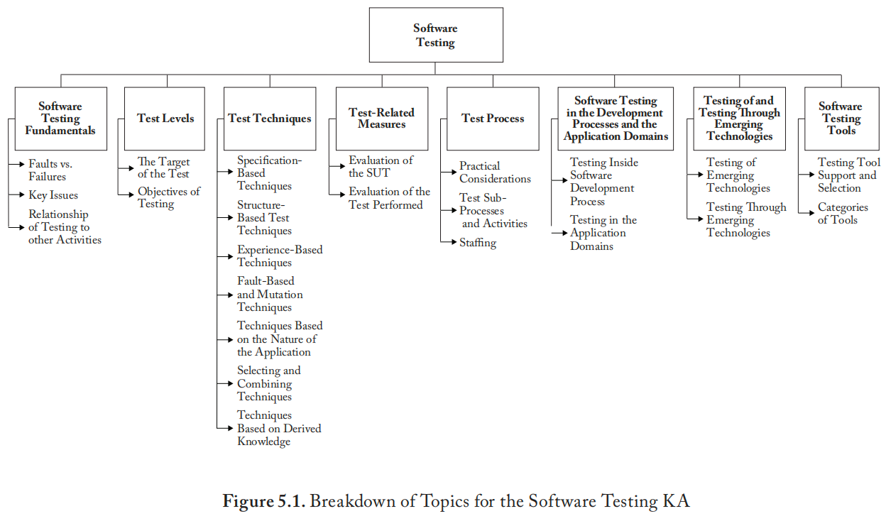

## **缩写词**

| 缩写  | 英文                                                      | 中文           |
| ----- | --------------------------------------------------------- | -------------- |
| AI    | Artificial Intelligence                                   | 人工智能       |
| API   | Application Programming Interface                         | 应用编程接口   |
| ARINC | Aeronautical Radio Incorporated                           | 航空无线电公司 |
| ATDD  | Acceptance Test-Driven Development                        |                |
| CMMI  | Capability Maturity Model Integration                     |                |
| CSS   | Cascading Style Sheets                                    |                |
| DICOM | Digital Imaging and Communications in Medicine            |                |
| DL    | Deep Learning                                             |                |
| DU    | Definition and Use                                        |                |
| EBSE  | Evidence-Based Software Engineering                       |                |
| ETSI  | European Telecommunications Standards Institute           |                |
| FHIR  | Fast Healthcare Interoperability Resources                |                |
| GDPR  | General Data Protection Regulation                        |                |
| GPS   | Global Positioning System                                 |                |
| GUI   | Graphical User Interface                                  |                |
| HIL   | Hardware-In-the-Loop                                      |                |
| HIPAA | Health Insurance Portability and Accountability Act       |                |
| HL7   | Health Level Seven                                        |                |
| IoT   | Internet of Things                                        |                |
| KPI   | Key Performance Indicator                                 |                |
| MC/DC | Modified Condition /Decision Coverage                     |                |
| ML    | Machine Learning                                          |                |
| MTTR  | Mean Time to Recovery                                     |                |
| OAT   | Orthogonal Array Testing                                  |                |
| ODC   | Orthogonal Defect Classification                          |                |
| SoS   | System of Systems                                         |                |
| SPI   | Software Process Improvement                              |                |
| SPICE | Software Process Improvement and Capability Determination |                |
| SUT   | System Under Test                                         |                |
| TDD   | Test-Driven Development                                   |                |
| TMMi  | Test Maturity Model integration                           |                |
| UI    | User Interface                                            |                |
| UP    | Unified Process                                           |                |

# **引言**

​	软件测试包含**动态验证**，即被测系统（SUT）在从通常无限的执行域中适当选取的**有限**测试用例集合上，提供**预期**的**行为**。

​	在上述陈述中，*斜体字*对应软件测试知识领域（KA）中的关键问题。这些术语讨论如下：

*   **被测系统（System Under Test）**：该术语指被测试的对象，可以是一个程序、一个软件产品、一个应用、一个面向服务的应用（例如：Web服务、微服务）、中间件（硬件/软件）、服务组合、一个系统、一个系统之系统（SoS）或一个生态系统。
*   **测试用例（Test Case）**：测试用例规定了执行所需的所有必要实体，例如：输入值、执行与时间条件、测试步骤以及预期结果（例如：产生的数值、状态变化、输出消息）。仅凭输入值往往不足以明确规定测试用例，因为被测系统可能对相同的输入有不同的行为反应，例如，这取决于被测系统的状态或环境条件。一组测试用例通常称为一个**测试套件**。
*   **动态（Dynamic）**：动态验证需要在被测系统上执行测试套件。静态技术是对动态测试的补充，属于软件质量知识领域的范畴。
*   **有限（Finite）**：即使在一个简单的被测系统中，执行所有可能的测试用例（即穷尽测试）也可能需要数月或数年的时间。因此，在实践中，测试的目标是根据不同标准确定的所有可能测试用例的一个子集。测试始终意味着在有限的资源与进度和本质上无限多的测试需求之间进行权衡。
*   **选取（Selected）**：在给定条件下确定最合适的选取标准是一个复杂的问题。可以考虑并结合不同的技术来处理该问题，例如：风险分析、软件需求、成本降低、质量属性满足、优先级排序以及缺陷检测。众多提出的测试技术其区别在于如何选取测试套件，软件工程师必须清楚，不同的选取标准可能产生效果差异极大的结果。
*   **预期**：对于每个执行的测试用例，**必须能够**（尽管可能并不容易）判断观察到的被测系统结果是否与预期结果相符。实际上，观察到的行为可以**对照用户需求**（通常称为**确认测试**）、**对照规格说明**（**验证测试**）或者可能对照源自**隐性需求或预期**的预见行为进行检查。（参见软件需求知识领域中的4.3节"基于验收标准的需求规格说明"。）

​	正如本次讨论所反映的，软件测试是一项普遍且全面的活动，涉及任何过程开发生命周期（例如：传统开发或左移开发）的所有步骤。本章的其余部分将介绍软件测试的基础知识及其挑战、问题，以及普遍接受的实践与解决方案。

# **软件测试主题分解**

图5.1展示了软件测试知识领域的主题分解结构。本知识领域末尾的"主题与参考资料对照表"提供了更详细的分解说明。

第一个主题**软件测试基础**涵盖了软件测试的基本定义、基本术语与关键问题，以及软件测试与其他活动的关系。

第二个主题**测试级别**包含两个（正交的）子主题。第一个子主题**测试对象**列出了大型软件测试传统上细分出的各个层级；第二个子主题**测试目标**则讨论了针对特定条件或属性的测试。并非所有测试类型都适用于每个软件产品，也未能穷尽列出所有可能的测试类型。**测试对象**与**测试目标**共同决定了测试套件的确定方式，这既涉及测试的充分性（为实现既定目标需要进行多少测试？），也涉及测试的构成（为实现既定目标应选择哪些测试用例？）。（然而，通常"为实现既定目标"这一前提是隐性的，实际只明确提出了上述两个问题的第一部分。）用于解决第一个问题的标准是**测试充分性准则**，而用于解决第二个问题的标准则是**测试选择准则**。

第三个主题涵盖了被普遍接受且标准化的技术。包括过去几十年已发展出多种**测试技术**，以及新的技术。

第四个主题论述**测试相关度量**，第五个主题涵盖**测试过程**的相关问题。

第六个主题描述了**开发流程与应用领域中的软件测试**。

第七个主题阐述了**新兴技术的测试**及**基于新兴技术的测试**。

第八个主题介绍了**软件测试工具**。

## **1. 软件测试基础**

[1*, 第1章, 第2章；2*, 第8章；14*, 第7章]
	本节概述了主要的测试问题以及测试与其他活动的关系。此处也定义了使用的大部分测试术语。有关测试及测试相关术语更全面的概述，请参阅引用的参考文献。

### **1.1 缺陷与故障**

[1*, 第1章第5节；2*, 第1章；14*, 第1章第3节]
	软件工程文献中使用许多术语来描述功能失常，尤其值得注意的是：**缺陷**（为作比较，请参见软件质量知识领域第3.2节“缺陷特征”中的"defect"）、**故障**和**错误**。必须区分功能失常的**原因**（此处使用术语**缺陷**）与在系统交付服务中观察到的**不良影响**（**故障**）。事实上，软件中很可能存在从未表现为故障的缺陷。（参见第1.2.8节“测试的理论与实践局限”）。因此，测试可以揭示故障，但导致故障的缺陷才是可以且必须被移除的。然而，故障的原因并不总是能被明确地识别。一般而言，目前没有确定性的理论标准来最终确定导致已观察故障的缺陷。为了移除故障，可能需要修改该缺陷，但其他修改也可能奏效。为避免歧义，我们可以指代**导致故障的输入**而非缺陷——即那些导致故障出现的一系列输入。

### **1.2. 关键问题**

​	本小节概述了主要的测试问题。

#### **1.2.1. 测试用例创建**

[1*, 第12章第1节, 第12章第3节；2*, 第8章]
	测试用例创建或生成是指，为特定目的（例如，充分性、准确性或评估）创建对测试被测系统有用的测试套件。由于测试用例生成是最重要且最密集的软件测试活动之一，它通常需要方法、技术和工具的支持以实现该过程的自动化。

#### **1.2.2. 测试选择与充分性准则**

[1*, 第1章第14节, 第6章第6节, 第12章第7节；2*, 第8章]
	测试选择准则是选择测试用例或确定测试套件对于特定目的而言是否充分的一种手段。测试用例选择旨在减少测试套件的规模，同时在覆盖率或缺陷检测率方面保持相同的有效性。测试充分性准则可用于判断何时完成了充分的测试。

#### **1.2.3. 优先级排序/最小化**

[4, 第2部分, 第3部分, 第5章]
	可以采用合适的测试用例选择或优先级排序策略来提高测试效能。测试用例优先级排序旨在根据某些标准（例如，覆盖率、缺陷检测率、相似性和风险）定义测试执行顺序，使得优先级较高的测试在优先级较低的测试之前执行。测试用例最小化通常旨在根据某些标准或目的，通过移除冗余的测试用例来缩减测试套件。

#### **1.2.4. 测试目的**

[1*, 第13章第11节, 第11章第4节；2*, 第8章]
	不同的、明确定义的目的可以指导测试活动；只有考虑特定目的，才能生成（选择）、执行和评估测试套件（更多细节参见第2节）。

#### **1.2.5. 评估与认证**

[4, 第1部分, 第5章；2*, 第7章, 第25章；8]
	测试需要聚焦于特定的（强制性的）规定，如需求、法律和标准。应生成和执行测试用例，以提供可用于评估和/或认证是否符合所选规定的证据。通常，测试结果的评估和认证包括验证测试用例是否已基于基准需求推导和生成、是否采用了配置控制过程以及是否使用了可重复的过程。

#### **1.2.6. 质量保证/改进测试**

[1*, 第16章第2节；4, 第1部分, 第5章；9]
	测试包含许多方面，包括质量改进和保证。这些特性涉及有计划的、系统性的支持过程和活动，以提升被测系统满足既定技术或质量要求的信心。因此，质量改进和保证涉及定义方法、工具、技能和实践，以实现特定的质量水平和目标。ISO/IEC 25010:2023 [9] 列出了测试可以测量或评估的主要质量特性清单。（另见软件质量知识领域的第1.3.2节“软件产品质量”）。

#### **1.2.7. 断言问题**

[1*, 第1章第9节, 第9章第7节]
	测试的一个重要组成部分是**断言**。实际上，只有在能够判断其观察结果的情况下，测试才具有意义。断言可以是任何能根据预期结果判断被测系统在每次测试中行为是否正确的人或机械代理。因此，断言提供“通过”或“失败”的判定。断言并非总能做出判定；在这些情况下，测试输出被归类为不确定。断言有许多种类——例如，明确的需求规格说明、行为模型和代码注释。断言的自动化可能既困难又昂贵。

#### **1.2.8. 理论与实践局限**

[1*, 第2章第7节]
	测试理论警告不要对一系列成功的测试赋予不当的信心。不幸的是，测试理论的大多数既定结果都是否定性的，因为它们陈述的是未实现什么，而非实现了什么。关于这一点最著名的引述是Dijkstra的格言：“程序测试可以用来显示缺陷的存在，但永远无法显示其不存在”[3]。这显而易见的原因在于，在现实的软件中，完全测试是不可行的。

#### **1.2.9. 不可行路径问题**

[1*, 第4章第7节]
	不可行路径是指无法被任何输入数据（即测试用例）执行的控制流路径。管理（即识别、解决或移除）不可行路径有助于减少测试所投入的时间和资源。它们在基于路径的测试中是一个重要问题，特别是在自动推导测试用例以执行控制流路径时。此外，检测不可行路径也可能有助于减少安全漏洞。

#### **1.2.10. 可测试性**

[1*, 第17章第2节]
	术语**软件可测试性**有两个相关但不同的含义。一方面，它指的是满足给定测试覆盖准则的难易程度；另一方面，它被定义为如果软件存在缺陷，测试套件暴露故障的可能性（可能通过统计方式衡量）。两种含义都很重要。

#### **1.2.11. 测试执行与自动化**

[4, 第1部分, 第4章]
	测试的一个重要挑战是提高可实现的自动化水平，可以通过开发生成测试输入的高级技术来实现，或者超越测试生成，通过寻找创新的支持程序来（完全）自动化不同的测试活动——例如，增加生成或执行的测试用例数量。

#### **1.2.12. 可扩展性**

[1*, 第8章第7节]
	可扩展性是软件在非功能性需求（如负载、事务数量和数据量）上增加和扩展的能力。可扩展性也与程序运行的平台和环境的复杂性相关，例如分布式无线网络和虚拟化环境、大规模集群和移动云。

#### **1.2.13. 测试有效性**

[1*, 第1章第1节；2*, 第8章第1节；8]
	评估被测系统、衡量测试技术的效能以及判断测试是否可以停止，是软件测试的重要证据，这可能需要定义和选择适当的测试有效性度量。

#### **1.2.14. 可控性、可复现性与可推广性**

[1*, 第12章第12节；4, 第2部分, 第7章]
	测试的具体方面包括：

*   **可控性**指的是测试活动从实验室（即受控条件）向现实（即非受控条件）的过渡。
*   **可复现性**指的是不同人员执行相同测试活动的能力。其目的是验证给定的测试理论是否有效，至少在实验室内。
*   测试的**可推广性**与外部效度相关——即测试方法可应用于更广泛环境或目标人群的程度。软件测试的可推广性对于管理测试活动（在成本和工作量方面）以及增强对测试结果的信心可能很重要。

#### **1.2.15. 离线测试与在线测试**

[10, 第3章]
	测试过程可以在两种环境下执行：离线和在线。通常，在离线测试中，被测系统在没有外部交互的环境中得到验证；在线测试中，被测系统与真实应用环境进行交互。在这两种情况下，测试用例都是手动或自动推导的，并使用预期结果来评估被测系统。

### **1.3. 测试与其他活动的关系**

​	软件测试与静态软件质量管理技术、正确性证明、调试和程序构建相关但又不同。然而，从软件质量分析师和认证者的角度考虑测试是有启发意义的。更多讨论，请参见：

*   **测试与静态软件质量管理技术**：见软件质量知识领域的第2.2.1节“静态分析技术”。
*   **测试与质量改进/保证**：见软件质量知识领域的第1.3.2节“软件产品质量”。
*   **测试与正确性证明及形式化验证**：见软件工程模型与方法知识领域。
*   **测试与调试**：见软件构造知识领域的“构造测试”和计算基础知识领域的“调试工具与技术”。
*   **测试与程序构建**：见软件构造知识领域的“构造测试”。
*   **测试与安全**：见新知识领域：软件安全。
*   **测试与工作量估算**：见软件工程管理知识领域。
*   **测试与法律问题**：见软件工程专业实践知识领域。

## **2. 测试级别**

[1*, 第1章第13节；2*, 第8章第1节]
	软件测试通常在开发和维护过程的不同级别进行。可以根据测试对象、测试目标或（测试级别的）目的来区分不同的级别。

### **2.1. 测试对象**

[1*, 第1章第13节，2*, 第8章第1节]
	测试对象可能因被测系统、环境条件以及分配给测试活动的预算/时间而异。可以区分四个测试阶段：**单元测试、集成测试、系统测试和验收测试**。这四个测试阶段不暗示任何特定的开发过程，也不假定其中任何一个比其他三个更重要。

#### **2.1.1. 单元测试**

[1*, 第3章，2*, 第8章]
	单元测试验证被测系统中可单独测试的元素在隔离环境下的功能。根据上下文，这些元素可以是单独的子程序或组件、子系统，或被测系统组件的组合。通常（但并非总是）由编写代码的人员进行单元测试。

#### **2.1.2. 集成测试**

[1*, 第7章，2*, 第8章]
	集成测试验证被测系统元素（例如，组件、模块或子系统）之间的交互。集成策略涉及基于已识别的功能线程或架构规范，对被测系统元素进行增量式（且系统性的）集成。典型的集成测试策略包括自顶向下、自底向上、混合式（或三明治式）和大爆炸式。它们关注的是被测系统元素在不同集成层面的不同视角。集成测试是一项持续的活动，可以在每个开发阶段进行。它可能针对不同的方面，例如被测系统元素之间或与外部环境的互操作性（例如，兼容性或配置）。也可以考虑与其他应用程序、实用程序、硬件设备或操作环境的外部接口。

#### **2.1.3. 系统测试**

[1*, 第8章，2*, 第8章]
	系统测试涉及根据第1节的定义测试被测系统的行为。有效的单元测试和集成测试应该已经识别出许多被测系统缺陷。此外，系统测试通常被认为是评估非功能性系统需求的合适手段，例如安全性、隐私性、速度、准确性和可靠性。（参见软件需求知识领域的“功能性与非功能性需求”和软件质量知识领域的“软件质量需求”。）

#### **2.1.4. 验收测试**

[1*, 第1章第7节，2*, 第8章第4节]
	验收测试针对被测系统的部署。其主要目标是验证被测系统满足需求和最终用户的期望。通常，它由最终用户运行或与最终用户共同运行，以执行构建该软件所要实现的功能和任务。例如，此测试活动可以针对可用性测试或操作验收。在实现相应功能之前定义验收测试是验收测试驱动开发（ATDD）的一项关键活动。（参见软件需求知识领域第4.3节。）

### **2.2. 测试目标**

[1*, 第1章第7节]
	进行测试时会考虑特定的目标，这些目标被（或多或少）明确地陈述，并具有不同程度的精确性。以精确、量化的术语陈述测试目标，有助于对测试过程进行度量与控制。

​	测试可以针对验证不同的属性。例如，可以设计测试用例来检查功能规格说明是否正确实现，这在文献中被称为**一致性测试**、正确性测试或功能测试。然而，也可能需要测试其他几种非功能性属性，包括性能、可靠性和可用性。（参见软件质量知识领域的“模型与质量特性”。）

​	其他重要的测试目标包括但不限于：可靠性度量、安全性和隐私漏洞识别以及可用性评估；根据目标不同，可能需要不同的方法。需要注意的是，一般而言，测试目标随测试对象而变化；不同的测试级别解决不同的目的。

下面列出的子主题是文献中最常引用的。

#### **2.2.1. 一致性测试**

[1*, 第10章第4节]
	一致性测试旨在验证被测系统是否符合标准、规则、规范、需求、设计、过程或实践。

#### **2.2.2. 符合性测试**

[1*, 第12章第3节]
	符合性测试旨在证明被测系统遵守某项法律或法规。通常，符合性测试是由外部监管机构强制要求的。

#### **2.2.3. 安装测试**

[1*, 第12章第2节]
	通常在系统和验收测试完成后，在被测系统安装到目标环境后，会对被测系统进行验证。安装测试可以看作是在硬件配置和其他操作约束的实际操作环境中进行的系统测试。安装程序也可能被验证。

#### **2.2.4. α测试与β测试**

[1*, 第13章第7节, 第16章第6节；2*, 第8章第4节]
	在被测系统发布之前，有时会分发给一小部分选定的潜在用户试用（α测试）和/或分发给更广泛的代表性用户群体（β测试）。这些用户报告产品的问题。α测试和β测试通常不受控制，且不一定在测试计划中提及。

#### **2.2.5. 回归测试**

[1*, 第8章第11节, 第13章第3节；4, 第1部分，第5章]
	根据[5]中的定义，回归测试是“对被测系统进行选择性重测，以验证修改未引起非预期影响，且被测系统仍符合其规定的需求”。在实践中，该方法旨在显示被测系统在测试套件中仍然能通过先前通过的测试（实际上，它有时被称为“非回归测试”）。在某些情况下，必须在每次变更后通过回归测试提供的保证与执行回归测试所需资源之间做出权衡。这可能相当耗时，因为可能需要执行许多测试。回归测试可以在第2.1节描述的每个测试级别进行。它可能涉及功能性和非功能性测试，例如可靠性、可访问性、可用性、可维护性、转换、迁移和兼容性测试。

​	回归测试可能涉及对测试用例的选择（参见第1.2.2节）和最小化（参见第1.2.3节），以及对现有测试套件采用优先级排序方法（参见第2.2.6节）。

​	回归测试是敏捷、DevOps、测试驱动开发（TDD）和持续开发的一项基本活动。通常在集成测试之后、部署到生产或运行环境之前进行。

#### **2.2.6. 优先级排序测试**

[1*, 第12章第7节]
	测试用例优先级排序旨在安排测试用例的执行顺序，以提高缺陷检测率和可能性、被测试代码的覆盖率以及被测系统的可靠性。通常，优先级排序测试依赖于启发式方法，其性能可能根据被测系统、环境和可用测试用例而变化。在各种优先级排序方案中，基于相似性的优先级排序是最常采用的方法之一。在这种优先级排序方法中，测试用例根据预定义的距离函数，从最不相似的测试开始进行优先级排序。

#### **2.2.7. 非功能性测试**

[2*, 第8章]
	非功能性测试旨在验证非功能性方面（如性能、可用性或可靠性），并在所有测试级别进行。根据当前实践，存在数百种非功能性测试技术，包括但不限于以下几种：

*   **性能测试** [4, 第1部分]：性能测试验证软件是否满足指定的性能要求，并评估性能特征（例如，容量和响应时间）。
*   **负载测试** [4, 第1部分]：负载测试侧重于在负载压力条件下验证被测系统的行为，以发现问题（例如，死锁、竞态、缓冲区溢出和内存泄漏）或可靠性、稳定性、健壮性违反情况。它旨在评估向被测系统提交不同服务请求的速率。
*   **压力测试** [1*, 第8章第8节]：压力测试旨在通过生成超过系统预期处理能力的负载，将系统推向其能力极限。
*   **容量测试** [4, 第1部分]：容量测试旨在评估被测系统的内部存储限制及其交换数据和信息的能力。
*   **故障转移测试** [1*, 第17章第2节；2*, 第8章]：故障转移测试验证被测系统管理重负载或意外故障以维持典型操作的能力（例如，通过分配额外资源）。故障转移测试也与可恢复性验证相关。
*   **可靠性测试** [1*, 第15章；2*, 第11章]：可靠性测试通过识别和纠正缺陷来评估被测系统的可靠性。可靠性测试通过根据统计模型（操作剖面）使用测试用例来观察运行中的被测系统或演练被测系统，这些模型模拟不同用户的行为。通常，通过可靠性增长模型来评估可靠性。持续开发过程（如DevOps）有助于在各个迭代中采用可靠性测试，以提高最终被测系统的质量。
*   **兼容性测试** [4, 第1部分；10, 第3章]：兼容性测试用于验证软件是否能够与不同的硬件和软件设施，或与不同的版本或发行版协同工作。
*   **可扩展性测试** [1*, 第8章第7节；2*, 第17章]：可扩展性测试评估软件在非功能性需求（如负载、事务数量、数据量）方面的扩展能力。它可以集成或扩展负载测试、弹性测试和压力测试。
*   **弹性测试** [17]：弹性测试评估被测系统（如云和分布式系统）在不影响满足峰值利用率能力的情况下，快速扩展或收缩计算、内存和存储资源的能力。弹性测试的一些目标是控制行为、识别要（取消）分配的资源以及协调并行事件。
*   **基础设施测试** [8, 附录H]：基础设施测试测试和验证基础设施组件，以减少停机可能性并提高IT基础设施的性能。
*   **背对背测试** [5]：ISO/IEC/IEEE 24765将背对背测试定义为“一种测试，其中程序的两个或多个变体使用相同的输入执行，比较输出，并在存在差异时分析错误”。
*   **恢复测试** [1*, 第14章第2节]：恢复测试旨在验证系统崩溃或其他灾难后软件的重新启动能力。

#### **2.2.8. 安全测试**

[2*, 第13章；4, 第4部分，附录A]
	安全测试侧重于验证被测系统是否受到保护，免受外部攻击。更准确地说，它验证系统及其数据的机密性、完整性和可用性。通常，安全测试包括针对软件或系统误用和滥用的验证（负面测试）。（参见软件安全知识领域的“安全测试”。）

#### **2.2.9. 隐私测试**

[2*, 第13章, 第14章]
	隐私测试致力于评估用户个人数据的安全性和隐私性，以防止攻击。它专门评估隐私和信息共享策略，以及分散式用户社交档案管理和数据存储解决方案的验证。（参见软件工程专业实践知识领域的“法律问题”。）

#### **2.2.10. 接口与应用程序编程接口（API）测试**

[2*, 第8章第1节；14*, 第7章第12节；4, 第5部分，第4章, 第7章]
	接口缺陷在复杂系统中很常见。接口测试旨在验证组件接口是否正确交换数据和控制信息。通常，测试用例从接口规范生成。一个特定的接口测试目标是模拟最终用户应用程序对API的使用。这涉及生成API调用的参数、设置外部环境条件以及定义影响API的内部数据。

#### **2.2.11. 配置测试**

[1*, 第8章第5节]
	在被测系统构建用于服务不同用户的情况下，配置测试验证软件在特定配置下的行为。

#### **2.2.12. 可用性与人机交互测试**

[2*, 第8章第4节；19*, 第6章；4, 第4部分，附录A]
	可用性与人机交互测试的主要任务是评估最终用户学习使用软件的难易程度。它可能涉及测试支持用户任务的软件功能、辅助用户的文档以及系统从用户错误中恢复的能力。（参见软件设计知识领域的“以用户为中心的设计”。）

## **3. 测试技术**

[1*, 第1章第15节；4, 第4部分]
	现有技术提出了系统性的程序和方法，以提高被测系统的整体质量 [4, 第4部分]。

​	测试技术可以通过考虑不同的关键方面进行分类，例如基于规格说明、基于结构以及基于经验 [4, 第4部分]。其他分类依据可以是待发现的缺陷、预测的用途、模型、应用的性质或衍生的知识。例如，**基于模型的测试**[7; 4, 第1部分]指的是所有使用模型概念来代表行为规格说明、被测系统结构或可用知识经验的测试技术。然而，分类可能存在重叠，并且某一类别可能涉及两种或多种技术的组合。

​	文献中还提供了基于被测系统信息程度的替代分类。确实，在**基于规格说明的技术**（也称为**黑盒测试技术**）中，测试用例的生成仅基于被测系统的输入/输出行为；而在**基于结构的技术**（也称为**白盒测试**、**玻璃盒测试**或**明盒测试技术**）中，测试用例的生成使用了关于被测系统如何设计或编码的信息。

​	由于某些测试技术比其他技术使用得更频繁，本节的其余部分将介绍标准的测试技术以及当前实践中普遍采用的技术。

### **3.1. 基于规格说明的技术**

[1*, 第6章第2节；4, 第4部分]
	基于规格说明的技术（有时也称为**域测试技术**）的基本思想是从输入域中选择少量测试用例，这些测试用例能够检测特定类别的缺陷（也称为域错误）。这些技术检查被测系统是否能处理某个范围内的输入并返回所需的输出。

#### **3.1.1. 等价类划分**

[1*, 第9章第4节]
	等价类划分涉及根据指定的标准或关系，将输入域划分为一系列子集（或等价类）。此标准或关系可以依赖于计算结果、控制流或数据流，或者被测系统接受和处理的有效输入与无效输入。一个例子可以是有效值和超出范围的值。后者可能会生成错误消息或启动错误处理。通常从每个等价类中选取一个代表性的测试套件（有时只包含一个测试用例）。

#### **3.1.2. 边界值分析**

[1*, 第9章第5节；4, 第4部分]
	测试用例选择在变量的输入域的边界上或附近，其基本原理是许多缺陷往往集中在输入的极端值附近。此技术的扩展是**健壮性测试**，其中测试用例还选择在变量的输入域之外，以测试程序在处理意外或错误输入时的健壮性。

#### **3.1.3. 语法测试**

[1*, 第10章第11节，2*, 第5章；4, 第4部分]
	语法测试技术，也称为**基于形式化规格说明的技术**，依赖于用形式化语言描述的被测系统规格说明。（参见软件工程模型与方法知识领域的“形式化方法”。）这种表示法允许自动推导功能测试用例，同时为检查测试结果提供断言。

#### **3.1.4. 组合测试技术**

[1*, 第9章第3节；4, 第4部分]
	组合测试技术系统地推导出覆盖特定参数值或条件的测试用例。根据[4, 第4部分]，常用的组合测试技术包括：全组合测试、两两组合测试、逐项选择测试和基项选择测试。全组合测试侧重于所有可能的输入组合，而其子集（也称为 **t-wise 测试**）则考虑 t 个输入的所有可能组合。在这种情况下，会推导出多对组合（即包括更高级别的组合）。两两组合测试是一种特定的组合测试技术，其中测试用例通过组合输入集中每一对参数的值来推导。这些技术也称为**正交表测试**。

#### **3.1.5. 决策表**

[1*, 第9章第6节；1*, 第13章第6节；4, 第4部分]
	决策表（或决策树）表示条件（大致对应输入）和动作（大致对应输出）之间的逻辑关系。通常，它们被广泛用于知识表示（例如，机器学习）。测试用例通过系统地考虑条件的每种可能组合及其相应的结果动作来推导。一种相关技术是因果图。左移开发过程正在利用这类测试技术，因为这些技术有助于记录测试结果以及可能影响结果的因素。

#### **3.1.6. 因果图**

[1*, 第1章第6节；4, 第3、4部分]
	因果图技术依赖于逻辑网络，通过系统性地探索输入条件的可能组合，将一组原因映射到一组结果。它们识别结果，并通过模型图将结果与其原因联系起来。因果图技术用于测试，因为它们允许进行规格说明分析、识别相关的输入条件或原因、后续转换以及输出条件。

#### **3.1.7. 状态转换测试**

[1*, 第10章；4, 第4部分]
	基于有限状态机的技术（[4, 第4部分]中的状态转换测试技术）侧重于用有限状态机表示被测系统。在这种情况下，推导测试套件以根据特定的覆盖级别覆盖状态和转换。

#### **3.1.8. 基于场景的测试**

[2*, 第8章第3节, 第19章第3节；4, 第4部分；7]
	此处的模型是被测系统或其软件需求的一种抽象（形式化）表示。（参见软件工程模型与方法知识领域的“建模”。）基于场景的测试用于验证需求、检查其一致性，并生成侧重于被测系统行为方面的测试用例。（参见软件工程模型与方法知识领域的“模型类型”。）基于场景的测试的关键组成部分包括：用于表示软件或其需求模型的符号、工作流模型或类似模型、用于生成测试用例的测试策略或算法、支持测试执行的基础设施，以及与预期结果相比较的测试结果评估。由于这些技术的复杂性，基于场景的测试方法通常与测试自动化框架结合使用。

​	在基于场景的测试中，工作流模型也可用于图形化地表示由人类和/或软件应用程序执行的一系列活动。在这种情况下，每个动作序列构成一个工作流（也称为一个场景）。通常，确保测试典型工作流和替代工作流都很重要。例如，业务流程测试就是这种基于场景的技术的一部分。在这种情况下，特别关注工作流规格说明中的角色。

#### **3.1.9. 随机测试**

[1*, 第9章第7节；4, 第4部分]
	在这种方法中，测试用例纯粹是随机生成的。这种测试属于输入域测试的范畴，因为必须知道输入域才能在其中随机选取点。随机测试提供了一种相对简单的测试自动化方法。已经提出了随机测试的增强形式（如自适应随机测试），其中其他输入选择标准指导着随机输入采样。

​	在**模糊测试**的名称下，对无效和意外输入及数据的随机选择被广泛用于网络安全领域，以寻找可被利用的软件错误、编码错误和安全漏洞。（另见第2.2.8节“安全测试”和第8.2节“工具类别”。）

#### **3.1.10. 基于证据的技术**

​	[10, 第6章第2节]
基于证据的软件工程遵循严谨的研究方法，是解决实际问题的理想方案。EBSE 包括以下几个阶段：

*   识别证据并形成问题
*   找出最佳证据来回答问题
*   根据证据应帮助解决的问题对证据进行批判性分析

​	EBSE 原则也可应用于测试过程。为此，常用的用于识别和聚合证据的方法是系统映射研究和系统综述。

#### **3.1.11. 强制异常**

[5]
	测试用例专门设计用于检查被测系统是否能管理一组预定义的异常/错误，例如数据异常、操作异常、溢出异常、保护异常或下溢异常。测试技术通常侧重于负面测试场景（即能够强制生成错误消息的测试用例）。

### **3.2. 基于结构的技术**

[4, 第4部分]
	基于结构的测试技术（有时称为基于代码的测试技术）侧重于代码及其结构。基于结构的测试技术可以在不同级别执行（如代码开发、代码审查或单元测试），并且可以包括静态测试（如代码审查、代码走查和代码评审）、动态测试（如语句覆盖、分支覆盖和路径覆盖）或代码复杂度度量（例如使用圈复杂度 [12] 等技术）。

#### **3.2.1. 控制流测试**

[1*, 第4章；4, 第4部分]
	控制流测试覆盖被测系统中的所有语句、分支、决策、分支条件、修正条件/判定覆盖、语句块或语句的特定组合。基于控制流的准则中最严格的是**路径测试**，其目标是执行被测系统控制流图中所有从入口到出口的控制流路径。由于循环的存在，穷举路径测试通常不可行，因此其他不那么严格的准则侧重于限制循环迭代次数的路径覆盖，如语句覆盖、分支覆盖和条件/判定测试。此类测试的充分性以百分比来衡量；例如，当所有分支至少被测试执行一次时，即达到了100%的分支覆盖。

#### **3.2.2. 数据流测试**

[1*, 第5章；4, 第4部分]
	在数据流测试中，控制流图会标注关于变量如何被定义、使用和消除（取消定义）的信息。常用的数据流测试技术包括：全定义测试、全计算使用测试、全谓词使用测试、全使用测试和全定义使用路径测试。最严格的数据流测试准则是**全定义使用路径测试**，它要求覆盖所有定义和使用（DU）路径 [4, 第4部分]。这是因为它要求对于每个变量，执行从该变量的定义到该定义使用的每个控制流路径段。然而，使用较弱的策略（如全定义和全使用）来减少所需覆盖的路径数量。

#### **3.2.3. 基于结构技术的参考模型**

[1*, 第4章]
	虽然本身不是一种技术，但可以使用流图以图形方式表示被测系统的控制结构，以可视化基于结构的测试技术。流图是一个有向图，其节点和弧对应于程序元素。（参见数学基础知识领域的“图与树”。）例如，节点可以表示语句或连续的一系列语句，弧可以表示节点之间的控制转移。

### **3.3. 基于经验的技术**

[4, 第1、4部分]
	生成最合适的测试套件可能取决于不同的因素，例如人员对被测系统及其上下文的了解，以及测试人员的经验和直觉。在下面的章节中，将简要介绍常用的基于经验的技术。

#### **3.3.1. 错误猜测**

[1*, 第9章第8节；4, 第4部分]
	在错误猜测中，软件工程师专门设计测试用例来预测每个被测系统中最可能出现的缺陷。良好的信息来源包括在先前项目中发现的缺陷历史以及软件工程师的专业知识。

#### **3.3.2. 探索性测试**

[4, 第1部分]
	探索性测试定义为同时进行学习、测试设计和测试执行。测试用例不预先定义，而是根据收集到的证据和测试结果（如观察到的产品行为、被测系统的特性、领域和环境、故障过程、可能的缺陷和故障类型以及与特定产品相关的风险）动态地设计、执行和修改。通常，负责执行探索性测试的人员的直觉、知识和专业素养会影响测试的有效性。探索性测试广泛用于左移开发（如敏捷开发）。（参见第5.4.2节。）

#### **3.3.3. 其他基于经验的技术**

[4, 第4部分；13]
	在当前实践中，基于经验的技术可能还包括其他方法，如基于 Ad Hoc、基于知识和基于机器学习的测试技术。

**Ad Hoc 测试**是一种广泛应用的技术，其中测试用例的推导依赖于软件工程师在类似程序方面的技能、直觉和经验。它对于识别不易通过更正式化技术生成的测试用例非常有用。典型的 Ad Hoc 方法包括：
*   **猴子测试**：运行随机生成的测试用例，以模拟随机活动并导致程序停止。
*   **结对测试**：涉及两个人。一个人生成并运行测试用例；另一个人观察和分析测试过程。结对测试可以生成覆盖范围更广、更好的测试用例。
*   **游戏化**：旨在将测试任务转化为游戏玩法的组成部分。通过应用特定技术（如让从业人员参与或众包复杂的测试任务），游戏化可以显著改进软件测试实践，从而提高被测系统的质量。
*   **快速测试**：选择和执行一个非常小的测试套件，以快速识别被测系统中的关键问题。其目的是提高在开发过程早期发现缺陷的可能性。
*   **冒烟测试**（也称为构建验证测试）：确保被测系统的核心功能正常运行。它还保证在计划测试开始之前被测系统是可操作的。此外，冒烟测试可防止因测试环境（例如，工件或包未正确构建）而导致的失败。冒烟测试也被视为快速测试的一种特殊情况。

​	**基于知识的测试**和**基于机器学习的测试**利用（正式或非正式的）关于被测系统的知识，或从观察被测系统执行中推导知识，以定义其行为模型（如本体或决策表）（参见第3.6.1节）、规则和非功能属性。此外，基于知识的测试和基于机器学习的测试指定测试需求并识别测试目标，从而生成测试用例。

### **3.4. 基于缺陷与变异的技术**

[1*, 第1章第14节，1*, 第3章第5节；5]
	基于缺陷的测试技术专门设计测试用例来揭示可能或预定义的缺陷类别。可以引入一个缺陷模型，对不同的缺陷进行分类，以更好地聚焦测试用例的生成或选择。在此背景下，各种平台和开发过程（例如瀑布模型、螺旋模型和敏捷开发）认为**正交缺陷分类**是收集不同缺陷语义信息并减少根本原因分析时间和精力的有效方法。

​	**变异测试**最初被构想为一种评估测试套件的技术（参见第4.2节“已执行测试的评估”），其中变异体是被测系统的一个稍微修改的版本（也称为“黄金版本”），仅通过一个小的语法变化与之不同。每个测试用例同时运行黄金版本和所有生成的变异体。如果一个测试用例成功识别出黄金版本和某个变异体之间的差异，则称该变异体被“杀死”。变异测试的基本假设（耦合效应）是，通过寻找简单的语法缺陷，将能发现更复杂但真实的缺陷。为了使该技术有效，必须自动生成许多变异体并进行系统性的执行 [6]。变异测试本身也是一种测试标准。随机生成测试用例直到杀死足够多的变异体，或者专门设计测试用例来杀死存活的变异体。在后一种情况下，变异测试也可归类为基于结构的技术。变异测试已被有效地用于生成模糊测试。变异过程的一个较新应用是**蜕变测试**。这对于解决机器学习系统的测试挑战尤其适用。在这种情况下，修改（也称为“变形”）被应用于输入，以便一种关系可以将先前的输入（及其输出）与新的变形输入（及其输出）联系起来。

### **3.5. 基于用法的技术**

[1*, 第15章第5节]
	基于用法的技术通常依赖于使用模型或配置文件。在这种情况下，测试环境需要代表实际的操作环境，测试用例的执行顺序应再现目标利益相关方对被测系统的使用方式。统计抽样被用来模拟许多测试用例的执行。因此，有时术语“随机测试”也与这些技术相关联。基于用法的统计测试更多地在验收测试阶段应用。

#### **3.5.1. 操作剖面**

[1*, 第15章第5节，2*, 第11章]
	基于操作剖面的测试旨在生成测试用例，以估计被测系统或其部分的可靠性。因此，目标是从观察到的测试结果中推断软件（在使用时）的未来可靠性。由于所建立的可靠性严格依赖于操作剖面，使用这种测试方法的主要困难（和成本）来自操作剖面的推导。因此，一种可能的解决方案是根据输入在实际操作中出现的频率为其分配概率或配置文件。

#### **3.5.2. 用户观察启发法**

[19*, 第5、7章；4, 第4部分，附录A]
	专门的启发法，也称为可用性检查方法，被应用于在受控条件下系统地观察系统使用情况，以确定人们使用系统及其界面的好坏程度。可用性启发法包括认知走查、主张分析、现场观察、出声思考，甚至间接方法如用户问卷和访谈。

### **3.6. 基于应用性质的技术**

[2*, 第16、17、18、20、21章；14*, 第4章第8节；8]
上述技术适用于所有类型的软件。额外的测试推导和执行技术则基于被测试软件的性质。例如：

*   面向对象软件
*   基于组件的软件
*   基于 Web 的软件
*   并发程序
*   基于协议的软件
*   通信系统
*   实时系统
*   安全关键系统
*   面向服务的软件
*   开源软件
*   嵌入式软件
*   基于云的软件
*   基于区块链的软件
*   基于大数据的软件
*   基于 AI/ML/DL 的软件
*   移动应用
*   安全与隐私保护软件

在某些情况下，标准如 ISO/IEC/IEEE 29119 [4, 第4、5部分] 提供了示例和支持，用于指定测试用例、自动化其执行以及维护测试套件，例如**关键字驱动测试**[4, 第5部分]。

### **3.7. 选择与组合技术**

[14*, 第7章第12节；10；4, 第5部分]
	组合不同的测试技术一直是保证被测系统所需质量水平的可靠手段。尤其是在左移开发中，测试技术的自适应组合方法是当前实践的一部分。目标是通过从经验中学习，同时根据当前测试会话调整技术选择，来提高测试过程的有效性。

#### **3.7.1. 组合功能与结构测试**

[1*, 第9章；4, 第5部分]
	基于场景和基于结构的测试技术常被对比为功能测试 vs. 结构测试。这两种测试用例选择方法被视为互补，因为它们使用不同的信息来源并凸显不同的问题。根据不同的组织约束（如预算考虑），可以将它们结合起来。

#### **3.7.2. 确定性 vs. 随机**

[1*, 第9章第6节]
	测试用例可以按照多种技术以**确定性的方式**进行选择，或者从某个输入分布中**随机抽取**，如通常在可靠性测试中所做的那样。已经进行了若干分析和实证比较，以分析使一种方法比另一种更有效的条件。

### **3.8. 基于衍生知识的技术**

[2*, 第19、20章；14*, 第7章]
	测试技术可以整合来自不同研究领域和背景的证据与知识。为此，使用了各种方法和方法论来支持测试活动并提高其有效性。创新方法包括使用数字孪生或仿真方法和框架、利用机器学习和游戏化设施，以及使用（模拟的）神经网络。

## **4. 测试相关度量**

[2*, c24s5; 14*, c10; 4, 第4部分]
	测试技术如同工具，有助于达成特定的测试目标。为了评估测试目标是否达成，需要定义明确的度量。度量通常被认为是质量分析的基础。度量也可用于优化测试计划与执行。测试管理可使用多种不同的过程度量来监控进度。（关于度量项目的信息，请参阅软件工程管理知识领域中的"软件工程度量"；关于度量的信息，请参阅软件工程过程知识领域中的"软件度量"。）

​	根据[4, 第4部分]中的定义，测试技术可根据其能达到的覆盖度进行分类。覆盖率范围可以从0%到100%（不包括可能的不可行测试，即无法执行的测试）。因此，对于每个基于规格说明、基于结构和基于经验的测试技术，必须确定相关的覆盖度量以及评估该覆盖度的程序。覆盖度量的例子可以是程序流程图中被覆盖的分支百分比，或者规格说明文档中列出的功能需求中被执行的功能需求百分比。

​	重要的是要考虑，监控设施可以动态计算已覆盖元素与总数的比率。此外，特别是在基于结构的测试技术中，可能还需要对被测系统进行适当的插装。

​	然而，所提出的测试度量集也可以从不同角度进行分类——从基于观察到的测试输出对被测试系统进行评估的角度，以及从评估已执行测试套件的彻底性或有效性的角度。

### **4.1. 被测系统的评估**

[2*, c24s5]
	通常，可以使用指标（即可度量的信息）来确定被测系统是否按预期运行并实现其预期结果。这些指标（有时称为关键绩效指标）与所采用的评估度量、方法、数据分析和报告密切相关。

#### **4.1.1. 有助于计划和设计测试的被测系统度量**

[14*, c10; 10, c6; 4, 第1部分，第4部分]
	[4, 第4部分]中提出的所有测试度量都可用于计划和指导测试活动。此外，在左移开发过程中，也通常采用特定度量（如部署频率、交付周期、平均恢复时间和变更失败率）来计划和管理测试活动与结果。

#### **4.1.2. 缺陷类型、分类与统计**

[1*, c13s4, c13s5, c13s6]
	测试文献中有丰富的缺陷分类和分类法，这些分类可以是通用的，也可以是针对特定上下文或质量属性的（例如，可用性缺陷分类、硬件/软件安全和隐私漏洞及攻击分类法、网络安全风险分类）。为了使测试更有效，了解被测系统中可能存在哪些类型的缺陷以及这些缺陷过去发生的相对频率非常重要。这些信息对于进行质量预测和过程改进很有用（参见软件质量知识领域中的"特征描述"）。

#### **4.1.3. 缺陷密度**

[1*, c13s4; 14*, c10s1]
	传统上，可以通过统计发现的缺陷数来评估被测系统，即发现的缺陷数量与被测系统规模之比。由于缺陷的定义基于语义，可以考虑其他度量，例如缺陷深度（使被测系统正确所需的最小缺陷移除次数）和缺陷多重性（修复单个缺陷所需的原子变更次数）。

#### **4.1.4. 寿命测试，可靠性评估**

[1*, c15; 2*, c11; 14*, c1s3]
	软件可靠性的统计估计可用于评估是否可以停止测试，或者被测系统是否足够成熟以发布下一版本。可靠性评估在云（和雾）计算环境中起着关键作用[18]。
	一方面，验证和确认方案专注于维持云（雾）服务所需的高水平可靠性和可用性。另一方面，测试活动正利用云（雾）环境的计算能力来加速可靠性评估并大幅降低成本。

#### **4.1.5. 可靠性增长模型**

[1*, c15; 2*, c11s5]
	可靠性增长模型基于观察到的故障来预测可靠性。它们通常假设，当导致观察到的故障的缺陷被修复后（尽管有些模型也接受不完美的修复），产品的可靠性将会提高。已发表的可靠性增长模型有很多。值得注意的是，这些模型分为故障计数模型和故障间隔时间模型。

### **4.2. 已执行测试的评估**

[4, 第4部分, c6]
	通常通过执行测试套件来验证被测系统的行为，测试套件在发现缺陷方面至关重要。因此，从研究人员和实践者的角度来看，软件测试的一个基本部分是测试套件的比较。通常，评估测试套件意味着比较那些生成测试用例的测试用例生成技术。为此目的使用不同的标准，例如覆盖标准或变异分析标准。

#### **4.2.1. 缺陷注入**

[1*, c2s5]
	在缺陷注入中，一些缺陷在测试前被人工引入被测系统。当执行测试套件时，一些注入的缺陷会被发现，可能还有一些原本就存在的缺陷也会被发现。理论上，根据发现哪些以及多少人工缺陷，可以评估测试有效性，并估计剩余的真实缺陷数量。在实践中，统计学家对注入缺陷相对于真实缺陷的分布和代表性，以及任何外推所基于的小样本量提出了质疑。也有人认为应极其谨慎地使用此技术，因为向被测系统中插入缺陷存在明显的残留风险。

#### **4.2.2. 变异得分**

[1*, c3s5; 6]
	在变异测试中，测试套件的有效性度量计算为被杀死的变异体数量与生成的变异体数量之比。测试套件有效性值越高越好，因为它表明发现最真实注入缺陷的能力更强。

#### **4.2.3. 不同技术的比较与相对有效性**

[1*, c1s7; 5; 9]
	相对有效性将不同的测试技术与特定属性进行比较，例如找到第一次故障所需的测试数量、通过测试发现的缺陷数量与在测试期间和之后发现的所有缺陷数量之比，以及可靠性提高了多少。已经进行了多项研究，根据定义的每个属性（或有效性）概念，在分析和实证上比较不同的技术。

## **5. 测试过程**

[4, 第1部分, 第2部分, 第3部分; 2*, c8]
	测试概念、策略、技术和度量需要整合到一个定义明确且受控的测试计划过程中，直至测试输出评估。测试过程为测试提供支持，并为负责不同测试活动的人员提供指导方针，以确保以经济高效的方式实现测试目标。

​	如[4, 第2部分]所述，测试过程是一个多层次的过程活动，包括组织层面、管理层面和动态层面的测试规范制定。组织测试过程定义了创建和维护测试规范的步骤，例如组织测试政策、策略、过程、程序和其他资产[4, 第2部分]。
​	测试管理过程定义了管理所需的必要步骤：计划、监控与控制，以及完成。
​	最后，动态测试过程规定了设计与实现、环境设置与维护、执行以及测试事件报告的步骤。

​	在本节的剩余部分，将提供一些关于测试过程规范、管理和执行的实用考量，并总结[4, 第2部分]中所述的组织层面、管理层面和动态层面所包含的测试子过程和活动。

### **5.1. 实用考量**

[4, 第1部分]
	测试过程应允许不同测试阶段的自动化，并应依赖于所执行活动的可控性、可追踪性、可复现性以及风险/成本估算。在本节的剩余部分，将描述通常应用的测试步骤，这些步骤兼容并适用于所有生命周期模型。（关于软件生命周期，请参阅软件工程过程知识领域。）

#### **5.1.1. 态度/无我编程**

[1*, c16; 2*, c3]
	成功测试的一个重要元素是对测试和质量保证活动持协作态度。管理者在促进软件开发与维护期间对发现和纠正故障持欢迎态度方面起着关键作用。例如，在像敏捷这样的左移开发变革中，测试人员和开发人员之间的沟通与协作被认为是取得成功测试结果的关键。

#### **5.1.2. 测试指导方针与组织过程**

[1*, c12s1; 2*, c8; 4, 第2部分, 第3部分; 14*, c7s3]
	各种目标可以指导测试阶段。例如，基于风险的测试利用产品风险来确定测试策略的优先级和侧重点，而基于场景的测试则根据指定的软件场景和待办列表定义测试用例。通常，测试过程的组织包括定义测试政策（即指定测试的目的、目标和总体范围）和测试策略（即指定测试将如何执行的指导方针）。例如，在左移开发中，测试策略至少应包含以下数据：目的（例如，通过用户故事定义）、目标（例如，一个测试套件）、范围（被测系统）以及环境和方法（例如，测试套件如何、在何处运行）。

#### **5.1.3. 测试管理与动态测试过程**

[1*, c12; 4, 第2部分, 第3部分; 14*, c7s3]
	在不同级别（参见第2节，测试级别）进行的测试活动应通过人员、工具、政策和度量组织成一个与生命周期紧密结合的、定义明确的过程。测试过程管理包括不同的子过程，如计划、监控、控制和完成，而动态测试过程则包括测试设计与实现、测试环境设置与维护、测试执行和测试事件报告。

#### **5.1.4. 测试文档**

[1*, c8s12; 14*, c7s8; 4, 第3部分]
	根据[4, 第3部分]，文档是测试过程形式化不可或缺的一部分。测试文档可以分为三个层次类别：组织测试文档、测试管理文档和动态测试文档。组织测试文档包括记录测试政策和组织测试策略所需的信息。测试管理文档包括测试计划、测试状态报告和测试完成报告。最后，动态测试文档包括以下文档：测试规格说明（测试设计规格说明、测试用例规格说明和测试规程规格说明）、测试数据需求、测试环境需求、测试数据就绪报告、测试环境就绪报告，以及测试执行文档（如实际结果、测试结果、测试执行日志和事件报告）。

​	测试文档应像其他软件工程文档一样，以相同的质量来产生并持续更新。测试文档也应置于软件配置管理的控制之下。（参见软件配置管理知识领域。）

#### **5.1.5. 测试团队**

[1*, c16; 2*, c23s5; 4, 第2部分, 第3部分]
	使测试过程形式化可能也涉及到使测试团队的组织形式化。成本、进度、相关组织的成熟度水平以及应用的关键性等考量可以指导决策。测试团队可以由参与（或未参与）被测系统开发的成员（即是否具有公正、独立的视角）或内部（或外部）人员组成。左移开发并不严格区分测试团队成员，因为测试套件是根据被测系统的开发和交付的代码来定义和更新的。

#### **5.1.6. 测试过程度量**

[1*, c18s3; 14*, c10; 4, 第1部分, 第2部分, 第3部分]
	管理者使用多种度量来衡量测试花费的资源以及各个测试阶段相对发现缺陷的有效性，以控制和改进测试过程，并为管理过程风险提供信息。因此，监控和控制测试必须定义所需的数据和信息，并说明如何获取它们。测试度量可以涵盖测试用例的指定、执行、通过和失败数量等要素。这些度量也可以与特定的过程指标结合，如残余风险、累计已打开和已关闭的缺陷、测试用例进度以及缺陷检测百分比。对测试阶段报告的评估可以与根本原因分析相结合，以评估测试过程在尽早发现缺陷方面的有效性。这种评估可以与风险分析相关联。此外，值得花费在测试上的资源应与应用的用途和关键性相称。不同的技术具有不同的成本，并对产品可靠性产生不同的置信水平。

#### **5.1.7. 测试监控与控制**

[4, 第1部分, 第2部分]
	监控与控制是如[4, 第2部分]所述的测试管理过程的一个重要子过程，用于收集测试管理和评估期间所需的数据和信息。通常，监控与控制活动与测试执行并行进行，有时，收集到的数据可能会促使整体过程计划被修订。监控确保测试过程活动符合特定的测试计划，以追踪需求满足情况并令人满意地缓解已识别的风险。在测试监控与控制期间，可以定期生成特定的文档（测试报告），以帮助评估和记录测试活动。

#### **5.1.8. 测试完成**

[14*, c7s11; 4, 第3部分]
	必须决定多少测试才足够以及何时可以完成一个测试阶段。因此，测试完成（如[4, 第2部分]所述的测试管理过程的一个子过程）的目的，是确保测试需求得到满足和验证，测试报告已完成，并将测试结果传达给相关干系人。彻底性度量，如已达到的代码覆盖率或功能覆盖率，以及缺陷密度或操作可靠性的估计，提供了有用的支持，但其本身并不足够。该决策还涉及对可能剩余的故障所带来的成本与风险的考量，这与继续测试所产生的成本相对。（参见第1.2节"关键问题"中的"测试选择与充分性准则"。）与其他活动一样，在此阶段，会生成特定的文档（例如，测试完成报告）并传达给相关干系人。

#### **5.1.9. 测试可重用性**

[14*, c3; 9]
	为了在测试工件（如测试用例或执行环境）中实现可重用性，需要增加测试计划和设计的复杂性和时间，这在测试开发成本高昂、耗时且复杂时是期望的。

​	测试可重用性收集和分类测试知识（测试用例和测试结果），使这些信息可搜索并可用于创建新测试或重新执行现有测试。应配置和管理合适的基于知识的存储库，以实现测试可重用性，以便软件需求或设计中的变更能够反映在测试的变更中。测试用例的可重用性在基于特性的开发、产品线开发和回归测试中至关重要。测试可重用性也与可维护性相关，因为可重用性可以降低所涉及的成本和工作量，并提高测试的有效性。

### **5.2. 测试子过程与活动**

[1*, c1s12; 1*, c12s9; 4, 第2部分]
	在本节的剩余部分，将简要介绍主要的测试活动和子过程。

#### **5.2.1. 测试计划过程**

[1*, c12s1, c12s8; 11; 4, 第2部分]
	与项目管理的所有其他方面一样，测试活动必须进行计划。根据[4, 第2部分]，测试计划的关键方面包括识别和协调人员、识别测试目标和完成准则、定义测试设施和设备、创建和维护所有与测试相关的文档，以及对可能的不良结果进行风险规划和管理。这些活动可以在三个不同级别进行组织：(1) 过程管理（即识别测试政策、策略、过程和规程），(2) 组织管理（即定义测试阶段、测试类型和测试目标），以及 (3) 设计与实现（即定义测试环境、测试执行过程与监控、完成过程及报告）。

#### **5.2.2. 测试设计与实现**

[1*, c12s1, c12s3; 11]
	测试用例的生成基于要执行的测试级别和选择的测试技术。根据如[4, 第2部分]所述的动态测试过程，测试用例生成的先决条件是识别测试目标以及选择适当的测试/演示技术。测试生成侧重于实现和执行测试用例。它通常与工具相关（即使用特定软件，也称为测试用例生成器）。该软件接受输入（如源代码、测试准则、规格说明或数据结构定义）并利用它们生成测试套件。有时，测试用例生成器可以通过使用特定的断言器设施来确定预期结果。这有助于整个测试过程的全自动化。

#### **5.2.3. 测试环境设置与维护**

[1*, c12s6; 2*, c8s1; 14*, c13s2; 4, 第2部分; 11]
	根据如[4, 第2部分]所述的动态测试过程，测试环境开发与设置涉及识别测试基础设施。这包括选择或开发用于进行测试活动的设施、硬件、软件、固件和规程。测试环境可以在体外或体内模拟、控制和执行。开发测试环境还包括设置监控和日志记录设施，这些设施有助于记录测试活动和评估获得的结果。测试环境应与所使用的其他软件工程工具兼容。

#### **5.2.4. 对照实验与测试执行**

[1*, c12s7; 14*, c4s7, c5s6; 4, 第2部分]
	测试的执行应体现科学对照实验的一个基本原则——测试期间所做的一切都应被具体、清晰地执行和记录，以便他人能够复现结果。因此，测试应遵循文档化的规程，使用明确定义版本的被测系统来执行。特别是在验收测试期间，也可以执行像A/B测试这样的对照实验，以统计评估用户在不同版本被测系统之间的偏好。

#### **5.2.5. 测试事件报告**

[1*, c13s4, c13s9, c13s11; 2*, c8s3; 14*, c7s8; 4, 第3部分; 12]
	根据如[4, 第2部分]所述的动态测试过程，测试事件和报告侧重于明确定义的测试数据收集过程（即识别测试何时进行、谁执行了测试、使用了什么软件配置以及其他相关的识别信息）。此过程和收集的证据可用于追究责任。测试报告可能涉及合适的审计系统，以识别意外或不正确的测试结果，并将其记录在问题报告系统中。这些数据构成了后续调试和修复在测试期间观察到的故障的基础。此外，未被归类为缺陷的异常情况如果后来变得比最初想象的更严重，也应予以记录。测试报告也是变更管理请求过程的输入。（参见软件配置管理知识领域中的"软件配置控制"。）

​	因此，测试事件报告过程侧重于识别相关干系人的事件，这些事件可用于确定软件测试和其他过程的哪些方面需要改进，以及先前的方法效果如何。

​	事件报告的一部分还包括评估测试结果，以确定测试是否成功。在大多数情况下，"成功"意味着软件按预期运行，并且没有任何重大的意外结果。并非所有意外结果都一定是缺陷；有时它们被简单地确定为噪声。在能够移除缺陷之前，需要进行分析和调试工作以隔离、识别和描述它。当测试结果特别重要时，可能会召集正式的评审委员会来评估它们。

### **5.3. 人员配置**

[1*, c16; 4, 第3部分]
	根据[4, 第3部分]，人员配置包括定义角色、活动和职责，确定招聘需求，以及定义培训需求。人员配置会影响项目风险，因为团队的专业知识可能会影响其发现缺陷、应对不断变化的需求、满足截止期限的能力，并增加/降低维护成本。

​	角色、活动和职责的定义确立了以下角色和职责：活动负责人和支持人员、与测试相关的角色及其对应的职责，以及负责提供测试项的人员。

​	根据采用的开发生命周期，典型的测试角色包括但不限于：Scrum Master/测试负责人、QA/测试分析师、测试设计师、测试安全/性能工程师和顾问、测试环境专家、测试执行员以及测试自动化顾问或架构师。

​	招聘需求要求识别出需要额外测试人员来完成测试过程的特定要求（以及何时需要这些人员以及所需的技能）。根据业务需求，人员配置可以采取不同的形式，从内部调动到外部招聘，甚至是顾问和/或外包资源。

​	最后，培训需求规格说明包括所需技能水平的定义。它还包括培训活动（如课堂培训、自主学习培训、基于计算机的培训或指导）的规格说明，这些活动有助于向选定的员工提供必要的技能。

## **6. 开发过程与应用领域中的软件测试**

[2*, c8, c15; 14*, c4s8, c7]
	无论采用何种开发过程，测试都是一项基本活动。然而，在某些情况下（如采用的开发生命周期和/或应用领域），可能会使用特定的测试活动或术语。

### **6.1. 软件开发过程中的测试**

[2*, c8; 14*, c7]
	在本节的剩余部分，将提供不同开发过程中测试的特殊性。

#### **6.1.1. 传统过程中的测试**

[1*, c18; 14*, c7]
	有多种传统过程（基本上基于被测系统的开发原则）可以在组织内采用。顺序、V模型、螺旋模型和迭代模型只是其中一些常用的过程。（软件工程过程知识领域中的"软件生命周期"对每种模型进行了详细描述。）然而，在所有这些过程中，测试通常只被视为一项活动；有时在过程结束时进行，如果最终用户需求发生偏差或评估出现问题，则存在被测系统开发失败的切实风险。近年来，为了评估和控制被测系统的整体质量，已经建立了诸如测试成熟度模型集成和软件过程改进等倡议。因此，现有的不同框架（如软件过程改进与能力测定、能力成熟度模型集成和统一过程）为此目的进行了更新或改进。

​	例如，CMMI 是被引用最多的模型之一；它可以指导关键的被测系统干系人控制其开发和维护过程。实际上，它是一套定义明确的软件测试最佳实践，通过提高客户满意度来提升被测系统质量。

​	UP模型在21世纪初提出，可被视为左移运动的前身。UP通过提供多种机制使测试更紧密地与软件开发工作相结合来鼓励早期测试，使测试成为一个独立的学科。此外，UP推广一种用于持续验证质量的迭代开发方法。它还允许使用用例和风险来驱动被测系统开发，并支持战略性的变更管理。UP将被测系统的增量开发和迭代分为四个阶段：初始、细化、构建和移交。

​	UP可被视为既是迭代的又是敏捷的——迭代是因为所有核心活动在整个被测系统开发项目中重复进行，敏捷是因为所选择生命周期定义的阶段可以重复进行，直到被测系统满足（功能性和非功能性）需求、实现既定目标并保证目标质量为止。

#### **6.1.2. 顺应左移运动的测试**

[2*, c3, c8s2; 4, 第1部分; 10, c3, c5]
	左移测试运动提倡在软件开发的早期阶段就采用测试，以尽早发现和移除缺陷，从而提高被测系统的整体质量，降低测试活动的成本和风险。不同的开发生命周期，如敏捷、DevOps 和 TDD，都属于左移运动。（参见软件工程过程知识领域中的"敏捷方法"。）

在基于左移的开发中，应考虑不同的测试方面：

A. **内部代码质量**：回归、优先级排序、安全性和隐私性可以是内部代码质量的主要目标（第2.2节）。通常，单元测试和集成测试是目标级别（第2.1节），而基于结构是主要的测试技术（第3.2节）。
B. **业务需求**：合规性与一致性、可用性、安全性和隐私性仅是业务需求方面可能目标的一个子集（第2.2节）。关于此方面，测试更侧重于系统和验收测试级别以及最终用户期望，同时也包括基于使用（第3.5节）和基于场景的技术（第3.1.8节）。
C. **感知质量**：Alpha测试、Beta测试、安装测试、可用性测试、安全性测试和隐私性测试可以是内部感知质量的主要目标（第2.2节）。感知质量通常侧重于验收测试级别，并通过应用基于软件工程直觉和经验的技术（第3.3节）以及基于使用和基于缺陷的技术（如变异测试，第3.4节）来实现。
D. **质量保证**：性能安装测试、安全与隐私合规性测试是质量保证的一些主要目标（第2.2节）。此方面可能涉及所有测试级别，测试技术的选择取决于目标和所选的级别。

在不同左移运动实施中的测试示例如下：
*   在敏捷过程开发中，测试活动涉及所有干系人（如客户和团队成员），旨在识别在未来的迭代中可以改进的地方。管理回归缺陷的风险、满足不断变化的需求以及管理其对测试工件的影响也是敏捷测试过程的目标。通常，使用测试自动化来管理回归风险，并使用探索性测试来应对缺乏详细需求的情况。
*   在TDD中，测试用例主要针对软件需求规格说明和验收，它们是在编写代码之前生成的。测试基于用户故事，并使用自动化组件测试工具实现。TDD是一种需要定义和维护单元测试的实践，可以帮助澄清用户需求和软件需求规格说明。
*   在测试自动化构建和持续集成（例如，DevOps）中，被测系统被持续开发、集成、交付和监控。在此过程中，持续进行回归测试以及时识别和纠正开发与集成问题。此外，在持续集成期间通常使用快速的测试技术（如冒烟测试），以保证被测系统在发布到运行阶段之前是可测试的。

### **6.2. 应用领域中的测试**

[2*, c15; 14*, c4s8]
通常，一个应用领域与某个特定现实紧密相连。因此，测试方法可以针对该领域的需求进行定制，并根据所采用的技术进行调整。

每个特定领域的环境都有特定的软件测试方面和解决方案，例如：

*   **汽车领域测试**：由于汽车系统的复杂性，该测试涉及几乎所有软件组件及其与硬件交互的方面。安全测试、仿真测试、可靠性/生命周期测试、集成系统测试、数据采集与信号分析测试、质量测试与检验以及应力/应变测试只是在该领域进行的各种测试中的一部分。根据待评估的特殊性、组件或质量方面，有若干支持性标准指导和规范汽车测试。AUTOSAR 和 Automotive SPICE 就是例子。
*   **物联网领域测试**：该测试涉及应用开发、设备管理、系统管理、异构性管理、数据管理以及用于分析、部署、监控、可视化和研究的工具。此外，在质量评估中还应考虑安全性、隐私性、通信和用户/组件交互。例如，欧洲电信标准协会标准中详细说明了用于物联网被测系统网络安全评估的指南和特定的一致性测试套件。
*   **法律领域测试**：法律领域最重要的方面之一是处理高度敏感的用户数据；因此，安全性、隐私性和信任是测试最常见的关注领域。此外，由于收集和交换的大量数据，还应进行数据仓库的性能测试、展示准确通信和集成的测试，以及一致性和合规性测试。最后，由于法律领域具有特定的术语和行话，在测试用例生成中让法律领域专家参与是常见做法，以确保关注所需的特性和质量。
*   **移动领域测试**：该测试通常用于可用性、功能性、配置和一致性评估。在测试活动中还应考虑移动特定的方面，如屏幕分辨率、全球定位系统、操作系统和设备制造商。最后，需要测试移动应用的类型（原生应用或Web应用）及其交互。例如，W3C Web和移动兴趣小组为开发和测试基于Web的内容、应用和服务提供了有用的设施、指南和专用测试套件。
*   **航空电子领域测试**：通常，航空电子系统包含多个独立或松散耦合的组件以及商用现成产品。因此，测试需要包含在系统和过程级别都适用的非常通用的过程和方法。功能性和非功能性测试、集成测试、通信操作测试、压力测试、安全性测试和安全测试是可能采用的方法示例。与其他领域一样，可以参考诸如航空无线电公司和ASTM F3153-15等支持性标准。
*   **医疗领域测试**：医疗领域测试应确保数据交换的安全可靠、性能稳定、隐私性和安全性等方面的质量。还应考虑互操作性、可用性、性能以及对行业法规以及安全与隐私标准（如健康七级、快速医疗互操作性资源、医学数字成像与通信、健康保险携带与责任法案以及通用数据保护条例）的合规性。
*   **嵌入式领域测试**：由于软件和硬件在嵌入式系统中紧密耦合，测试活动应评估软件和硬件的功能与非功能属性。
*   **图形用户界面测试**：GUI测试涉及评估用户界面（即我们看到的用户对象的元素）。因此，GUI测试的目标是设计模式、图像、对齐方式、拼写以及UI的整体外观和感觉。可以考虑基于有限状态机的方法、目标驱动的方法、基于抽象的方法以及基于模型的方法。
*   **游戏领域测试**：游戏应用和软件正在导致对确保其质量和安全的新方法的需求增加。在特定的测试技术中，试玩测试是最常用的之一。在这种情况下，真实的游戏玩家（通常来自开发或测试团队）在游戏执行或设计过程的多个节点重复质量控制方法。GUI测试、功能测试、安全测试、控制台测试、合规性测试和性能测试也可以考虑。
*   **实时领域测试**：实时测试通常侧重于评估时间约束和确定性行为。可以采用单元、集成和系统测试方法。也可以进行通信、交互和行为测试。
*   **面向服务体系架构测试**：该测试主要侧重于业务流程的正确实现，涉及单元和集成测试方法。可以应用基于结构、基于规格说明和安全性测试。测试活动根据环境、组织以及需满足的需求集而变化。
*   **金融领域测试**：该测试涵盖广泛的方面，从管理财务需求到评估金融应用和软件程序。与其他领域一样，领域特定的知识（例如由银行、信用合作社、保险公司、信用卡公司、消费金融企业、投资基金和股票经纪公司所掌握的知识）可能是有效和高效应用测试过程所必需的。客户满意度、可用性、安全性、隐私性、第三方组件和应用集成、实时问题和性能是该领域一些最重要的挑战。

## **7. 新兴技术测试及利用新兴技术测试**

软件开发受到新趋势的驱动，例如移动技术的广泛普及、云基础设施的采用、大数据分析以及软件即服务范式，这些都为测试带来了新的约束和挑战。

### **7.1. 新兴技术测试**

*   **人工智能/机器学习/深度学习测试** [13]：AI、ML 和 DL 正在实践中得到应用。大多数商业应用都将包含某种形式的 AI、ML 或 DL。由于其特殊性（例如其非确定性），测试此类应用具有挑战性且可能非常昂贵。在此场景中定义缺陷和进行测试时，应考虑三个主要方面：所需条件（正确性、鲁棒性、安全性、隐私性）；AI、ML 或 DL 项（例如，缺陷可能存在于数据、学习程序或所用框架中）；以及涉及的测试活动（测试用例生成、断言器识别与定义、测试用例充分性准则）。在所有此类应用中，首先基于历史数据生成原型模型。然后，进行离线测试（如交叉验证）以验证生成的模型满足所需条件。通常，在部署后，该模型通过生成新数据用于预测目的。最后，通过在线测试分析生成的数据，以评估模型如何与用户行为交互。
*   **区块链测试** [15]：验证区块链及相关应用（如智能合约）常用的测试技术包括压力测试、渗透测试和属性测试。然而，根据具体情况，在测试基于区块链的被测系统时，应考虑不同方面，例如：
    *   **平台类型**：验证级别取决于用于实现的平台类型——公共链或私有链。后者需要更多的测试投入。
    *   **与其他应用的连接**：当区块链与各种应用协同工作时，应执行集成测试以检查一致性。
    *   **性能**：应设计处理大量交易的特定策略，以保证令人满意的性能水平。还应考虑定性和定量指标，如平均交易验证延迟和安全性。
*   **云测试** [1*, c10s10, 2*, c18]：云测试通过考虑功能和非功能属性，验证部署在云中的应用程序和基础设施的质量。重点是识别驻留在云中的系统所引发的问题。因此，测试活动使用技术来验证基于云的服务的性能、可扩展性、弹性和安全性。此外，当使用不同部署模型（例如，私有、公共或混合）时，测试还应侧重于异构云资源之间的兼容性和互操作性。
*   **并发与分布式应用测试** [1*, c10s10, 2*, c17]：测试动态、复杂、分布式或并发应用的一个主要方面是处理多个操作系统和更新、多个浏览器平台和版本、不同类型的硬件以及许多用户。对于此类测试，很难使用基于组件或系统之间经典层次结构的测试方法；相反，基于输入/输出、依赖线程或动态关系的解决方案通常效果更好。此外，不同组件持续集成和部署的可能性迫使测试过程纳入方法，以根据时间、带宽使用、吞吐量和适应性约束来管理持续的测试操作、注入、监控和报告。最后，仍然需要支持测试知识、架构和代码可重用的解决方案，以使测试活动更有效且成本更低。

### **7.2. 利用新兴技术测试**

*   **利用机器学习测试** [13]：AI、ML 或 DL 技术已成功用于减少软件工程中多个活动（如行为提取、测试或缺陷修复）所涉及的工作量。这些技术帮助研究人员和从业者采用并识别适合其目标应用的合适方法。在软件测试中采用机器学习技术的兴趣日益增长，因为大多数软件测试问题都被表述为机器学习问题。实际上，AI、ML 或 DL 被用于几乎所有软件测试方面，如测试用例设计、断言器问题、测试用例评估、测试用例优先级排序与优化以及变异测试自动化。确实，它们减少了维护工作量，并通过分析大量数据从而更高效地对缺陷进行分类、分类和优先级排序的能力，提高了整体被测系统质量。从 DevOps 角度来看，AI、ML 和 DL 解决方案可用于测试用例的被测系统自动化编写和执行阶段，以及用于识别趋势、模式及对被测系统测试活动影响的执行后测试分析。
*   **利用区块链测试** [15]：当不同的团队、领域专家和用户需要在协作的、大规模的系统和复杂软件系统中共同工作以实现共同目标时，测试变得复杂。这主要是因为时间限制、数据共享政策、验收标准以及参与测试过程的各团队之间的可信协调。可以利用区块链技术来提高软件测试效率，并避免使用集中式权威来管理不同的测试活动。这有助于确保分布式数据管理、防篡改、可审计性和自动化的需求合规，从而提高软件测试和开发的质量。基于区块链的受信测试用例库管理方法以及支持基于测试的软件和安全测试的方法也在考虑之中。
*   **利用云测试** [17]：利用云测试指的是通过利用可扩展的云技术来执行被测系统测试。通常，只要需要大规模模拟和弹性资源，云就会被用于测试目的。确实，这可以影响测试基础设施（脚手架）的成本降低、开发和维护，以及系统（如基于 ML 的被测系统）的在线验证。一种特殊情况是"利用云本身来测试云"。这是"新兴技术测试"和"利用新兴技术测试"交叉的一个例子。可以利用云的带宽，来测试部署在云中的应用程序和基础设施。
*   **利用仿真测试** [1*, c3s9]：仿真是测试活动的一项重要技术，因为它代表了在危急情况或灾难下评估被测系统执行，或评估特定行为或恢复活动的有效手段。测试方法的复杂性可能根据所采用仿真系统的复杂性而变化，可能涉及闭环测试；评估设备、通信和接口；以及使用实时数据（例如，电压、电流和断路器状态）。仿真测试可应用于每个开发级别，可能涉及真实系统、环境、网络条件和控制设备的数学、形式化表示。仿真测试目前在许多应用领域得到采用。特别是在汽车和嵌入式领域，在不同的方案中，仿真测试的一个新兴解决方案是硬件在环仿真测试。在这种情况下，当真实世界的系统被使用时，会持续执行向被测系统发送真实信号以模拟现实、测试和设计迭代。
*   **利用众包测试** [16]：众包测试（也称为众测）是一种让用户和专家参与测试活动的方法。因此，众包用户代表了由多个独立测试人员组成的分散的、临时的劳动力。利用众包进行测试主要用于测试移动应用程序，因为它确保了技术多样性和以客户为中心的验证。然而，众测不能替代内部被测系统验证。它是一种检测故障和问题的有效手段，因为它涉及许多身处不同地点、在不同条件下使用不同技术、拥有不同技能和知识的个体（测试人员）。

## **8. 软件测试工具**

[1*, c12s11, 14*, c7]
	多种测试工具侧重于满足被测系统的特性和需求。本节描述了与测试工具相关的主要问题和挑战，并对其进行了分类。

### **8.1. 测试工具支持与选择**

[1*, c12s11, 14*, c7]
	测试涉及许多劳动密集型任务，因为它需要运行大量程序执行并处理大量信息。合适的工具可以减轻繁琐文书操作的负担，并降低出错率。复杂的工具可以支持测试设计和生成，使其更加有效。

​	为管理者和测试人员提供选择测试工具的指导至关重要，因为合适的工具会显著影响测试效率和效果。工具选择取决于多种因素，例如开发方案、评估目标和执行设施。通常，可能没有单一的工具能满足特定需求，因此一套经过挑选的工具组合可能更为合适。

### **8.2. 工具类别**

[1*, c1, c3, c4, c7, c8, c9, c12]
	测试工具主要有以下几种功能分类：

*   **测试用具(驱动程序，桩程序)** [1*, c3s9] 提供一个受控环境，可以在其中启动测试并记录测试输出。提供驱动程序和桩程序来执行被测系统的部分组件，以模拟调用和被调用模块。
*   **测试生成器** [1*, c12s11] 协助生成测试用例。生成方式可以是随机的、基于路径的、基于模型的或混合方式。
*   **捕获/回放工具** [1*, c12s11] 自动重新执行或回放之前执行过的、已记录输入和输出（例如屏幕内容）的测试。
*   **断言器*Oracle*、文件比较器、断言检查工具** [1*, c9s7] 协助判断测试结果是否成功。
*   **覆盖率分析器和插装器** [1*, c4] 协同工作。覆盖率分析器评估程序流程图中，被选定的测试覆盖准则所要求的实体中，哪些以及有多少已被执行。分析可以通过被测系统插装器进行，该插装器将记录探针插入代码中。
*   **追踪器** [1*, c1s7] 记录程序执行路径的历史。
*   **回归测试工具** [1*, c12s16] 支持在软件某部分被修改后重新执行测试套件。它们还可以帮助根据所做的更改选择测试子集。
*   **可靠性评估工具** [1*, c8] 支持测试结果分析和图形化可视化，以根据选定的模型评估与可靠性相关的度量。
*   **基于注入的工具** [1*, c3, c7s7] 侧重于引入或重现特定问题，以确认被测系统在相应条件下行为得当。这可能涉及管理某些输入或触发事件。通常考虑两类基于注入的工具：攻击注入和故障注入。
*   **基于仿真的工具** [1*, c3s9] 验证和确认选定的属性。通常，它们利用特定模型来自动执行场景，以评估被测系统是否按预期运行，或预测被测系统如何响应定义的输入。典型的基于仿真的工具分为用于验证的工具、用于协作的工具、用于优化的工具、用于测试自动化系统的工具以及用于评估软件概念的工具。
*   **安全测试工具** [1*, c8s3, c12s11] 侧重于特定的安全漏洞。其中包括攻击注入工具、渗透测试工具和模糊测试工具。
*   **测试管理工具** [1*, c12s11] 包括所有确保高效、有效的测试管理和数据收集的支持性工具。
*   **跨浏览器测试工具** [1*, c8s3] 使测试人员能够快速构建和运行跨桌面、移动和Web应用程序的用户界面测试用例，以检查被测系统在每个设备和浏览器上的外观和功能是否符合预期。
*   **负载测试工具** [1*, c3] 为被测系统性能评估收集有价值的数据和证据。
*   **缺陷跟踪工具** [1*, c3] 有助于跟踪被测系统开发项目中检测到的故障。这些工具作为跟踪系统，允许最终用户直接输入故障报告。
*   **移动测试工具** [1*, c8s3] 支持移动应用的实现和测试，允许在应用平台上进行多次重复的UI测试、在真实移动设备或模拟器上进行开发、对实时实现中的移动应用进行测试以及收集用于特定质量保证措施的数据。
*   **API测试工具** [1*, c7s2] 通过自动化特定的API测试，检查应用程序是否满足功能、性能、可靠性和安全性期望。
*   **Web应用测试工具** [1*, c8s3]，也称为Web测试工具，支持验证基于Web的被测系统的功能和性能。这些工具为不同的利益相关者（如开发人员、服务器管理员和基础设施管理员）提供相关的见解和数据。这些工具在被测系统提供给最终用户之前解决相关问题或缺陷。

# **知识点与参考资料对照矩阵**

|                                           | 1*                            | 2*                      | 14*        | 19*    |
| ----------------------------------------- | ----------------------------- | ----------------------- | ---------- | ------ |
| 1.软件测试基础                            | c1, c2                        | c8                      | c7         |        |
| 1.1缺陷vs.故障                            | c1s5                          | c1                      | *c1s3*     |        |
| 1.2关键问题                               |                               |                         |            |        |
| 1.2.1测试用例创建                         | c12s1, c12s3                  | c8                      |            |        |
| 1.2.2测试选择与充分性准则                 | c1s14, c6s6, c12s7            | c8                      |            |        |
| 1.2.3优先级排序/最小化                    |                               |                         |            |        |
| 1.2.4测试目的                             | c13s11, c11s4                 | c8                      |            |        |
| 1.2.5. 评估与认证                         |                               | c7, c25                 |            |        |
| 1.2.6测试质量改进/保证                    | c16s2                         |                         |            |        |
| 1.2.7断言问题                             | c1s9, c9s7                    |                         |            |        |
| *1.2.8.理论与实践局限*                    | c2s7                          |                         |            |        |
| 1.2.9. 不可行路径问题                     | c4s7                          |                         |            |        |
| 1.2.10. 可测试性                          | c17s2                         |                         |            |        |
| *1.2.11. 测试执行与自动化*                |                               |                         |            |        |
| 1.2.12. 可扩展性                          | c8s7                          |                         |            |        |
| *1.2.13. 测试有效性*                      | c1s1                          | c8s1                    |            |        |
| 1.2.14. 可控性、可复现性与可推广性        | c12s12                        |                         |            |        |
| 1.2.15. 离线测试与在线测试                |                               |                         |            |        |
| 1.3. 测试与其他活动的关系                 |                               |                         |            |        |
| 2. 测试级别                               | c1s13                         | c8s1                    |            |        |
| 2.1. 测试对象                             | c1s13                         | c8s1                    |            |        |
| 2.1.1. 单元测试                           | c3                            | c8                      |            |        |
| 2.1.2. 集成测试                           | c7                            | c8                      |            |        |
| 2.1.3. 系统测试                           | c8                            | c8                      |            |        |
| 2.1.4. 验收测试                           | c1s7                          | c8s4                    |            |        |
| 2.2. 测试目标                             | c1s7                          |                         |            |        |
| 2.2.1. 一致性测试                         | c10s4                         |                         |            |        |
| 2.2.2. 符合性测试                         | c12s3                         |                         |            |        |
| 2.2.3. 安装测试                           | c12s2                         |                         |            |        |
| 2.2.4. α测试与β测试                       | c13s7, c16s6                  | c8s4                    |            |        |
| 2.2.5. 回归测试                           | c8s11, c13s3                  |                         |            |        |
| 2.2.6. 优先级排序测试                     | c12s7                         |                         |            |        |
| 2.2.7. 非功能性测试                       | c8s7, c8s8, c14s2, c15, c17s2 | c8, c 11, c17           |            |        |
| 2.2.8. 安全测试                           |                               | c13                     |            |        |
| 2.2.9. 隐私测试                           |                               | c13, c14                |            |        |
| 2.2.10. 接口与应用程序编程接口（API）测试 |                               | c8s1                    | c7s12      |        |
| 2.2.11. 配置测试                          | c8s5                          |                         |            |        |
| 2.2.12.可用性与人机交互测试               |                               | c8s4                    |            | *c6*   |
| 3.测试技术                                | c1s15                         |                         |            |        |
| 3.1. 基于规格说明的技术                   | c6s2                          |                         |            |        |
| 3.1.1. 等价类划分                         | c9s4                          |                         |            |        |
| 3.1.2. 边界值分析                         | c9s5                          |                         |            |        |
| 3.1.3. 语法测试                           | c10s11                        | c5                      |            |        |
| 3.1.4. 组合测试技术                       | c9s3                          |                         |            |        |
| 3.1.5. 决策表                             | c9s6, c13s6                   |                         |            |        |
| 3.1.6. 因果图                             | c1s6                          |                         |            |        |
| 3.1.7. 状态转换测试                       | c10                           |                         |            |        |
| 3.1.8. 基于场景的测试                     |                               | c8s3.2, c19s3.1         |            |        |
| 3.1.9. 随机测试                           | c9s7                          |                         |            |        |
| 3.1.10. 基于证据的技术                    |                               |                         |            |        |
| 3.1.11. 强制异常                          |                               |                         |            |        |
| 3.2. 基于结构的技术                       |                               |                         |            |        |
| 3.2.1. 控制流测试                         | c4                            |                         |            |        |
| 3.2.2. 数据流测试                         | C5                            |                         |            |        |
| 3.2.3. 基于结构技术的参考模型             | c4                            |                         |            |        |
| 3.3. 基于经验的技术                       |                               |                         |            |        |
| 3.3.1. 错误猜测                           | c9s8                          |                         |            |        |
| 3.3.2. 探索性测试                         |                               |                         |            |        |
| 3.3.3. 其他基于经验的技术                 |                               |                         |            |        |
| 3.4. 基于缺陷与变异的技术                 | c1s14, c3s5                   |                         |            |        |
| 3.5. 基于用法的技术                       | c15s5                         |                         |            |        |
| 3.5.1. 操作剖面                           | c15s5                         | c11                     |            |        |
| 3.5.2. 用户观察启发法                     |                               |                         |            | c5, c7 |
| 3.6. 基于应用性质的技术                   |                               | c16, c17, c18, c20, c21 | c4s8       |        |
| 3.7. 选择与组合技术                       |                               |                         | c7s12      |        |
| 3.7.1. 组合功能与结构测试                 | c9                            |                         |            |        |
| 3.7.2. 确定性 vs. 随机                    | c9s6                          |                         |            |        |
| 3.8. 基于衍生知识的技术                   |                               | c19, c20                | c7         |        |
| 4. 测试相关度量                           |                               | c24s5                   | c10        |        |
| 4.1. 被测系统的评估                       |                               | c24s5                   |            |        |
| 4.1.1. 有助于计划和设计测试的被测系统度量 |                               |                         | c10        |        |
| 4.1.2. 缺陷类型、分类与统计               | c13s4, c13s5, c13s6           |                         |            |        |
| 4.1.3. 缺陷密度                           | c13s4                         |                         | c10s1      |        |
| 4.1.4. 寿命测试，可靠性评估               | c15                           | c11                     | c1s3       |        |
| 4.1.5. 可靠性增长模型                     | c15                           | c11s5                   |            |        |
| 4.2. 已执行测试的评估                     |                               |                         |            |        |
| 4.2.1. 缺陷注入                           | c2s5                          |                         |            |        |
| 4.2.2. 变异得分                           | c3s5                          |                         |            |        |
| 4.2.3. 不同技术的比较与相对有效性         | c1s7                          |                         |            |        |
| 5.测试流程                                |                               | c8                      |            |        |
| 5.1. 实用考量                             |                               |                         |            |        |
| 5.1.1. 态度/无我编程                      | c16                           | c3                      |            |        |
| 5.1.2. 测试指导方针与组织过程             | c12s1                         | c8                      | c7s3       |        |
| 5.1.3. 测试管理与动态测试过程             | c12                           |                         | c7s3       |        |
| 5.1.4. 测试文档                           | c8s12                         |                         | c7s8       |        |
| 5.1.5. 测试团队                           | c16                           | c23s5                   |            |        |
| 5.1.6. 测试过程度量                       | c18s3                         |                         | c10        |        |
| 5.1.7. 测试监控与控制                     |                               |                         |            |        |
| 5.1.8. 测试完成                           |                               |                         | c7s11      |        |
| 5.1.9. 测试可重用性                       |                               |                         | c3         |        |
| 5.2. 测试子过程与活动                     | c12s9, c1s12                  |                         |            |        |
| 5.2.1. 测试计划过程                       | c12s1, c12s8                  |                         |            |        |
| 5.2.2. 测试设计与实现                     | c12s1, c12s3                  |                         |            |        |
| 5.2.3. 测试环境设置与维护                 | c12s6                         | c8s1                    | c13s2      |        |
| 5.2.4. 对照实验与测试执行                 | c12s7                         |                         | c4s7, c5s6 |        |
| 5.2.5. 测试事件报告                       | c13s4, c13s9, c13s11          | c8s3                    | c7s8       |        |
| 5.3. 人员配置                             | c16                           |                         |            |        |
| 6. 开发过程与应用领域中的软件测试         |                               | c8, c15                 | c4s8, c7   |        |
| 6.1. 软件开发过程中的测试                 |                               | c8                      | c7         |        |
| 6.1.1. 传统过程中的测试                   | c18                           |                         | c7         |        |
| 6.1.2. 顺应左移运动的测试                 |                               | c3, c8s2                |            |        |
| 6.2. 应用领域中的测试                     |                               | c15                     | c4s8       |        |
| 7. 新兴技术测试及利用新兴技术测试         |                               |                         |            |        |
| 7.1. 新兴技术测试                         | c10s10                        | c17, c18                |            |        |
| 7.2. 利用新兴技术测试                     | c3s9                          |                         |            |        |
| 8. 软件测试工具                           | c12s11                        |                         | c7         |        |
| 8.1. 测试工具支持与选择                   | c12s11                        |                         | c7         |        |
| 8.2. 工具类别                             |                               |                         |            |        |

# 参考

[1*] S. Naik and P. Tripathy, *Software* *Testing and Quality Assurance: Theory and* *Practice*, 1st ed: Wiley, 2008.

[2*] I. Sommerville, *Software Engineering*,  10th ed., Addison-Wesley, 2016. 

[3] E.W. Dijkstra, *Notes on Structured* *Programming*, Technological University,  Eindhoven, 1970.

[4] ISO/IEC/IEEE 29119 — System  and software engineering — Software testing, ed. 2022.

[5] “ISO/IEC/IEEE 24765:2017 Systems and Software Engineering — Vocabulary,” 2nd ed. 2017.

[6] M. Papadakis, M. Kintis, J. Zhang, Y. Jia, Y. Le Traon, and M. Harman, Chapter Six — Mutation Testing Advances: An Analysis and Survey, *Advances in* *Computers,* 112, 2019: 275-378. 

[7] M. Utting, B. Legeard, F. Bouquet, E. Fourneret, F. Peureux, and A. Vernotte, Recent advances in model-based testing, *Advances in Computers*, 101, 2016, pp. 53-120. 

[8] IEEE Std 1012-2016, IEEE Standard for System, Software, and Hardware Verification, and Validation, ed. 2016.

[9] ISO/IEC 25010:2011, Systems and software engineering — Systems and Software Quality Requirements and Evaluation (SQuaRE) — System and Software Quality Models, ed. 2011.

[10] ISO/IEC/IEEE 32675:2022 Information technology — DevOps — Building reliable and secure systems including application build, package and deployment.

[11] Software Engineering Competency Model (SWECOM), v1.0, 2014.

[12]ISO/IEC 20246:2017, “Software and systems engineering — Work product reviews”, 2017.

[13] V. Riccio, G. Jahangirova, A. Stocco, etal., Testing machine learning based systems: A systematic mapping, *Empirical* *Software Engineering*, 25, 2020, pp. 5193-5254.

[14*] C.Y. Laporte, and A. April, *Software* *Quality Assurance*, IEEE Computer Society Press, 1st ed., 2018.

[15] S. Demi, R. Colomo-Palacios, and M. Sánchez-Gordón, Software Engineering Applications Enabled by Blockchain Technology: A Systematic Mapping Study, *Applied Sciences*, 11(7), 2021, pp. 2960.

[16] K. Mao, L. Capra, M. Harman, and Y. Jia. A survey of the use of crowdsourcing in software engineering, *Journal of Systems and Software*, 126, 2017, pp. 57-84.

[17] A. Bertolino, G.D. Angelis, M. Gallego, B. García, F. Gortázar, F. Lonetti, and E. Marchetti, A systematic review on cloud testing, *ACM* *Computing Surveys (CSUR)*, 52(5), 2019, pp. 1-42.

[18] R. Achary and P. Raj, *Cloud Reliability* *Engineering: Technologies and Tools*, CRC Press, 2021.

[19*]J. Nielsen, *Usability Engineering*, 1st ed., Boston: Morgan Kaufmann, 1993.
