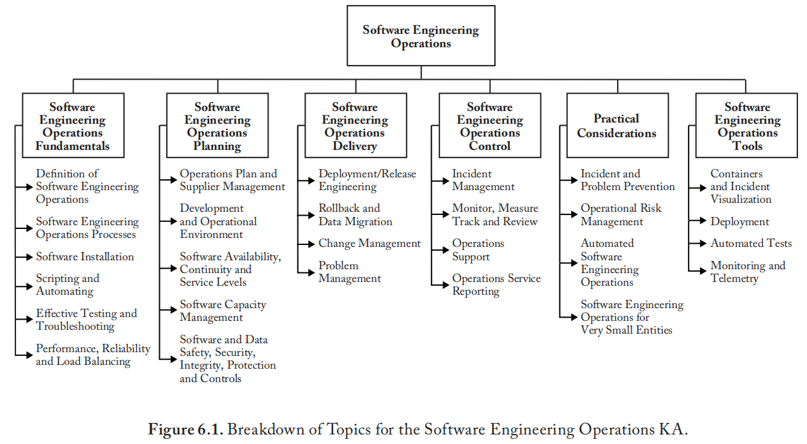
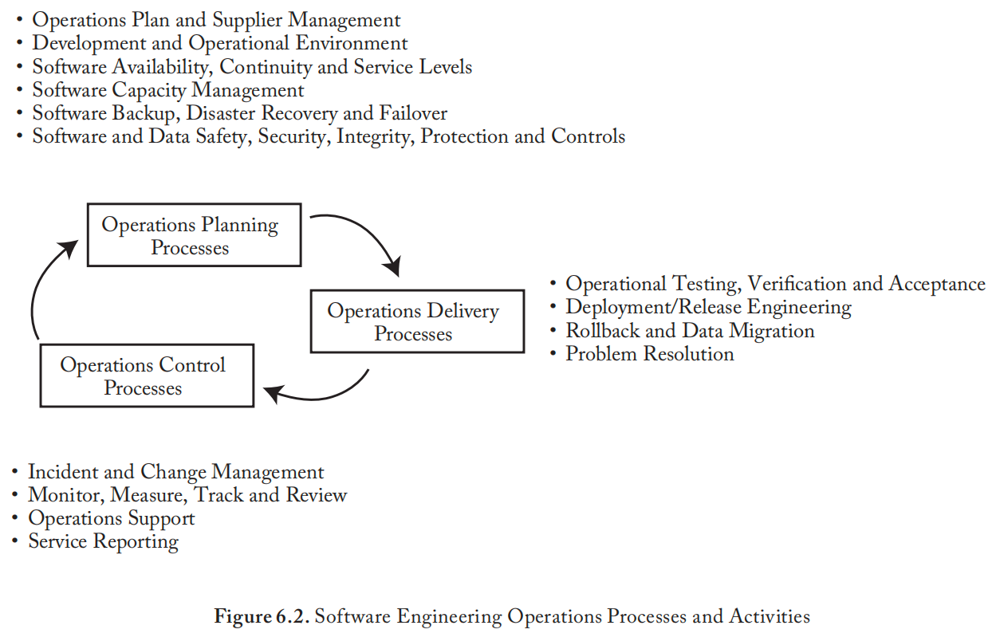

## **缩写词**

| 缩写   | 英文                               | 中文               |
| ------ | ---------------------------------- | ------------------ |
| API    | Application Programming Interface  | 应用编程接口       |
| ATDD   | Acceptance Test-Driven Development | 验收测试驱动开发   |
| CD     | Continuous Delivery                | 持续部署           |
| CI     | Continuous Integration             | 持续集成           |
| CPU    | Central Processing Unit            | 中央处理器         |
| CONOPS | Concepts of Operations             | 运维概念           |
| DBMS   | Database Management System         | 数据库管理系统     |
| IaC    | Infrastructure as-Code             | 基础设施即代码     |
| IaaS   | Infrastructure as a Service        | 基础设施即服务     |
| IT     | Information technology             | 信息技术           |
| ITIL   | IT Infrastructure Library          | 信息技术基础设施库 |
| KPI    | Key Performance Indicator          | 关键绩效指标       |
| MR     | Modification request               | 变更请求           |
| MVP    | Minimum Viable Product             | 最小价值产品       |
| PaaS   | Platform as a Service              | 平台即服务         |
| PR     | Problem Report                     | 问题报告           |
| QA     | Quality Assurance                  | 质量保证           |
| SaaS   | Software as a Service              | 软件即服务         |
| SLA    | Service-Level Agreement            | 服务等级协议       |
| SRE    | Site Reliability Engineering       | 站点可靠性工程     |
| TDD    | Test Driven Development            | 测试驱动开发       |

# **引言**

​	**软件工程运维指为部署、运行和维护软件应用或系统所需的一系列活动与任务，同时保障其完整性与稳定性**。这些活动包括在目标运行环境中部署和配置软件，以及在应用使用期间（直至其退役）对应用进行监控和管理。一旦应用投入运行，软件工程运维必须处理发现的各种缺陷、系统软件环境与硬件设备随时间推移发生的变更，以及出现的任何新用户需求。

​	软件工程运维是系统与软件生命周期流程的重要组成部分[3]。软件工程运维知识领域（KA）与软件工程的所有其他方面都有关联。传统上，专业的软件与信息技术（IT）运维工程师负责提供和管理IT运维服务。软件工程运维的最佳实践最初由IT基础设施库（ITIL）发布，并迅速被业界接受。这些实践在IEEE 20000标准中得到了总结和发布[1]。

​	历史上，运维和计算中心常常位于与软件开发活动分离的组织孤岛中。如今，先进的组织将软件开发、软件维护以及部分软件工程运维活动（通常以服务形式提供，常被称为DevOps）进行协同定位。这种方法的好处在于消除了分隔这些软件活动的组织孤岛，并实现了通用流程和工具的共享。DevOps实践[2*]及相关标准[4]日益普及和被接受，包括不断发展的工具集，正反映了这一趋势。DevOps旨在实现软件工程活动的自动化和持续演进，以确保高质量的软件，并满足用户对软件工程师快速交付的需求。

​	在此背景下，从2015年到2025年，随着基础设施即代码（IaC）、平台即代码（PaC）、敏捷基础设施、软件定义架构/系统等实践的出现，以及基础设施即服务（IaaS）和平台即服务（PaaS）解决方案的普及，软件工程师在软件工程运维中的角色发生了重大演变。传统上由IT基础设施工程师执行的任务正日益自动化，并以服务形式提供，使应用开发人员能够在日常项目活动中独立执行软件工程运维任务。例如，现在许多组织的应用开发人员可以直接使用IaaS和PaaS在生产环境中部署应用，并监控这些应用的各个方面，而无需运维工程师直接参与。

​	通过诸如IaC和PaC等实践，将端到端资源和期望状态配置像代码一样进行管理，可以带来诸多价值，包括提高可重复性、一致性/标准化、已知的安全策略、自文档化（透明性）、单一可信源、配置控制和可扩展性。从工程角度来看，关键在于，几乎所有直接或间接影响软件产品的因素，都应考虑用代码来表述。

​	为了执行软件工程运维任务，一些组织采用平台工程和站点可靠性工程（SRE）[6]的概念，以提高生产力和软件质量。平台工程的角色是构建和管理自助服务平台能力，软件工程师可以利用这些能力来开发、部署和运营软件应用。另一方面，SRE的角色是监控、自动化并改进软件运行在非功能性方面（包括可用性、性能、延迟和安全性）的表现。SRE还负责变更管理、应急响应、容量规划以及软件系统的整体效率。

​	尽管许多组织仍在使用传统的IT运维管理流程，但本知识领域主要关注在新兴的DevOps、IaC、PaC和敏捷基础设施实践背景下，软件工程师在运维中的角色。

​	在此背景下，我们确定了两个与运维相关的主要软件工程角色：**运维工程师**，负责开发以服务形式提供并通过应用程序编程接口（API）访问的运维服务；以及**软件工程师**，他们可以利用生成的运维服务（以服务形式提供），独立地部署和管理应用，而无需直接涉及IT运维专家。

# **软件工程运维知识领域主题分解**

​	软件工程运维知识领域的主题分解如图6.1所示。

## **1. 软件工程运维基础**

​	本节介绍构成理解软件工程运维角色和范围基础的概念与术语。

### **1.1. 软件工程运维的定义**

[1, c3s3.3] [3,c6s6.4.12]

​	在本指南中，术语"软件工程运维"指软件工程师或其组织为确保软件产品（包括IT基础设施、系统软件和应用软件）在开发、维护及实际运行条件下良好运行所使用的知识、技能、流程和工具。

​	在ISO/IEC/IEEE 12207 [3]中，**操作员**被定义为"执行系统运行工作的个人或组织"。SWEBOK指南为此修改了**运维工程师**的定义，指执行软件工程运维流程的软件工程师。在此角色中，运维工程师与软件工程师紧密合作，开发并提供以下运维服务：

*   容器和虚拟服务器的供应、部署、配置和支持
*   设计和提供按需服务（例如，环境即需提供、版本管理、持续集成与测试、部署和监控）供软件工程使用
*   通过运行诊断、记录问题和解决方案、确定问题优先级并评估问题影响，来监控和排查系统与应用软件事件
*   执行、自动化并实施适当的安全、数据保护和故障转移流程
*   监督容量、存储规划及数据库管理系统性能
*   为IT人员提供文档和技术规格，以规划和实施新的或升级的IT基础设施及系统软件

​	ISO/IEC/IEEE 20000-1阐述了发展和提升运维工程师专业能力的必要性。为实现此目标，软件组织应关注以下几点：

*   **人员招聘**：验证求职者的资历和能力，包括其专业认证，并根据运维工程师职位描述、掌握的核心技术与计算机语言以及整体经验，评估其优势、劣势和潜在能力。
*   **资源规划**：为新设或扩展的工程运维服务配置人员，规划新技术的使用，规划服务管理人员在开发项目团队中的分配，制定继任计划并应对人员流动造成的其他人力缺口。
*   **资源培训与发展**：识别培训和发展需求，并制定满足需求的培训发展计划；同时，及时、有效地提供运维服务。应培训运维工程师服务管理的相关方面（例如，通过培训课程、自学、指导和在职培训），并发展其团队协作和领导技能。应为每个人维护按时间顺序的培训记录，并描述所接受的培训内容。

### **1.2. 软件工程运维流程**

[2*, s1] [3, c6s6.4.12]

​	ISO/IEC/IEEE 20000-1是概述运维流程的参考标准，规定了运维服务的设计、转换、交付和改进要求。该标准描述了五个主要运维流程组：服务交付流程、发布流程、控制流程、解决流程和关系流程。这些运维流程在ISO/IEC/IEEE 12207 [3]中被进一步归类为技术流程。从软件工程师的视角来看，运维流程包含了在保持软件系统或产品完整性的前提下，部署、配置、运行和支持现有软件系统或产品所需的活动与任务。该国际标准描述了四项主要的运维流程活动：1) **准备运行**：需要定义运行策略；2) **执行运行**：包括运行和监控；3) **管理运行结果**：记录并处理异常；以及4) **支持客户**：向运维服务的任何用户提供协助和咨询。

​	最后，ISO/IEC/IEEE 32675 [4]从敏捷和最小可行产品的角度引入了若干软件工程运维活动。该标准认可DevOps作为一套原则和实践的影响力，这些原则和实践能促进相关利益相关者之间更好的沟通与协作，以用于规定、开发、持续改进和运营软件与系统产品及服务。这些流程和活动是运维工程师的职责。

​	就SWEBOK指南而言，工程运维活动可以分为三个主要运维流程（见图6.2），每个流程包含多项运维活动，将在本章后续章节中描述：

*   **运维规划**（第2节）
*   **运维交付**（第3节）
*   **运维控制**（第4节）

​	每个软件工程运维流程都包含软件项目交付前和交付后阶段执行的活动。软件工程运维规划活动发生在交付前阶段，这些活动在本章涵盖。

### **1.3. 软件安装 **

*[1, c3, c6s2][2*, c3s3.1]

​	在软件应用或更新可供用户使用之前（即发布到生产环境），运维工程师必须将软件安装作为其部署的一部分。安装软件时，工程师可能需要卸载先前版本、为目标环境配置软件，并在目标环境上创建必要的目录、注册表文件和环境变量。这通常使用脚本语言完成。软件到适当位置的安装通常以电子方式进行，但对于嵌入式系统，可能需要使用物理介质。软件安装后，会进行验证步骤以确保操作成功。

### **1.4. 脚本编写与自动化 **

[2*, c9]

​	作为软件工程运维的一部分，重复性任务被自动化以减少延迟、提高质量，并确保一致且稳定的运行环境。这通常通过使用脚本语言（一种基础编程语言）来实现。自动化运维使得在发生故障时能够更快地响应，从而减少停机时间和严重事件，因为警报会立即发出。自动化此类任务也是确保组织内运维标准化的好方法。它同时也是开发以服务形式提供的运维功能的基础。有关运维工具的进一步讨论，请参阅第6节。

### **1.5. 有效的测试与故障排除**

[2*, c3]

​	软件工程运维负责确保系统的稳定性。为此，软件在发布前（部署到生产环境并供用户使用）必须经过彻底测试。由于手动测试效率低、易出错且不可扩展，必须在整个软件流程中尽可能实现测试自动化。同时，由于可用的测试时间有限，回归测试和测试覆盖策略（对软件应用或组件进行选择性再测试，以验证待部署的软件不会引起意外影响）在软件工程运维中扮演重要角色。

​	当发现错误时（在软件发布后的生产环境中或在内部测试阶段），软件工程师和软件运维工程师需要通过运行诊断、记录问题和解决方案、确定问题优先级并评估问题影响来排查硬件和软件事件。对大型软件进行全面重复测试的成本（时间和金钱方面）是巨大的。为确保所报告的问题是有效的，运维工程师应通过运行适当的测试来复现和验证问题。在生产环境中测试软件的某些方面可能特别具有挑战性。例如，当软件执行关键功能时，使其离线进行测试可能很困难。通常，在生产系统环境中测试软件具有挑战性（有时不可能），可能需要使用金丝雀测试和灰度发布等测试技术。软件测试知识领域提供了关于测试的额外信息和参考。

### **1.6. 性能、可靠性与负载均衡**

[1, c6s6.2]

​	软件运维工程师在软件项目早期就规划性能、可靠性和负载均衡，以确保满足项目要求。（参见软件需求知识领域第1.2至1.7节）。当前的趋势是软件工程师设计和使用基础设施/运维服务，以根据需求动态调整基础设施（例如，可扩展性）。采用DevOps实践使运维工程师能够及早预见到这些需求，并提供基础设施服务，供软件工程师在项目开发阶段使用和测试。

## **2. 软件工程运维规划**

​	本主题介绍了软件工程运维规划中一些普遍接受的技术。运维工程师必须处理若干关键问题以确保软件有效运行。运维工程师应记录其软件工程运维步骤和工具，使用任何适合此目的的类型、形式或媒介（例如，维基、文档等）。以下主题通常被视为有据可循的运维的合适证据：

*   政策与计划
*   服务文档
*   程序
*   流程
*   流程控制记录

### **2.1. 运维计划与供应商管理**

[1, c4s4.1] [3, c6s6.1]

​	软件工程运维规划应是转化项目需求及开发维护人员需求为服务的过程的一部分，并应为指导进展提供路线图。此过程常涉及供应商的产品和服务，必须对其进行良好协调以确保服务质量。ISO/IEC/IEEE 20000-1描述了规划活动，同样，ISO/IEC/IEEE 12207列出了运维工程师需从人力、技术和系统角度考虑的活动。

#### **2.1.1. 运维计划 **

[1, c4s4.1] [3,c6s6.4.12.3a]

​	软件开发通常持续数月到数年，而运维阶段通常持续很多年。因此，估算资源是运维规划的关键要素。软件工程运维规划应始于决定开发新软件产品之时，并应及早考虑其维护和运维需求。应制定概念文档，随后制定运维和维护计划 [1,c7s2]，两者都应解决以下问题：

*   运维和软件维护的范围
*   软件工程运维流程和工具的适配
*   软件工程运维组织的确定
*   软件工程运维和维护成本的估算

​	下一规划步骤建议制定一份软件工程运维计划，或称作战构想（CONOPS）。该计划应在软件开发期间制定，并应明确软件投入运行时，用户将如何请求软件修改以及报告问题。软件工程运维规划在ISO/IEC/IEEE 12207 [3]和ISO/IEC/IEEE 32675 [4]中有所阐述。这些标准为规划、实施、维护、自动化和支持生产软件提供了指导。最后，在最高规划层面，运维组织必须进行业务规划活动（例如，预算、财务和人力资源），正如组织的其他所有部门一样（参见软件工程管理知识领域）。ISO/IEC/IEEE 20000-1建议运维计划应解决与多种规划视角相关的问题，包括：

*   实施、运行和维护新服务或变更服务的角色和职责
*   客户和供应商需执行的活动
*   对现有服务管理框架和服务的变更
*   与相关方的沟通
*   新的或变更的合同与协议，以与业务需求的变化保持一致
*   人员配置和招聘要求
*   技能和培训要求（例如，用户、技术支持）
*   与新服务或变更服务相关的流程、措施、方法和工具
*   容量管理
*   财务管理
*   预算和时间表
*   服务验收标准，以及
*   以可度量的方式表述的运行新服务的预期成果

​	该计划确保定义运行策略，识别和评估正确运行的条件，软件在其预期环境中按规模进行测试，并通过确保持续支持来提供监控，以保证软件的响应性和可用性。在个别请求层面（例如，问题报告或修改请求）也需要规划。一旦收到并验证了个别请求，发布或版本规划活动要求运维工程师执行以下任务：

*   确定个别请求的目标可用日期
*   就后续发布或版本的内容达成一致
*   识别潜在冲突并制定替代方案
*   评估给定发布的风险，并制定在出现问题时回滚和数据迁移的计划（见第3.3节）
*   通知所有利益相关者

#### **2.1.2. 供应商管理 **

[1, c7s3] [3, c6s6.1]

​	供应商管理确保对组织的供应商及其绩效进行适当管理，以支持无缝提供高质量的产品和服务。ISO/IEC/IEEE 12207列出了运维工程师为就获取供应商产品/或服务达成协议而将执行的活动。从运维工程师的角度看，与供应商的关系性质及合作方式应由项目所需产品和服务的性质决定。管理与操作软件相关的服务供应商包括管理外包服务和云服务，如IaaS和PaaS。

### **2.2. 开发与运行环境 **

[2*, c9]

​	整个软件流程需要在不同阶段使用不同的环境。这些通常定义为开发环境、测试或质量保证环境、预生产环境和生产环境。为了将质量内建于产品中，并降低在生产环境中发布软件（无论发布是关联新功能还是软件缺陷）的风险，工程师必须确保所有不同环境与生产环境保持一致和同步。

​	因此，DevOps建议所有不同环境的创建都应自动化，并从单一代码仓库构建。在成熟的DevOps组织中，不同环境的创建是完全自动化的，并以服务形式提供。同时，所有环境都需要从相同的代码源（单一可信源）构建，以确保所有环境与软件发布所在的生产环境同步。这引出了基础设施即代码的概念。

### **2.3. 软件可用性、连续性与服务水平 **

[1, c6s6.3]

​	必须对服务可用性和连续性进行管理，以确保满足客户承诺。因为服务可用性和连续性在项目早期被定义为非功能性需求（参见软件质量知识领域），运维工程师将确保规划、设计、实施和测试适当的基础设施。软件可用性需进行度量和记录，并对非计划的不可用进行调查并采取适当措施。服务报告会生成运维服务相对于服务水平目标的可用性和连续性指标。

​	服务级别管理流程监控商定的软件服务水平，包括工作负载特征、性能和可用性趋势信息以及客户满意度分析。定义、协商并记录服务水平协议有助于明确所提供运维服务的全部义务范围。软件维护知识领域提供了关于SLA的额外信息和参考。

### **2.4. 软件容量管理 **

[1, c6s6.5]

​	ISO/IEC/IEEE 20000-1描述了确保软件产品始终具备满足由客户业务需求产生的当前及未来商定需求的容量的必要性。应从业务为向其客户交付其产品或服务所需的角度来理解当前和预期的服务业务需求。应将业务预测和工作负载估算转化为具体需求并记录下来。对工作负载或环境变化的反应应具有可预测性；应捕获和分析关于当前和先前组件以及适当级别的资源利用率的数据，以支持该流程。

​	容量管理是所有性能和容量问题的焦点。该流程应通过对新服务和变更服务进行规模评估和建模，直接支持其开发。应考虑到服务和服务量的变化率、变更管理报告中的信息以及客户业务需求的变化，以适当的频率（至少每年一次）生成一份容量计划文件，记录基础设施的实际性能和预期需求。容量计划应记录满足业务需求的成本化选项，并推荐解决方案以确保实现SLA中定义的商定服务水平目标。应充分理解技术基础设施及其当前和预计容量，以确保软件运行最佳化。

### **2.5. 软件备份、灾难恢复与故障转移**

[1, c6s6.3.4]

​	ISO/IEC/IEEE 20000-1还提出，在重大服务故障或灾难后应能快速获取以下资源以确保连续性规划和测试：数据、文档和软件的备份，以及服务恢复所需的任何设备或人员。备份和数据恢复是重要的活动；成功的恢复尤其关键。成功恢复的需求应影响所采用的备份和恢复方法（完全或增量）、建立还原点的频率、存储位置以及保留时间。

​	随着生产环境的变更，应不断演练备份、灾难恢复和故障转移的准备工作和定期测试。这是进行停机评估时触发的另一项基本活动。测试灾难恢复需要停止服务、识别检查点状态并触发故障转移过程。软件工程师应理解故障是不可避免的，而自动化故障转移守护程序可以显著减少恢复时间。为此，软件应用程序应包含故障处理逻辑；这必须在开发期间进行规划。对于那些希望通过尽可能频繁地自动化和启动测试来减少故障转移和灾难，从而确保在发生故障或灾难事件时准备就绪的组织，DevOps可以提供帮助。

### **2.6. 软件与数据的安全性、保密性、完整性、保护与控制 **

[1, c6s6.6]

​	ISO/IEC/IEEE 20000-1描述了在所有服务活动中有效管理信息安全的必要性。这通过对信息的保密性和可用性进行软件风险评估来完成。运维工程师应努力执行以下控制措施：

a.  高级管理层应定义其信息安全政策，将其传达给员工和客户，并采取行动确保其有效实施，
b.  应定义信息安全管理的角色和职责，并分配给具体岗位人员，
c.  应指定管理团队的一名代表负责监控和维护信息安全政策的有效性，
d.  承担重要安全角色的员工应接受信息安全培训，
e.  应让所有员工了解信息安全政策，
f.  应能获得风险评估和控制实施方面的专家帮助，
g.  变更不应损害控制措施的有效运行，以及
h.  信息安全事件应按事件管理程序报告，并启动响应。

​	随着DevOps的发展演变，DevSecOps正在推动安全在软件流程早期及全过程的整合，包括在运维层面整合不同的安全机制和工具。其目标是尽可能早地在整个流程中自动检测和纠正安全问题。

## **3. 软件工程运维交付**

​	本主题介绍软件工程运维交付过程中一些普遍接受的流程：服务水平协议、服务报告、服务连续性、可用性管理、IT服务预算与核算、容量管理和信息安全管理。

### **3.1. 运行测试、验证与验收**

[2*, c10] [3, c6s6.3.5.3d]

​	软件工程师应尽早规划和执行软件验证，使用测试驱动开发和验收测试驱动开发的技术与工具，确保在软件开发过程中（而不仅仅在项目结束时）持续进行运行测试。DevOps在开发和自动化软件测试服务以及整合不同工具以提高软件生产力和质量方面发挥着重要作用。（参见软件测试知识领域中的TDD和ATDD。）

### **3.2. 部署/发布工程**

[2*,c12] [3,c6s6.3.5.3d]

​	软件运维工程师的主要职责与软件的部署和发布有关，以确保其持续性能。如[2*]所定义，"部署是将指定版本的软件安装到给定环境中（例如，将代码部署到集成测试环境或在生产环境中部署代码）"，而"发布则是当我们向所有客户或一部分客户提供功能时（例如，我们使5%的客户基础能够使用该功能）"。发布流程包括所有与发布管理相关的活动。ISO/IEC/IEEE 12207 [3]列出了发布控制活动，并解释了需要识别和记录发布请求、识别发布中包含的软件系统元素并获得批准，以及在指定环境中跟踪发布。

​	DevOps倡导将开发和运维整合到同一团队中，以提高软件工程运维效率。在传统的软件流程中，当应用程序准备好部署时，它从开发团队转移到一个负责部署的运维团队，这大多是手动完成的。这导致了从时间和质量角度来看都效率低下的流程。为了提高部署流程的效率，DevOps呼吁自动化不同的部署步骤，包括打包代码、生成配置文件、重启服务器、配置服务器和数据库、在不同服务器上安装软件、启动应用程序的执行以及执行冒烟测试。

​	可以采用不同的发布工程策略来降低与软件发布相关的风险。这些策略可以分为两大类：基于环境的发布策略和基于应用的发布策略。基于环境的发布策略使用一个预备（staging）环境来支持应用程序新版本的发布。换句话说，基本策略涉及将应用程序的新版本部署到预备环境。基于应用的发布策略则基于使用开关（例如，功能开关），通过配置参数可以启用或禁用代码的特定部分（例如，一个功能）。

​	部署和发布得到自动化技术和工具的支持。金丝雀发布测试技术是对服务变更的部分、限时部署和评估。这种评估有助于运维工程师决定是否进行完整部署。同样，管理新软件安装的工具通常会观察新启动的软件一段时间，确保软件不会崩溃或出现其他异常行为。相同的技术对于观察最近的变更也很有用；如果它们没有通过验证期，可以自动回滚。软件配置管理知识领域提供了关于发布流程的更多信息。一旦应用程序平台部署在目标生产环境中，将其提供给用户使用的决定就变成了一个业务决策。

### **3.3. 回滚与数据迁移**

[2*, c12] [3, c6s6.4.10.3]

​	回滚和数据迁移是用于描述将软件及其数据库恢复到正常工作状态过程的术语。软件工程师确保当软件的新版本及其数据库被修改并部署到生产环境后，如果新版本在生产环境中导致缺陷或产品退化，可以轻松快速地回滚。这意味着在软件新版本部署到生产环境之前，需要完成计划好并经过演练的回滚。DevOps流程自动化了这一过程，使其更快；事实上，自动监控可以如此快速地触发回滚和数据迁移到先前状态，以至于最终用户不会注意到存在问题。两种发布策略类别（在第3.2节中描述）——基于环境的发布和基于应用的发布——都可以用于支持回滚。

### **3.4. 问题解决 **

[1, c8s8.3]

​	此运维流程的目标是通过识别和分析软件与系统事件和问题的原因，最大限度地减少对业务的中断。这种方法可能需要一个多学科团队的参与，其中软件工程师和运维工程师共同调查，例如，可能由软件基础设施和系统组件底层原因引起的反复出现的生产问题。这可能需要对软件及其基础设施行为进行监控、日志记录和分析。

## **4. 软件工程运维控制**

本主题介绍软件工程运维控制中一些普遍接受的技术。

### **4.1. 事件管理 **

[1, c8s8.2]

​	事件管理是对软件事件进行记录、优先级排序、评估业务影响、解决、升级和关闭的流程。现代DevOps方法利用警报和日志自动进行软件监控，以防止小事件演变成大事件。当事件发生时，必须进行适当的分析和/或事后分析，以找出事件的根源，并实施适当的解决方案，防止未来再次发生类似事件。

### **4.2. 变更管理 **

[1, c9s9.2]

​	此运维流程确保所有变更都以受控的方式进行评估、批准、实施和评审。所有变更请求都会被记录和分类（例如，紧急、重要、主要和次要）。此流程评估变更的风险以及在失败时需要回滚策略的必要性。大型系统可能需要与产品经理和最终用户共同规划变更排期。

​	在传统软件交付流程（或软件生命周期模型）中，所有变更都是作为新软件发布（包含与应用或系统不同方面相关的多个变更）的一部分，在固定的时间间隔（例如，每三个月）发布。而DevOps的目标是按需且彼此独立地交付小的变更单元（单一新功能或服务，或缺陷修复，而不是包含多个变更的应用新版本）。为此，软件应用程序（或服务）必须进行架构设计，以支持小型、独立的软件部署。

### **4.3. 监控、度量、跟踪与评审 **

[2*, c14-15]

​	软件工程运维活动监控容量、连续性和可用性。在DevOps理念中，不应依赖侥幸；相反，工程师应通过证据了解系统质量和运行健康状况，例如以下关键绩效指标，这些指标应能实时提供给利益相关者：

*   生产系统的监控和产品遥测数据
*   发布到生产环境前后的可操作的验证与确认结果
*   最终用户活动和资源使用情况
*   影响分析结果
*   系统运行所需的内部和外部相关依赖关系
*   与已批准部署任务无关的配置变更
*   安全性和弹性性能能力

### **4.4. 运维支持 **

[1, c6, c14s5]

​	ISO/IEC/IEEE 12207 [3]、ISO/IEC/IEEE 20000-1 [1]和ISO/IEC/IEEE 32675 [4]确定了支持运维流程的主要软件工程运维活动（在预期环境中操作软件产品的活动），以及为软件产品客户提供支持的主要活动。运维支持活动在项目规划阶段启动，然后执行，这通常需要技术和工具来主动监控产品和服务，并对事件和事故做出快速反应。支持活动通常在SLA中描述。

### **4.5. 服务报告 **

[1,c6s6.2]

​	服务报告旨在为决策提供商定的、及时、可靠和准确的信息。每份服务报告有助于展示运维服务的执行情况以及是否满足某些规定并商定的最终用户目标。典型的服务报告涉及相对于服务水平目标的绩效，以及安全漏洞、交易量和资源使用情况、事件和故障、趋势信息和满意度分析。运维工程师需要建立用于度量的自动化系统和工具，以执行以下操作：

*   确定度量指标是否已可用，或者是否需要额外的工具来进行收集、分析和报告
*   选择或开发一个框架和工具，以协调度量收集，进行分析、报告和控制

## **5. 实际考量**

​	本主题介绍软件工程运维的实际考量因素。

### **5.1. 事件与问题预防 **

[2*, c7]

​	整个运维流程需要尽可能自动化，以防止事件和问题发生，并且自动化测试需要整合到整个流程中。此外，应结合适当的分析技术实施产品遥测，以尽早发现问题，防止事件发生。为此，必须收集和分析产品堆栈所有层（包括应用层、操作系统层和基础设施层）收集的数据。使用产品遥测不仅使工程师能够发现潜在问题，还为识别问题根源提供了基础。

### **5.2. 运维风险管理 **

[3, c6s6.4.12.3c4]

​	运维工程师必须管理多种风险。IEEE 2675 [4]将持续风险管理定义为一个可以自动化的持续过程，用于持续监控可能影响软件可用性、可扩展性和安全性的风险。运维工程师可以采取措施自动化警报。为了决定哪些事件将触发警报，他们需要与产品负责人和软件工程师沟通，以建立商定的风险承受水平。其他视角包括选择适合给定服务风险状况以及暴露私人数据风险的部署流程。

### **5.3. 自动化软件工程运维**

[2*, c8]

自动化在现代软件运维中扮演着重要角色。当软件工程师将应用程序和运维自动化结合起来时，会取得最佳效果。虽然自动化主要侧重于管理系统或基础设施的生命周期（例如，用户帐户创建、环境和服务器供应、运行时配置更改），但它也可用于其他用例，通过开发服务来帮助软件工程师在开发过程中进行部署、测试和调试。运维自动化的趋势旨在降低复杂性、加速基础设施供应、向开发人员提供运维服务脚本、定义应用程序、自动化部署和测试工作流。

### **5.4. 小型组织的软件工程运维**

​	非常小的组织（25人以下）很难应用由大型组织开发并为大型组织制定的标准，因为这些标准的要求可能会使小型组织难以承受。这正是ISO/IEC 29110系列标准有用的地方，它提供了适合非常小组织的标准和指南，以确保其软件工程运维的质量[7]。软件工程师应了解，运维流程可以适应小型组织，而ISO/IEC CD 29110-5-5将解决这一目的。

## **6. 软件工程运维工具 **

[1, c5s5g] [2*, c12]

​	本主题涵盖对软件工程运维特别重要的工具，旨在最大限度地提高人员效率。自动化开发、维护和与运维相关的任务可以节省工程资源，并提高质量和交付速度。如果实施得当，此类自动化任务通常比软件工程师和运维工程师手动尝试执行更快、更容易且更可靠。DevOps支持此类自动化，用于集成、构建、打包、配置和部署可靠且安全的系统。它结合了开发、维护和运维资源与流程，以执行持续集成、交付、测试和部署。

​	**持续交付**是一种软件工程实践，使用自动化工具向预生产环境或各种测试环境频繁发布新系统（包括软件）。持续交付持续从主线组装最新的代码和配置，生成候选发布版本。

​	**持续测试**是一种软件测试实践，涉及在软件开发生命周期的每个阶段测试软件。持续测试旨在通过及早并经常测试，来评估持续交付过程中每一步的软件质量。持续测试涉及各种利益相关者，如开发人员、DevOps人员、质量保证人员和最终用户。

​	**持续部署**是一种自动化流程，通过验证预期功能和确认来减少风险，从而将变更部署到生产环境。Jez Humble和David Farley [8]指出："任何软件工作的最大风险是最终构建的东西没有用处。越早、越频繁地将可工作的软件呈现在真实用户面前，就能越快获得反馈，了解它的真正价值。"

### **6.1. 容器与虚拟化**

​	运维工程师可以使用不同的容器/虚拟化技术和管理工具（也称为编排器），以提高应用程序的可扩展性，并在多个计算机和服务器供应商之间标准化软件部署。[4, c6s6.4.12] 运维工程师利用其对每个项目规模和复杂性的了解，选择最适合灵活性、安全性和监控的工具。

### **6.2. 部署 **

*[2*, c12]

​	可以使用不同的技术和工具来管理不同环境中的软件部署。[4, c5s5.1] 此外，通常会组合使用不同的工具来覆盖软件部署的不同阶段和方面，从使用描述符文件指定部署和配置，到自动化部署和生产环境资源管理。

### **6.3. 自动化测试 **

[2*, c10]

​	为了向开发人员提供快速、持续的反馈，必须在整个软件交付过程（包括整个开发和运维过程）中尽可能自动化测试。为此，必须定义涵盖不同类型测试（单元测试、集成测试、系统测试、用户验收测试）的测试策略，并选择支持和自动化不同测试阶段的工具。测试自动化对于向开发代码的软件工程师提供持续反馈从而提高软件质量至关重要。

### **6.4. 监控与遥测 **

*[2*, c14-15]

​	监控与遥测是软件工程运维的关键方面。它们在软件系统的所有层面（包括应用程序、操作系统和服务器）收集数据，并提取可用于分析和监控系统不同方面、检测问题以及跟踪各种属性演变的信息。James Turnbull [9] 描述了工程运维在许多技术组织中使用的通用监控框架架构。实施监控解决方案需要结合不同的技术和工具来收集不同层面的数据。这包括应用级别的日志、操作系统级别的执行跟踪以及服务器级别的资源使用信息（如CPU和内存使用情况）。然后，基于收集的数据，可以使用不同的分析技术（例如，统计分析和机器学习技术）来提取相关信息。最后，可以使用仪表板来可视化提取的信息；可以开发不同的仪表板，向不同的利益相关者展示相关信息。

# 知识点与参考资料对照矩阵

|      |      |      |      |
| ---- | ---- | ---- | ---- |
|      |      |      |      |
|      |      |      |      |
|      |      |      |      |
|      |      |      |      |
|      |      |      |      |
|      |      |      |      |
|      |      |      |      |
|      |      |      |      |
|      |      |      |      |
|      |      |      |      |
|      |      |      |      |
|      |      |      |      |
|      |      |      |      |
|      |      |      |      |
|      |      |      |      |
|      |      |      |      |
|      |      |      |      |
|      |      |      |      |
|      |      |      |      |
|      |      |      |      |
|      |      |      |      |
|      |      |      |      |
|      |      |      |      |
|      |      |      |      |
|      |      |      |      |
|      |      |      |      |
|      |      |      |      |
|      |      |      |      |
|      |      |      |      |
|      |      |      |      |
|      |      |      |      |
|      |      |      |      |
|      |      |      |      |
|      |      |      |      |
|      |      |      |      |
|      |      |      |      |
|      |      |      |      |
|      |      |      |      |
|      |      |      |      |

**REFERENCES** 

[1] IEEE standard, *ISO/IEC/IEEE 20000-**1:2013, Information technology — Service* *management — Part 1: Service management* *systems requirements,* ed. IEEE, 2013.

[2*] G. Kim, J. Humble, J. Debois, J. Willis, and N. Forsgren, *The DevOps* *Handbook: How to create world-class* 

*agility, reliability and security in tech**nology organizations*, 2nd ed., IT Revolution Press, 2021.

[3] IEEE standard, *ISO/IEC/IEEE* *12207:2017, Systems and software* *engineering — Software Life Cycle* *Processes*, ed. IEEE, 2017.

[4] IEEE standard, *ISO/IEC/IEEE* *32675:2022, Information Technology* *— DevOps: Building Reliable and* *Secure Systems Including Application* *Build, Package and Deployment,* ed. IEEE, 2022.

[5] “ISO/IEC/IEEE 24765:2017 Systems and Software Engineering — Vocabulary,” 2nd ed. 2017

[6] B. Beyer, C. Jones, J. Petoff, and N.R. Murphy, *Site Reliability Engineering —* *How Google Runs Production Systems*, O’Reilly Media, 2016. 

[7] *ISO/IEC CD 29110-5-5:2023, Systems* *and software engineering — Lifecycle* *profiles for Very Small Entities (VSEs),* *Part 5-5:* Agile/DevOps guidelines.

[8] J. Humble and D. Farley. *Continuous* *delivery: reliable software releases through* *build, test, and deployment automation*. Pearson Education, 2010.

[9] J. Turnbull, *The Art of Monitoring*. James Turnbull, 2016.